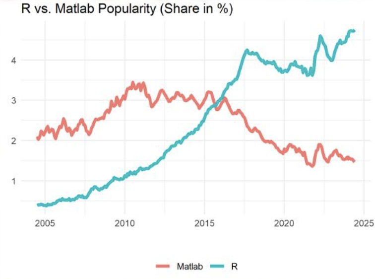
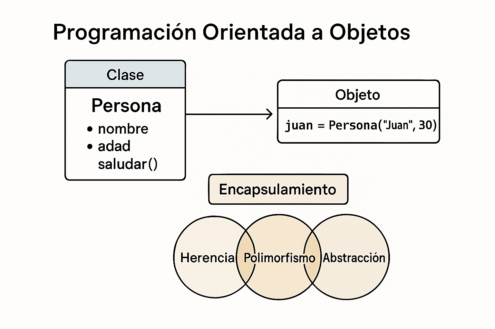
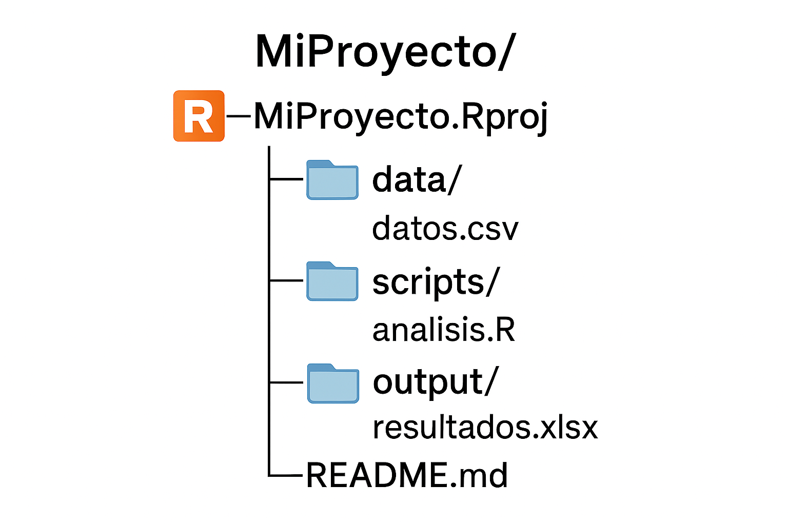
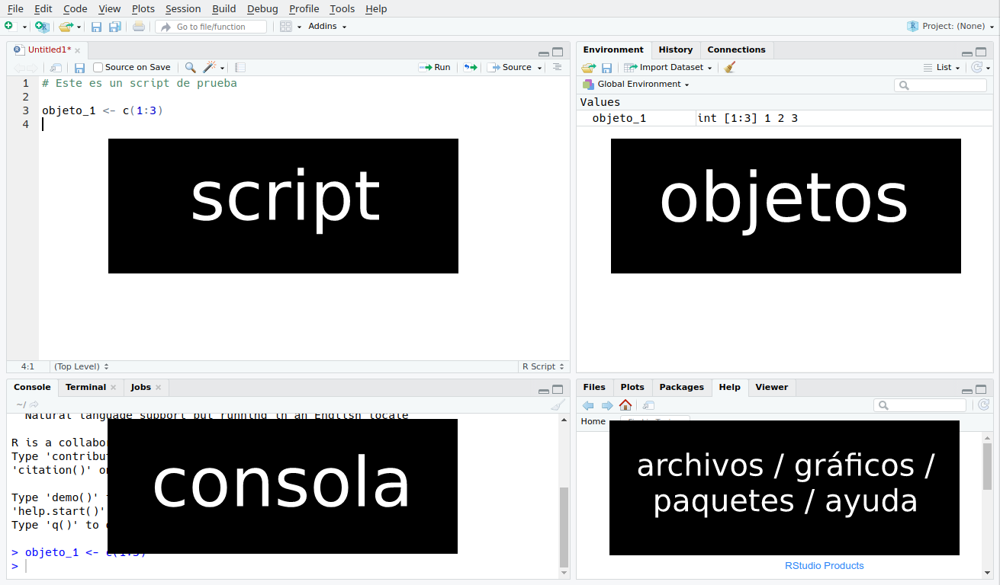
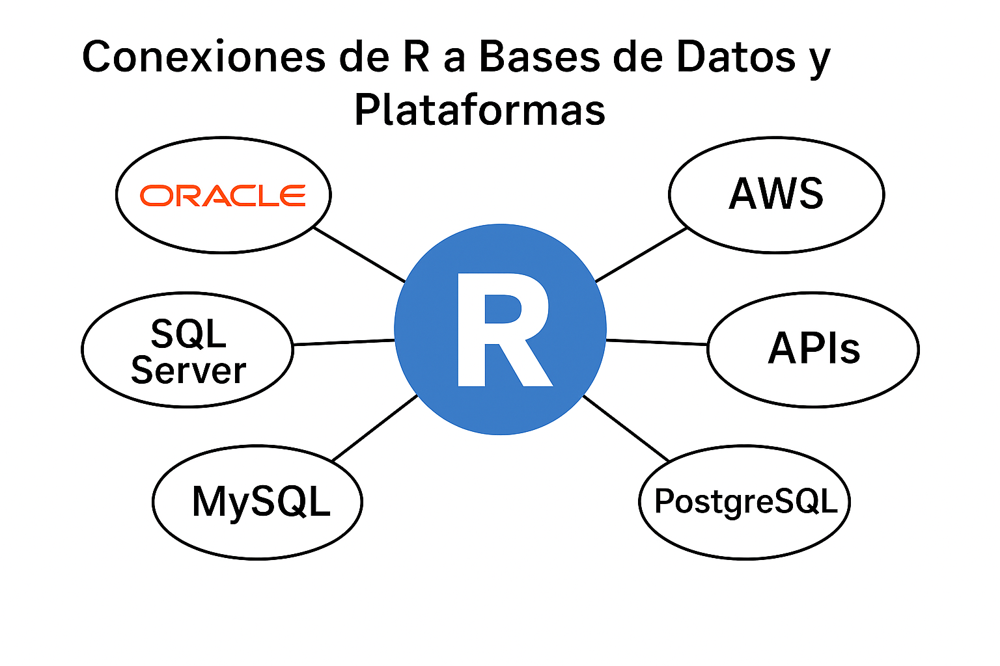
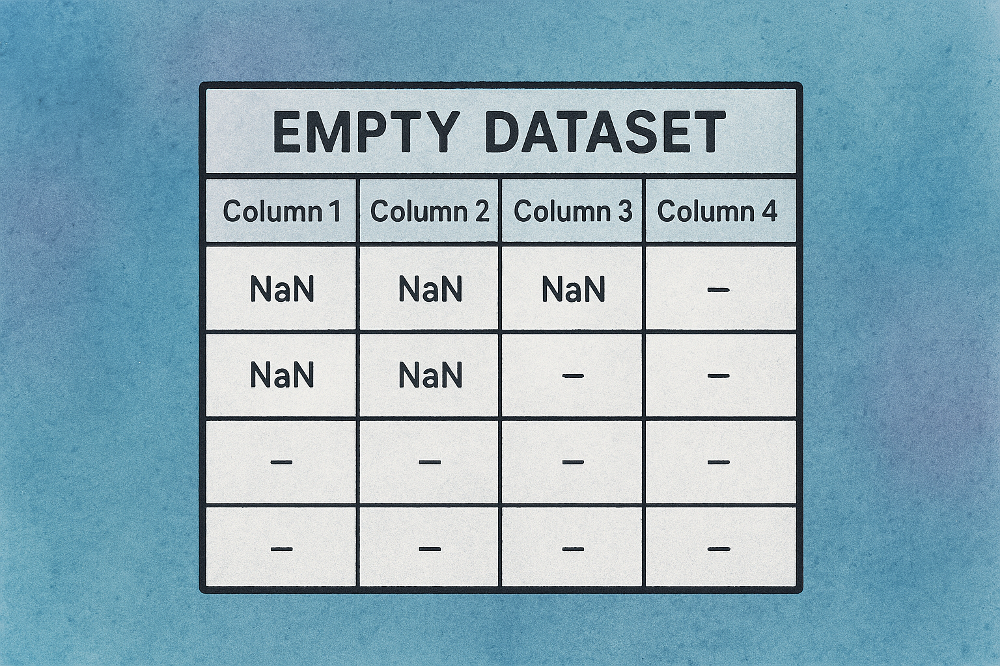
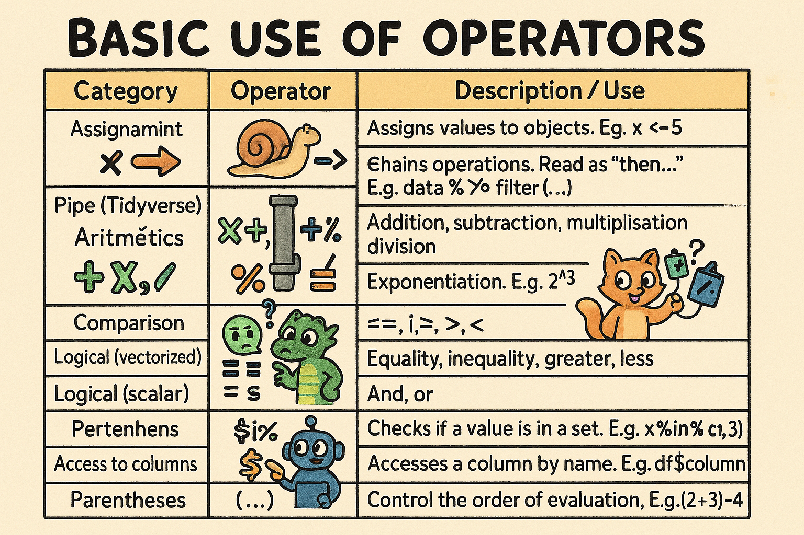

<!-- Entrada de despliegue para Posit Connect Cloud. El cuaderno fuente vive en notebooks/. -->

```{r setup, include=FALSE}
knitr::opts_chunk$set(
  echo = TRUE,
  warning = FALSE,
  message = FALSE,
  fig.width = 10,
  fig.height = 6
)

paquetes_requeridos <- c(
  "tidyverse", "dplyr", "tidyr", "ggplot2", "readr", "stringr",
  "lubridate", "purrr", "data.table", "janitor", "messy", "naniar",
  "visdat", "readxl", "writexl", "jsonlite", "DBI", "RSQLite",
  "skimr", "summarytools", "DataExplorer", "Hmisc",
  "formattable", "ISLR", "gapminder", "DT", "reactable", "plotly",
  "scales"
)

paquetes_faltantes <- paquetes_requeridos[
  !vapply(paquetes_requeridos, requireNamespace, logical(1), quietly = TRUE)
]

if (length(paquetes_faltantes) > 0) {
  stop(
    "Faltan paquetes requeridos: ",
    paste(paquetes_faltantes, collapse = ", "),
    ". Ejecuta: Rscript scripts/install_r_packages.R",
    call. = FALSE
  )
}

if (utils::packageVersion("dplyr") < "1.2.1") {
  stop(
    "Este cuaderno usa funciones modernas de dplyr y requiere dplyr >= 1.2.1. ",
    "Ejecuta: Rscript scripts/install_r_packages.R",
    call. = FALSE
  )
}

options(scipen = 999)
```

# Introducción

Capacitarse en **R** es fundamental porque se ha convertido en uno de los lenguajes más potentes y versátiles para análisis estadístico, ciencia de datos y modelado, especialmente en sectores regulados como el financiero, donde la transparencia y reproducibilidad son esenciales. Su ecosistema de paquetes permite desde análisis descriptivo hasta machine learning avanzado, todo dentro de un entorno abierto y ampliamente documentado.

Además, R ofrece una gran capacidad para **automatizar procesos y manejar grandes volúmenes de datos**, lo que reduce errores manuales y mejora la eficiencia en tareas críticas como monitoreo de riesgos, detección de patrones inusuales y generación de reportes regulatorios. Esto se traduce en decisiones más rápidas y basadas en evidencia, algo clave en áreas como cumplimiento y prevención de lavado de activos.

Por último, aprender R fomenta la **integración con otras herramientas** (bases de datos, APIs, dashboards interactivos y reportes automatizados) y el uso de metodologías reproducibles mediante scripts y reportes dinámicos. Esto no solo fortalece la gobernanza de datos, sino que también incrementa la competitividad profesional, ya que R es altamente demandado en analítica avanzada y gestión de riesgos.

# Sesión 1 : Introducción a R y RStudio

## 1.1) ¿Qué es R?

El gráfico ilustra el interés en búsquedas de Google asociado con R y con temas de estadística. La idea central es ubicar a R como una herramienta especialmente fuerte para análisis estadístico, ciencia de datos y comunicación reproducible.

 ![No hay descripción alternativa para esta imagen](data:image/jpg;base64,/9j/4AAQSkZJRgABAQEAYABgAAD/2wBDAAUDBAQEAwUEBAQFBQUGBwwIBwcHBw8LCwkMEQ8SEhEPERETFhwXExQaFRERGCEYGh0dHx8fExciJCIeJBweHx7/2wBDAQUFBQcGBw4ICA4eFBEUHh4eHh4eHh4eHh4eHh4eHh4eHh4eHh4eHh4eHh4eHh4eHh4eHh4eHh4eHh4eHh4eHh7/wAARCAH2AyADASIAAhEBAxEB/8QAHwAAAQUBAQEBAQEAAAAAAAAAAAECAwQFBgcICQoL/8QAtRAAAgEDAwIEAwUFBAQAAAF9AQIDAAQRBRIhMUEGE1FhByJxFDKBkaEII0KxwRVS0fAkM2JyggkKFhcYGRolJicoKSo0NTY3ODk6Q0RFRkdISUpTVFVWV1hZWmNkZWZnaGlqc3R1dnd4eXqDhIWGh4iJipKTlJWWl5iZmqKjpKWmp6ipqrKztLW2t7i5usLDxMXGx8jJytLT1NXW19jZ2uHi4+Tl5ufo6erx8vP09fb3+Pn6/8QAHwEAAwEBAQEBAQEBAQAAAAAAAAECAwQFBgcICQoL/8QAtREAAgECBAQDBAcFBAQAAQJ3AAECAxEEBSExBhJBUQdhcRMiMoEIFEKRobHBCSMzUvAVYnLRChYkNOEl8RcYGRomJygpKjU2Nzg5OkNERUZHSElKU1RVVldYWVpjZGVmZ2hpanN0dXZ3eHl6goOEhYaHiImKkpOUlZaXmJmaoqOkpaanqKmqsrO0tba3uLm6wsPExcbHyMnK0tPU1dbX2Nna4uPk5ebn6Onq8vP09fb3+Pn6/9oADAMBAAIRAxEAPwD7LooooAKKKKACiiigAooooAKKKKACiiigAooooAKKKKACiiigAooooAKKKKACiiigAooooAKKKKACiiigAooooAKKKKACiiigAooooAKKKKACiiigAooooAKKKKACiiigAooooAKKKKACiiigAooooAKKKKACiiigAooooAKKKKACiiigAooooAKKKKACiiigAooooAKKKKACiiigAooooAKKKKACiiigAooooAKKKKACiiigAooooAKKKKACiiigAooooAKKKKACiiigAooooAKKKKACiiigAooooAKKKKAEpKD1rA8eatdaD4TvdVs1heeAKUEoJQ5YDnBHrVU6bqSUI7vQmc1GLk+h0AorweP4weJ/9Y2n6YYwcHEUg/XfXpPw88a2fiy1lAha1vbfHnQk7hg91Pcfyr0MVlGKwtPnqR08jkoZhQrS5YvU7Ckoryz4m/EHWvDXiT+zbC3sXi8hZN00bMcnPow9K5cLhKmLqezpLU2xGIhQhzT2PUj1pa8V0f4w6lHfrHrmmQeRuw5twyunvgk5+nFexWdzDeWkN1byCSGZA8bDoVIyDWmLwFfB29rHcnD4ulXvyMs0UUVxnSFFFFABRRRQAUUUUAFFFFABRRRQAUUUUAFFFBPBoASivNfh/wCONZ17xZe6XfabHDDGjMu0MHhwcYck8/pzXpVb4jDzw8+Se5lRrRqx5oi0UUVgahRRRQAUUUUAFFFFABRRRQAd6Q/nUF9IYLWaVcZVSwz7CvEE+LHihiSlnppwNxxFJwP++qxq1oUviO/B5dXxibpLY92oNeefD74ip4ivRpt9bpa3pBMZRspJjkgZ5BxXofarp1FUV4mGJwtXC1PZ1VZifrRQDWH4g8VaHoM6W+q3wt5JF3KDGxyM47A1TaWrMacJ1HywV35G2B+BpTiuE+Luu3+leFrO+0e7MDz3SL5gUHKFGPcewrR+F2pXureDLW91GYz3Ds6tIQBnDkDpWarJ1OQ6ngprDLEN6Xt5nWUUUVqcYUUUUAFFFFADfxFBrzb4o+ONX8M63BY2ENk6SQCQmZGY53EdmHpWBp3xd1eK5VdV021aI9fIVkYD1GSc1zTxVOM+Vnq0ckxdakqtON0/M9ppe1U9LvrfUtPgvrWQSQzIHRvUGrZrp3PLaadmLRQKKBBRRRQAUUUUAFFFFABRRRQAUUUUAFFFFADcjIpRTehrzmx8baxN8S5PDz6agtBK8X3T5gAH+sJ6YPXp0NRKoo2v1OihhqldScPsq7PSaKKKs5wooooAKKKKACiiigAooooAKKKKACiiigAooooAKKKKACiiigAooooAKKKKACiiigAooooAKKKKAErkvi//AMk51b/dj/8ARiV1tcl8X/8AknOrf7sf/oxa6cB/vVP1X5mGK/gz9H+R4/4K8TaVo3hPXNOvoJJ5r5dsSBAV+6Rkk9ME10H7PWmXjaze6tsdLRLcwbj0dy4OB9AP1FcjpGh/2l4C1XUYkzPp9yknv5ZBD/0P4V6d8A9a+2eH5tHlb97YvlPeNuf0OfzFfY5u1DDVpUlq2lLy0X/APn8AnKtTU9ktD0wdTXz/APHn/ke/+3SP+Zr6AHU18/8Ax5/5Hv8A7dI/5mvE4a/3z5M9HOP93+ZV+KvifS/E99YvpltKvkRMjyugBk3YwPoOfzru9b1bWvBXws0JoFjW83RwyLMmdgKO2MeowBXS6F4F8L6VNFeWulp9oGGEkjtJg+oycCsD9oX/AJE2z9P7QT/0XJWyxdDFVaOFpx9xPqY/V6tGE68n7zXQw9B+IXirXNQ0a1tbRvL+1RrqM0VvuBBl6d9g2Y5+tXviV8QtU0/xB/YPh+NGuFIV5PL3sXPRFX8R681u/BGKMfD20ZVUNJLKXI7neR/ICvN5po9L+Nss+pMI4k1EsWfgKH+4T7cg1tRo4apjKsVTVqaend3FUqVYYeLcvitr2N/wX8RNcj8TRaJ4qhCmWQRb2i8p4nPTK+hyv55rT+LfjzUNDvotJ0YxrcmMSTSum/ZnoADxnv8AlXF/Ea6t9W+KEZ0qSObMlvEHjOQz8dD39Kk+LB+xfFMXVwpaH/R5sEdUAAP8jXRTwGGniaVR07Xi3y9L6f5mMsVVjSlFS2drlzU/iV420uK3tb+yhtrrbuZ5rcgyKehx2712fjnxZq2j+ANI1uz8j7VeGESblyvzRFjgfUVwvxx1rS9Y1fTv7MuYboRW7b3jbI5PAz6/41u/FU5+EXhz/ftv/RD1lUw1Gf1aTpKPM3dFxr1I+2Sney0INB+IXirXNQ0a1tbVvL+1RrqM0VvuBBl6d9g2Y5+tT/Ej4g61Z+Jzovh3ahhKo7iISPLIf4AD9ceua6X4IRxr8PrNlVQzyys+O53kfyArzWSeHTPjbLcaiwjhTU3Ys3AQHOCfbkGpoUsNUxlVKkrQT07u46k60MPBufxNa9jRuvid4ri1OGyms7ezmTYk0csBzu7nk8Z4NdP8W/Ges+GdQsYNM+z7JomZ/Nj3cg49a4H4n31nf/EdprGSOWMNCpeM5BIAzz39Pwrc/aIGNZ0r/r3f/wBCroWCw8q+G/dpcyba+SM3iKsaVX372a1KWr/FHxYs9tLDDHZQNGrKkkGfO9WyexOelS+IPil4maa3n0+2GnWjKCnmQ7vNPfk9s+lHxkVV8P8AhDAA/wBCb/0GKj4nqP8AhXfgz5R/x6j/ANFx1pQpYOaov2K95yX3X+/YynUxEede0eln+X+Z6Brniq8i+Fq+KLOOJLp4YH2uMqC8iKw/U153/wALS8Vy6JKYbaITLJ+8u1gykanGBjpknPWuk1j/AJN3Q/8ATvB/6OWue8GBf+FL+J/lH+v/AKR1xYPD4aFKUp007VLfLQ6sRWqyqJRlb3b/AJjovin4mk8OusNmsl7E2ZbwRZRIz0yOgbOfau0+DvivUPEthex6mySXNo6/vFXbuR84yBxn5TXE/DVVb4a+Mdyj/Uf+02rV/Zw/5j//AG7/APtWtMxw2GWHr+zppODWvrb/AD2JwlWs6tPmldNP9S18M/G+ta94ul06+S0EPlSOTFDtYkEYyc1U8R/ErXdL8b3WmrDBPaQXHliJI/3jj0z61i/A7/kocv8A17y/zFNu+fjwN3/QVT+laSweGWMqJ01ZQvYhYiq8PF82rlYu6L8S/FH/AAl9va6pHGkMtwkUlsYNrRhjjjvkZ711Xxd8cXfhx7bTtJ8sXk6eY8jru2JnAwPUkH8q4n4i/wDJaEx/z82v8o6X49RyQ+N4JXXKNaRlM9DhmyP8+tJYPDVcTh5ezSUo3sDxFeFKqua9na5NffEjxtpllaxahZxwzTAus00GPNQ4xxwPX869e8IahPqnhjTtQutvnXECySbRgZNeR/HDXtH1pNGGl3MVwY0kdzGc7A2zAPoeDxXqXw4/5ETRh3+yJ/KvPzOlT+pU6qpckm3f8TrwNSbxEoc/Mkjlv2lvFHirwV8J9Q8VeD/sjXunSRSTrcw+YrQFtr8ZHI3A/QGvKdG/aI1y5/ZS1X4iTjTv+Ens9R/s5EEJELys6EHbn/nk5PX+Gvo/xXo1r4i8MapoF6M22pWktpL/ALsiFT/Ovyn1O71/RNN1f4Z3CkqmuJJPCM5FzAJYcD67/wDx0V86ewfZ/gj48eLLT9mvV/it40tLG6uHvjaaPaW0JiSY8Lljk8b/ADM+0Z7mvLtG+O37TN3pP/CcWmhJqfhwyPny9H3W4AOCMp+82g8Zz2619B+Kfh34N0v9l228C+NNSTSdJ0/T7dbm/H/Lvc7wfNH1lY8dwxFfJeqS/ED9nbV7C78I/ETTNY0TUnea2FjdCa2uVXGfNt8naSCBkfg/FAH6C+EL3VtR8L6Zf67p6abqdxbRyXVpHIXEMhAJTJA6f5zW1XmVx8ZvB2h/Djwt4w8Z6nHog8QWMNzDb7Hlcl41dwFQEsF3jnHcetd/oup6frWkWuraXdxXljeRLNBPEcpIhGQRQA/Uv+Qfcn/pk38q+efhpr1j4e16a+1BZHha1eNQibiSSpx+hr6G1LP9nXPT/VN/Kvn/AOFGiafr/iWWx1OEywrbPIFDFeQyjt9TXDi+b2keXc+myR01hK/tfh0vb5jvh5FLqnxLt7myhaKIXElwVXpFHycfqB+NdrB431yz+JB8Paqbb7GbkwgiPDYb/VnOfda73QtC0nQ4TDpljHbBvvleS31J5NeW/HWwey1/T9etxtMo2lh2eM5U/kT+VQ4ToU7p9dTWni6GaYz2co6ONlfe/c09f8da5/wn/wDwj+jfZjB56W+5o9x3cbz17c/lXF/Fu71W68VSrqUBijhLJbExld8eTg89frWr8GLOTVvHNxrFwu4wK8xP/TSQkf1f8ql+P/8AyMlh/wBev/sxrKbnUoubfU7cLClhswhh4RV1HV+YeNbzVb74WabLq9u0MyagsaqYTHlBG2Dg/wA6yNK8aa9o/hOysdJha3gidxJcvFuVmLk7ATwOD9a7H4y7v+FdaMe32iL/ANEvWTIq/wDCgUO0Z+05P/f806iaqOz2ROFqUp4ePtIJp1LW6K9ztvBXix9R8Cz65qaqr2fmCcouN20A5A9SCPxrz25+I3jPUpri60yEQ2luN7pFb7wi/wC0xH+FXfC8c0nwQ1xIQSRcM5x/dGwn9Aai+FmsaVp/hDxBb3lxBHMylgsjAF1KEAD15/nVyqTlyxvbQxp4ShR9tU9kpNSsl2Wn+Z3Xwy8Xv4o0+b7REkV7bECUL0YHow/I1wOlfFDxPNNJELSG7maIiGOKA53ccnByQBmrH7PySHWtTlUHyxbqpPuW4/kaz/gVj/hNZN3T7HJ/NKn2tSSp62vcr6lhqFTFNwTUUml6m/8ADDx3rWq+J10rVnjmSdHKERhSjAZ7dsA160nQCvCPh2NvxjYL937TdfyaveO1dODm5Qd31PHz2hSpYiPslZNJ/meH/H//AJGuzx/z5D/0NqyfiD4k03XNO0i0sYH8yzh2yzOgXPAGB7cVq/H7jxXZ/wDXkP8A0Y1d54V8E+F4LGy1CPTI5LloUfdI7OASAc4JxXLKnKrVnGJ7VLF0MJgsPWqJuSva36mXYXWqeFPgvDdxqEvIlDqsqZwJJu4+jVzEPxI8Xalp3kWFr5l8JC0klvbbtiYGBjnvu5PtXoPxi/5J1qfp+6x/39SsD9n6OMeH9Rk8sbzdbSe5AUY/ma2kp+1VOLsrHDQnQeCqYupTUpc352/zF+J/jy80bU00XRFja52gyyMu7aT0UD16H8ax/DXxE8Q6fr8Om+KYcRSOFZnh8qSPPQ444/Csnxe62Pxm+1Xw2wJe28hZum3Cc/h/So/jJeWmq+Mov7NljucW0cRMRDAvuY4yPYisalWd3K+z2PQw+Bw7p0qLp3Uo3cut/U9C+K3jC68NWtvb6eI/ttxuZWcZCKO+PU/41xc3xF8a6fpcDXtrGrTtvhuZIMB48enA7jml+PcMy63pksmdjWe3PqQxz/MUvxU1/SdV8L6Hb6fPFLKAsjKhyYxtAwfQ57e1OtUnzS1tYjL8FQ9jQTpKXPe77WOpvfGGsRfC218RJ5H22V9rEp8v+sI6fQVzunfEPxVq32K1srPfKJ1N3NBb7gELcDHOOO9O1X/kgOn/APXYf+jWrpPgPFGvg2WXYAzXb5PrwtXGVSdRRv0OadPDYfC1KrpptTaRm/FDx5qmk64ui6KyJLGqmaQxhiWPIQA+xH51g6n8TPF1nJFbT2sVpcJGBMs1uQWbJ+bB6DGKqeLpo7P4ytc3nEUd7BI5PRVwpz+VRfGfULLUPFyS2U0U8aWiIzxMGBbLHqPYisqlSouZ83U78JgsO/Y03STvG7fmej/FDxRqvh3R9OutPEPmXD4fzFyPu5rhdT+JviqSxs5IIo7VSCGn8jImcHnbnjA4rf8Ajz/yLmjf9dD/AOgVh+KkX/hTHh1go5uv/jlXWnUc5JO1kYZdhsMqFGU6ablJr8xdX+J/iWbT7SexthZpjbNcGHcry9wueAMdutdrp3ivULz4Yz+IgsS30Ub5+T5d6nGcfSuJ1EL/AMKJ035R/wAfp/8AQ5K1PDWf+FE6n6Yl/mKKdSpd3fS5OJw2GlSXJTStU5fVXMqL4n+KJdMuTHbRNMrAmdITshX3HTJOOTT7L4n+JH0KeFbYXN9Gd32lYflSPuSBxnPfpTfhuqn4feL/AJR/x7H/ANFtR8IVVtC8WblB/wBCX/0GWs4Sqtx97dM6a9HB01VfsV7jX42/z2Os+EPi7U/Ef26z1aRJprdUdJVQLuByCCBx6fnVHTvGmsz/ABNOhOtp9l+1yQZEX7zaM45/Csr9nzP9s6nj/n3T/wBCNZ+jZ/4Xk/r/AGlN/wCz1oqsvZwd+pzVMFh1i8RFRVlG68nY6T4jeO9a8P8Aiz+z7T7P9mWONiGjy3PXnNc/ffEzxTba0JHtktbYEMLSWDaxj7ZJ56d6j+L+T8Sk3dPLhqf4+gDxVZ7en2Jf/Q2qKtSp7zT2ZvhMNhXGhTlSTc4vX7js/ih40uPD+nWcenKgu7wb1Z1z5aeuPXn9DXGzfETxpYaVA17axqZ23w3MkGA8ePTgdxzTPjdFMuoaNM4Ox7EKv1B5/mKl+KniDSdW8LaHb6fPFJKoWRlQ5MY2gYPoc9vaqq1J80vetYjA4KgqVFeyUuZu77WPUPAWp3OteErHUrzb58wbftGBw5HT8K6D3rk/hH/yT3S/91//AEY1dX0zXoUpc1NNnymMgoYicY7Jv8x1FFFaHMFFFFABRRRQAUUUUAFFFFABRRRQAUUVUmuXju1haH92Y3bfu9MdvxoAt0VkJqk7bF+yqJJNrRjzOCDk8nHHSr1lci4tFnI2ZHzAnpjrQBZoqLz4P+e0f/fQo8+D/ntH/wB9CgCWiovPg/57R/8AfQo8+D/ntH/30KAJaKi8+D/ntH/30KPPg/57R/8AfQoAloqLz4P+e0f/AH0KPPg/57R/99CgB561leKdHj17QrnSZpnijuAAzKMkYIP9K0fPg/57R/8AfQpfPg/57R/99CnGThJSjuhSipKzOW8HeCLHw7pt/p63Mt5BfcSCUAcYII4+tUvBnw8tfC+tDUrPVLqT92Y3idVwwP09wD+FdqJoP+e0f/fQpBNBz++j/wC+hXS8diHzXl8W/mYLC0lay22JjXDeNfh1Y+JtZ/tK41C4t38tY9qKCOM+v1rtPPg/57R/99Cjzof+e0f/AH0KyoYirh5c9N2ZpVpQqrlmroeq7VVfQYrnvHXhi38V6XFp9xcy26xzCYNGASSARjn/AHq3vPg/57R/99CkM0J/5bx/99Cpp1Z05qcHZocqanHllsZfhDQofDehQ6VBNJOkRYhnABOWJ/rWJ498Aab4pmW8M0lneBdpljXcGHbI712Ang/57x/99Cjz4P8AntH/AN9CtaeLrU6vtoS97uRPD050/ZtaHCeCfhnpvh6/XUZ7l7+7j/1RaMKkZ9QMnn8ay/i1ceELnVINO8QC/tLxEBju4IwR5Z9fUZz2r08zQf8APaP/AL6FY/iLRNA1+3WHVbe3uAv3G34dfoRzXTRzCcsSq2Ik36b/AORhUwsVRdOkl8zwDxnaeHYLix0/wvNLfEKfOnI5kkJG0Djtjt617ZrXg6HXvB2l6HfXUlubRYmLxgElkjK45+pp3h/wX4T0O7F5ZWsRnQZSWWXzGT6Z4H1rqfOgz/ro/wDvoV1Y/Nfa+zVFv3dbve5jhMDyczqJa9FsZXhDQofDehQ6VBPJOkRYhnABOWJ/rXOeOvhxY+J9SGpLePZXJAWUiPcJAOnGRzjjNdx58H/PeP8A76FHnwf89o/++hXmU8ZWpVXWjL3n1O2eHp1Kfs5LQ84f4Q6L9ot5Ib+6iEQQEYB3kdSfrW1468C2fiy8tri4vp7c28ZQCMA5yc966zzoP+e0f/fQo8+HP+uj/wC+hWkszxTmpueq2+ZnHB0YxceXRnH+LPAFl4gs9LtZr64gXToTEhUA7xhRk/8AfNL4i+H9lrOhaVpMl9cRJpsexGTGX+UDn8q7Dz4P+e0f/fQo8+D/AJ7R/wDfQqYY/ER5UpfDt8ynhKTvdbnO3fhO2uPAi+EzdSrAI0TzgBv+Vw307VR0n4f2Wn+EdQ8PR31w0V8+9pSBuXp0/KuwE0AH+uj/AO+hQZ4Mf66P/voUljK6TipaN3+fcbw1Ju9ulvkcf4f+H9lo/h/VNHivriSPUU2PI2MpwRx+dWfAPgu18ItefZrya5+1CPd5gAxt3en+9XTCa3wP38f/AH0KXzoM/wCuj/76FOeNrzUoylpLfzFHC0otNLbY4zwd8PbPw3rratBf3E8hjZNjqAOfp9KJfh5YyeNP+Ena/uPO+0Cfyto25HauyNxDn/XR/wDfQo8+D/nsn/fQpvH4lyc3PVq3yBYWkko20Wpxmu/D2x1bxYviGTULiOUSRSeWqjb8gGP5VmfGC68KPJbab4giv4pgnmW9zbxg4BOCMnr05H0r0bz4P+e0f/fQrM8QaTomu2v2XVIILlQcrl8FT7EcitMPj5KrB1ZO0dFbdGdXDJwkqaV33Pn7xta+FrKGxs/Dd7JqEp3STzuOTnG1RwPf869/8E2k2n+EtLs7hdssNrGrg9mxyKydF8C+D9Iu1u7WzjknU5R5pi+0+wJxXViaHH+uj/76FdWZ5lHE040YXaWt3uzHBYOVGbnKyv0RPXhWvfs1eE9V+NH/AAsyTVb5Jv7Ri1B9PWNPJaWPaeT1wWXJ+pr3Dz4P+e0f/fQo8+D/AJ7R/wDfQrxj0jkfi38P9F+Jng2Xwtr0l9DaSSLMJLOby3V0zg9ww56EEfiBXgOgfsU+F7TXkutW8X6jqemq4b7GlosDMPRpN54+ig19WefB/wA9o/8AvoUefB/z2j/76FAHjv7QHwE0P4q6boVumqy6BLoqNDam3t1lj8g7cx+XkdNgwQePQ16P8PfC+n+C/BeleFtKeR7TTbcQxtIcs/dmPuSSfxrb8+D/AJ7R/wDfQo+0Qf8APaP/AL7FADbiISwPETgMpXP1rj/BHgGz8Mau+oW99POzRGLa4AGCQc8fSuw+0Qf894/++xSiaDn9/H/30KhwTab6G1PEVaUJU4vSW4/n8K88+O8tsvhGKKVd0z3K+V/skA5P/fOR+Nd+J4P+e0f/AH0KwvFXhzQ/En2c6pIzCDdsCTbRzjP8qmvFyptI1wFaFHEwqT2XY574F6X9k8KPfsoEl7KWB/2V+Ufru/OtHxx4Es/FGow3dxez27xx+WBGAc8k9/rXSaVDY6bp0FjaNGkEEYSMbuwqyZ4M/wCuj/76FTCivZqDNK2PqvFSxFN2b/L/AIY57xZ4TtvEHh+10iW5lhS2kWQOoBYlVK/1qsfA1mfA48LfbJ/JD7/O43/f3V1fnwZ/10f/AH0KBPB/z2jH/AhVulBu9jGGNrxioqWid/mYXg/wvaeHtFk0pJnuopZGd/NA5yACMenFcdqnwhsJr5prHU5rWBjkwmPfj2ByP1zXppmg4/fR/wDfQpfOg5/fR/8AfQpSo05JKS2NKWY4mlNzhPV7mP4S8Naf4a0v7DYBjvO6SVzl3b1NYvgz4fWfhnV21C31C4uHMTRbXUAAEg9vpXZCeDH+vj/76FAnhz/r4/8AvoU/ZR002M/rtb3ve+LfzON0P4f2el+Kzr8V9cSSNJI/lsBt+bP+NdsMgVF9oh/57R/99CgTw8fvo/8AvoVUaahpEivialdqVR3a0OS8ceA7PxRqUV9PfT27RxeUFjAIIyTnn611On262djBarkiFFQE98DFSGa34/fR/wDfQpfPgz/ro/8AvoURgk211CeIqzgqcnotjN8WaNF4g0G40maV4Un25dRkjawb+lVPA3he38LafNZ291JcLLL5hMgAIOAO30rc+0Q/89o/++hR58P/AD2j/wC+hR7Nc3N1FHEVVSdFP3XrY5jx34I07xR5c8rvbXcQ2pMgzkehHcVkeEfhhp+i6hFqF3ePfzwndEDGERT2OMnJ/Gu/E0H/AD2j/wC+hR59uP8AltH/AN9CodGm5czWpvHMcTCl7GM/dOB+Ld14bNva2PiCK9HmZeCe3QEqRwRk/hkfSvMfFtr4UsdLtYtAv5dQuZZN8ssi4KLjhcYGOv6V73rWnaPrVkbTU4be5hJzh2+6fUHqDWHpngPwbpt39qis0llQ5TzpS4X8CcfnXPXoTqPSx6uWZpRwtJKTlddFaz/yKeieFRq3wu0/RL6WW2LKJiUHIyxcDn610Pgvw7B4a0c6bbzyTJ5pk3OADzj0+la/nwYH76P/AL6FHnQc/v4/++hXRClGNn1PIq4yrUUot6N3t5nIePPANn4ouY7sXLWlyq7DIE3Bl9xkc+9Y83wj0eRYVTULqIxptYgA+Y2Sdx/PH4V6R58H/PaP/voUnnQ9pox/wIUnh6cndo1pZpi6UFCFSyRzvjXwlb+JtOtbOe6lt1tmyCgBzxjvVTU/AdpfeELHw619cJFZyeYsoxub73X/AL6rrTPBj/XIf+BCl+0Qf89k/wC+hVOjFttrcyhjsRCMYxlondepyFx4Ds5vBsHhk31wIYZTKJeNxOScf+PVa0/wba2fg248MrdztBNvzKcbhuNdJ58OP9dH/wB9Cjz4cf66P/voUeyh28hvHYhqzl1v8+5yXh7wHZ6PomqaXHfXEqajH5bO2MpwRx+dJ4V8B2eg2mp28V9cTLqEQictgbBhhkf99V1wnh/57Rj/AIEKBPDn/XR/99CkqEFbTYJY/ES5k5fFv8jlfA3ge18K3dxcW95NcGeMIQ4Axg57VBa/D+zt/GZ8Si+nMpuHn8ogbctnj9a7EzQdpo/++hS+fB/z2j/76FHsadkrbDePxLlKblrJWfocd4q8AWWv+IRrM2oXELgIPLVQR8tO8a+A7TxRqUN5PfXFu0UPlARgEEZJzz9a677RB/z2jz/vCj7RD/z2j/76FDoU3e63COYYmLi1L4dF5HAfFSfw3FYWem6+l6V25t54EBKEcHk/hkV5p4ttfCljpdrFoF/LqFzLJvllkXBRccLjAx1/Sveta07R9asjaanDb3MJOcO3Q+oPUGsPTPAfg3TrsXUVmksqHKedMXC/gTj8656+HlUelj1cuzWjhqa5nK66K1n/AJF34bWc1h4H0u3mUrL5W9geoLEt/WukFRC4g6edH/30KbJdWsUZd7iJVXqS4ArsiuWKR4dWo61Rze7d/vLNFQJdWzoHW5iKnoQ4p3nwf89o/wDvoUzIloqLz4P+e0f/AH0KPPg/57R/99CgCWiovPg/57R/99Cjz4P+e0f/AH0KAJaKi8+D/ntH/wB9Cjz4P+e0f/fQoAloqLz4P+e0f/fQo8+D/ntH/wB9CgCWimoyuNysCPUU6gAqCe3WWeORifkRlx65x/hU9FAGWmlKuCLqXeu3y24+ULnA9+pq9aQLbWyQKWYKOp6mpqKAEwP7oowP7opaKAEwP7oowP7opaKAEwP7oowP7opaKAEwP7oowP7opaKAEwP7oowP7opaKAEwP7oowP7opaKAEwP7oowP7opaKAEwP7oowP7opaKAEwP7oowP7opaKAEwP7oowP7opaKAEwP7oowP7opaKAEwP7oowP7opaKAEwP7oowP7opaKAEwP7oowP7opaKAEwP7oowP7opaKAEwP7oowP7opaKAEwP7oowP7opaKAEwP7oowP7opaKAEwP7oowP7opaKAEwP7oowP7opaKAEwP7oowP7opaKAEwP7opGA2ngdKdTX+6fpQBDYgfY4eB9wVPgf3RUNh/x5xf7gqegBMD+6KMD+6KWigBMD+6KMD+6KWigBMD+6KMD+6KWigBMD+6KMD+6KWigBMD+6KMD+6KWigBMD+6KMD+6KWigBMD+6KMD+6KWigBMD+6KMD+6KWigBMD+6KMD+6KWigBMD+6KMD+6KWigBMD+6KMD+6KWigBMD+6KMD+6KWigBMD+6KMD+6KWigBMD+6KMD+6KWigBMD+6KMD+6KWigBMD+6KMD+6KWigBMD+6KMD+6KWigBMD+6KMD+6KWigBoAz0Fcb8Y2EfgK9xgFmjX/AMfFdn3NcF8c5NngrZ/z0uI1/mf6VjiJWps7stjzYumvNGr8LnWXwJpTcHEW38iRXTgD0Fch8HX3eALAf3TIP/HzXXrTpa016EY5cuJqLzf5i4H90UYH90UtFanIJgf3RRgf3RS0UAJgf3RRgf3RS0UAJgf3RRgf3RS0UAFFFFABRRRQAUUUUAFFFFABRRRQAUUUUAFFFFABRRRQAUUUUAFFFFABRRRQAUUUUAFFFFABRRRQAUUUUAFFFFABRRRQAUUUUAFFFFABRRRQAUUUUAFFFFABRRRQAUUUUAFNf7p+lOpr/dP0oAisP+POL/cFT1BYf8ecP+4KnoAafzoHHtXKeKfHmieH742F40r3IQPtjTOAelVfB3xB0zXmvFuFWwMHzDzZB80f97NZe2hflvqdawGIdL2vI+U7ekqG0uIbqCO4t5FkikUMjKchge9TVqcjVtGLRRRQAUUUUAFFFFACUUzcCuVIOPSvHb34ieIIdbuplS3fSba9EEhEfzAZPGc9cA1lVqxp7nZhcDVxTah0PZqKit5kmgSaNgyOoZSO4NS1qcbCiiigAooooAbijHfvXPz+KLGHxfF4ddts0kPmB88buy/XHNdAtJST2LnSlC3Mt9R1FFFMgKKKKACiiigAooooAKKKKACiiigAooooAKKKKAEHWvNvj8+PDVnH/eugfyU/416SK8t+P5Mlpo9uvWSdv5D/ABrnxf8ACZ6eTR5sbT/roa/wOk8zwSi/3J3X+R/rXd1538B2x4Wuoj1ju3H6CvRO4p4f+EjPNVbGVPUWiiitzgCiiigAooooAKKKKACiiigApCMgilooAwXjYxTvDeNHGZkjRpZ3wcHnn3PH4Vo6XN52npIFOcEYLZzg+pqyYo2j8sxqU/u44pyqFAUAADoBQBHvuP8AniP++6N9x/zxH/fdTUUAQ77j/niP++6N9x/zxH/fdTUUAQ77j/niP++6N9x/zxH/AH3U1FAEO+4/54j/AL7o33H/ADxH/fdTUUAQ77j/AJ4j/vujfcf88R/33U1FAEO+4/54j/vujfcf88R/33U1FAEO+4/54j/vujfcf88R/wB91NRQBDvuP+eI/wC+6N9x/wA8R/33U1FAEO+4/wCeI/77o33H/PEf991NRQBDvuP+eI/77o33H/PEf991NRQBDvuP+eI/77o33H/PEf8AfdTUUAQ77j/niP8Avujfcf8APEf991NRQBDvuP8AniP++6N9x/zxH/fdTUUAQ77j/niP++6N9x/zxH/fdTUUAQ77j/niP++6N9x/zxH/AH3U1FAEO+4/54j/AL7o33H/ADxH/fdTUUAQ77j/AJ4j/vujfcf88R/33U1FAEO+4/54j/vujfcf88R/33U1FAEO+4/54j/vujfcf88R/wB91NRQBDvuP+eI/wC+6N9x/wA8R/33U1FAEO+4/wCeI/77o33H/PEf991NRQBDvuP+eI/77pGe42n9wOn9+p6a/wB0/SgCnZtN9mi2xAjYP46fPcNBA80qKkaAsxLdAK868JeLfI8d6pod9N/o80/+jOTwrYHy/jWR458carfT6vpWl2vm2HFv56KxKt0bkevIrmeJgo3PWp5RWlVUOlk7+TNH4bWp8Ra/rHiq+tUnjlk8qBZACAPx9BgfnWl41+Hdvrt99ut2FlKsRVlRRiQj7v0rpvA+kronhmx0/aA6IDJ7ueTW51pxopwtIVfMakMU50XZLRei0PPfg1qk0mhzaNcLm606UxlWbB2Z4/I5H4V3m6b/AJ4j/vqvNPG9jeeEvFS+MNJgMlpKcX0I6c9W/H+dbXiDx9Y6fo+l6tbx+fbXs21h0ZFA5/EGlTmqa5ZdPyKxWFliaiq0VdT/AAfVHYZmGf3Q/wC+6dum/wCeI/77rC1fxXpen+G4td81Z7eUqI9p5bJ/pz+VbttPHPCk0TBkcBlI7g10Kabsjy5UakFzSWm33CF5scwj/vqopbryWRZQiM52oGkA3HrgUapf2emWEl9fSrDBENzse1eTeN9UuPGviTT9N8NXG9beI3AkDFcP1/AjAH/Aqzq1VBeZ14LATxU9dIq930R695k3Xyh/31VXVrx7PTrm6kjAWKJnPzegryU+MPFusrZeG7GGS21mKU/aJem4J6+nvU+s+O71vC2raDr1sbbWAnkjAwJATgn24/CsvrULM7VktZSV7PXZPW19/Qh+DuuzRz62tzI8m6E3Pzv0xnP86k8F6O2q/DHXZJIt8lzK8qHPdRkfrmuXvIpPDcls6If+JjpOG/3nBz/SvY/hhYG08BWFvIhVpI2dwRg/OS39a5aC5nyvon+J6uZTjQi61L7Tj/5LczvhbrqyeCrBbqZN6yG1Qs2Mn+EflXbb5j/yxH/fdfOEseqLfTeGbFGL299JPGqnncg6/kK9b8N+OrGTwQusarJ5bwv5EwAyWk9h7jmt8PiE1yy6Hn5plU4S9tT15nt67febd/4hjtfElhohjVri7V2+/wDdAHH51zXjzxXJo/jPQrYEpEGZrkbuCr/KM/TrXAzatf3njaz8XTxSR2sl8Ioi/GEGOPyP86u+I7GTxf4l8S38LM6afAFix0JU9P0as5YhyT5d7nTRymnSnF1NuXX1bt+v4HtqvI2GEQP/AAKoby8+xWktzcKscUSFnYv0ArG+GurHV/BtjcyOGmjXyZf95eP5YNYHxrvLhrLTtCtpCr6jcBGA6lBj+pFdkqqVPnR4lLBOWK9hLTXX5bnDTafqPiK11vxvC8kclvcCS3weydfyGK9g8Ha1Jrfhuz1JUUtImJPm/iHB/WrWlaPZWGhR6TDGv2dYthBH3s9SfrXmM+jeLvAVq+o6ffR3OmQzNJJajP3D3P6dK54wdB8299z06lanmKdJNRafu37Wtb8D13dN/wA8R/31Rvm/54j/AL7rlL3x9o1p4cs9XmZ83aFooFXLkjqPwNa/hDXY/EGgQapHH5XmFlZM52kHGK6VUi3ZM8ephK1OHPKNle3zNXfP/wA8R/33RvuP+eI/77qaitDmId9x/wA8R/33RvuP+eI/77qaigCHfP8A88R/33Sbp/8AniP++6mNUdavk0/S7q9f7sETSH8BQ3bUcIuUrIsB5v8AniM/79BebI/cj/vuvHfAnjbVIND1691C6kvJLdY5IVmfjkkEfyruY/Huh/8ACNjWmuRwvNvn94H/ALuP61hTxEJK56OJynEUZcvLfW2ne1zp2klGN0KjsP3lAM3/ADx4H+1Xj/jfxzPq2l6JLpe6K5EhuJY1OSrLwB/M16d4O1yDxDoMGpQ8FxiRf7jjqKdOvGcnFEYnLa2HpKrUW916f8Oau+f/AJ4j/vujfcf88R/33U1FbHAQ77j/AJ4j/vujfcf88R/33U1FAEG+f/niP++68z+Lm+48SeGrVowC07YGc5yRXqBNeY+Pf9I+Kvhq2Xkx/Ow9Pmz/AErnxPwW9D08ofLiObsm/wAGV/g5qkNjFd2MpAe41Bo4gTjnYT/SvUt8/wDzxH/fdfM95cXWn+I7iS3L5s715go7EP1r6Q0O+h1TSLa/hbKTxrIp+orLB1Lx5ex3Z/g/Z1FXW0izvn/54j/vujfcf88R/wB91NRXafPEO+4/54j/AL7o33H/ADxH/fdTUUAQ77j/AJ4j/vujfcf88R/33U1FAEO+4/54j/vujfcf88R/33U1FADYySvzLtPpnNOoooAKKKKACiimu6ohZjgAZJNACNjvS96w18SaXcaFfapZXSXEFqH3sh6EDOK4n4OeLpL55NF1KbM+TJA7H7yk5K1lKvFSUe52UsBWnSnUS+Hf+vI9UNJSZ4rgviT4qm8Oaxo+xiYWdzcp/ej4H/16qc1BXZlh8PPET9nDc74/SgdKgs7mG8tY7iBxJFIgZWHQg1BrepW2k6bNfXbbYoV3N7+1VdWuZKL5uW2pd4xRmuR+J+t3GkeDmvtPl8qeRo1jbGcZ/wDrVzln8Sre28IWT3m+51OaJ0OwDhxwC3pmsp4iEXZnbRy3EVqSqQV7uxp6X46t28Xa3p95IiWlsC0LH/YGHFdF4L1yPxFoialHH5YaR12+mDx+mK8h0nwDf614d0/VY3cXF3cv55btEf4vzB/Oux+B0kkFtq+jyNl7O7Ofx4/mprno1ajklLZnqZjgcJGjKVF+9Gyfy0f3s9LoooPSu4+cEoppOBzXJSePdCh8RT6LczGGaNgnmN9wt6Z7VEpKO7NaVCpVvyK9jT/t2H/hMf8AhH8Df9k+0Z984x+VbTsqAszAAdSa8J/4SFj8Xv7ZBP2b7Z9l3dtuNv8A9evQfjHqjaf4NljibbNeMIUx1x1P6A1hDEJxlJ9D08RlUoVaNOP2kvv6nb0dq5b4a6//AG94ZguJGBuIx5U4/wBod/xHNdTXRCSkro8ytSlRqOnLdBRWNDr9jL4jm0JW/wBKigWYj2J6fy/OtjPoaaaexEoSj8SHUUUUyQooooAKKKKACiiigAooooAKKKKACiiigAooooAKKKKACiiigAooooAKRvumlpshxGx9qBrc8U8L+FrXxXqviNriSWGSK5Hkyxt9w/N279BXovgHwtH4Z0drR5EuJpZC8smPv+n6VhfBmPMWu3H/AD0vyPyAP9a9Drlw9KFua2p6+Z42q5ujf3dNPkh1FFFdR45S1W1jvtNubSRcpLEyEfUV8/eHIZNY1fRvDFypaG2upd49QeSP/HT+dfRZ6j0rz3w34Ku9O+I97rcnlfYmMjwANzl/b865MTSc3Gx7eU42GHpVVJ62uvXVfqcTc+DdZbxK3hNZpF0+PzLuFjyuCMA/XOBUdlqHjLR7a01meOU2OlubXy2OAR0OfX0z9K97KIX37RuxjOOcVBfWdtfWklndRLLBKuHRhwRU/VLaxZqs+crRqU011/V+rPKtB8Ka74vgh1bX9WuEsp5TMLTnlP4cen+Fd34c8IaLoOpXF7p8LRvMgQqTkKM9vr/SughRYoljRQqqMADoBUgreFGMdep52IzGtWvFO0ey2KEOlWEepvqaWsYu3QRvKByVqHVfD+j6lOJ77T7a4kA27pEycVq0HpWnKjjVWad09TOk0XS5bu3upbKF5rZdkLMmfLHtWiBjoKKKdkiXJy3ZzNj4R0y08U3PiCNpDdXAO5WI2rnqRxXlMvhy4f4kyeGVZhZPefajH28vGc/kcV70MAeuKzk0m0HiBta25uTAIM/7Oc1z1aCla3c9TB5rUouTk73Vl8tvuOT+M2mpJ4GMkMYX7HKkihRjA6H+dXPhX4fXSfCarcR/6ReDzJgfccD8q6y+tbe+tXtrmMSQuPmU96mVQqhVrT2MefnMHj5/Vvq/nc8b8N6r/wAIdN4r0eZthgBmtAe56DH5pVDwZqGo+LvHejHUyJDp8TOzY+9jkE++SPyrZ+NXh2S713S721U7r1xaSY9c8H8s/lXo1homn2ckE9vbxpPHbi3Dgc7R2rlhSm58vRHs1sZQhh/bJXqTT+TSt+JqjpVXU7OO+0+4s5hmOaNo2HsRirfakrv3R8zGTTujwX4d6Bcaj4ufTdQUyWukCQMjLxkkjH4kk11vwcuP7On13w/cvg2c5kXPp0P8gf8AgVd3p2k2mn6hf3tvHtkvpBLKfcLj/P1ryf4pm68N+Mp9QsuI9Us3jb/eIwf6GvPlT9glLsfTxxX9q1JUNrpW9Vq/zZ6j4R1iPXdGTUYsANJIuPTDkD9MVsZ9K8o+CGrLZ6Hq1ndExizfz2DdgRz/ACqK1+LV5NbSRrohmuyT5Plk7CPcda2hiYqKcup59fKK3t6kKSuk/wA9j1v681T1LVNP01Fkv7yG2VztUyuFya4Kf4q2cmmQ/wBn2Fxc6nKMG3CnCN9e/wCFYNo198RfGNtb6tZvaWdhFmeHJHP9MnH4CnLEx2hqyaWUVVeWI92Kvfv8kdx4x8b2mi6fZ3Fgkepy3cm2KOKTqB1ORnvgVxfiXxtf+JNLbw1b6JcW2pXUgjkRm+6nX0BrW8O/Dp9K8crePIJ9KtwZbYO2SHbsR7dc/SvRfstsbn7UYIvPC7RLtG/Hpmo5KtW93Y2dbBYNx9nHne97216K3l1PnXxTpk+g63PoUZz50UIcDuTg/wA69ZtPhl4ZSWK4kglZ1CEoZPkJA9Kg8X+Db7VvHum6xEIvskXlmbL4PyNnp37V6Av61NDDJTlzL0NswzedSlS9nKztrbv/AEjyzwh4L/s74lagZIs2UERe3JHBEnAH4DIqT4dyHw5451fwrOcQyv51rnv3/l/KvUAPmz3rzz4q6FqE1xp/iDRIWk1G1kCEIuSyk8fkf51UqXs1zR6Mxo4+WMm6dd6SSXzWz+/8zo77xPY2viyz8Os2Z7hGYkH7p/hB+vNb/uOnevDvEHhfX9M04+MdQm36kl0k0iIc7E//AF4r02LxdoxsdOke8QPfoTEu7uBk59OeKunXbbU9DHF5fGMYSw75ujt3Wr/ryMfR/HltL4zv9BvtiKlwY7SXoGx/CffPSu725/Kvngae954T1PxSin7RHqYcN32dT+rD8q9f1XxXb2HgeHxAzAtNAhij/vSEdPz/AJVNCvJp8/r8jbMcuhGcFQWr91+tl+Y/4k+IH8O+GzeQbDcNKiRg9+cn9Aa4/wAE3ieK/ijda8qEQW1qqxhuqEjGP/Qq5S2vta8VarpPh3VzI3+lmZ2cYJRufyxnH1r1T4e+FB4Zm1RQQ6TzgwkdfLA4B/M1EZSrVE1sjqq0aWXYSUJP960/ubS/QyV8ALbXmv6hJcLOL+GVYk2YMe45/wAKxPBHi8aL4F0+GTbvGpfZ3B7Rs2Sf1r15huUr2r5s1fRbxvEusaZbByto805HbaO/8qWIXsbOAsskswjOniZbWf3aH0mjBlDDoafXE/D/AMX6Xqmj2NrPfQrqAhVXjZsMSOK7QHPSu2E1NXR4GIoVKFRwmrWA0Hgc8VzHiTxjpmg6xZabeMc3O4vIPuxDsT9TWnp2u6RqFzNbWeoQTTQgGREbO0UKpFu1weHqqCm4uzNQdPaq2oX1rp9o91eTpBAgyzucAVN5kZXf5i7fXPFeb/Gi4N2NJ0G3fL3tyCQD2HA/n+lTVqckWy8Hhvb1lTeiOt8M+J9J8Q/af7NmZzA+xgwxkeo9q5z4l+KdX0jXtL0/REE08qu0kBXPmeg/Q1j+I9DvPA+rQ+JvD0O+yChLyADAx3P0P6Gk8M6hD4s+LY1e3Vvs1raApuHIOMfzY1zSqya5HpK57FHBUYyeIguamk3r37M9Us2mktYmuIxHKUBdQcgHuKsUg60tdp8+woopD0NAimNRtDGZPOG0HGcHn6etWUaOaEOjB0ZeCOhFYsVndwujx27LFE6lYTNuyeQSPTrWlpsMkNgkcmFk5JxzjJzQB4t400vWvC76zZ2Ns7aNqjAh0GRHznHt6V0nibwSqeCrG608PDqumWysrx8M2OSPr1xXo7xM64aUMD2KClMUrLt875cf3RXN9Vhr/Vj2HnNVxhZWaevnpbX5GD8OdfHiDwzb3Ujg3MY8qf8A3x3/AB61xnjOxj8SfFm20abLQRWZ3kduCf54qG8S7+HXiye9hhnm0K9O9vLTPln09Bj+VWvht9o1zx1q3ibyZobeSPbA0kfXOB/JP1rFy9olTlvfU7adJYaU8XT+FxdvJvp6on+FGtLpb3fhPWbhYrmznZLfe2Ny+g/n+NZ/x210yND4etXLbF8+62dv7oP8/wAq6zxr4IsPEML3ClYNRAzHcIuCSOm71rmdH8E31t4Y1y+1pjJqtzDJGu5t5AHQ598D8MU5wqKPs+ncMPWwUqyxjfvfy+b6ry3ZX+It8b74e+GUXk3bx5H0XFP+FXhFrbxNqV1eRhksJWt4d44Zv735Y/Oub065bUrbwZpu/f5N24cen7wf0r3hIGXJWULk5bCDk1NGEas+d9LfkVmGIngaH1eH2ub/ANK/yJQqooCqAB0ArxbV9S1fwj491+bS7ITxy7JZCUJVVODk4/H869mCSf8APY/98ioZ7NbhJI5Sjq42yBox8w9DXVVouaVnax42Bxiw8pc8eZNWa+ZW0HW7PVtAi1iF1ELR7nz/AAEdQfpXmY8U+PPEVhez6NbwxWcbsPOUAOFHOBnvism/n1Pwjca54Qtop50vubTYMnD9/wAuPqK9R8BaLJo/hCysZP3chj3yoVH3m5IP8qwUp1ny3tbc9OdKjgIOrZS5muW/be/6Hltx4y1vUbPQYNLkml1C0jkacDkyEevr8ozW74F8F2/iHwreX+rKRc6jM0kUv8SYPUfU5q18OPC76f4512ZxiO0fyoCR1D/P/LFekxwtGoWOQIo6BYwAKVGi5e9U/roXmOYQofusKrbO/rrb8Tyq4+H17a/D64gwr6jDdtcrs53AcYH1HNUtOvr/AOIXiPRIZLV1ttOUNeOfulu/54Ax9a9k2TE484/98iqmm6VbackqWKR24lkMj7IwMueprR4ZXVtjkhnEuWTmry1s+19H/wAA8+8LD/hFfinf6Kx22Wor5sI7A9R/UV1HjrxfbeFRZfaLd5jcsy/IeUA7/rWZ8U/Dt3f2MWs6dI39o6e3mR7Ryy5yR9R1rktE1CTx34+0p7qHEVnbbpldQRvHXj0JIrJydK8F1eh0woU8Ylip6pL3vVLT7zGtrvV01I/EBVdoDfFXA/uen0xxXsi+KtDfR/7V+3wmDy/MxuG76Y65q3HotjHp7adHDEloykNCIxtOetcg/wAJ/DjOx869VT2EnT9KuNOdL4db/mZVsXhMZJe2vG21u3YoeGPijC88669GbWB2L2rrGT8meh9frXo+l31vqFhDfWcgkt5V3qw7isXVPCWlXWhf2abaArFAYrdzEN8fHY1yvwg1uGDR5tD1C+itri0uTGiOQMg9hn3zVwnKElGb3MsRSw+JpSrYeLTTV15d/wDM9RpKhCS4/wBf/wCOCqj6hax332F9SgW62b/KJUNj1xXRc8lRb2NE/SkPTpVCwvIb9He01CKdY3KuY8HB9KyvEnijTvD95bWupXjRNcBijbMhcetDlGKu2XGhUnLkirvsdJjrnpRg/jXB+FPHUOveJb2xjdYrWGEPBKwAMmD85PoOlXdd8daDpdt5x1Rbpz92KABmb/Cs1Wg1zXNpYDERqez5Hf8AzI/i1rkujeFmNtIY7maVEjYHkYOSf0rb8JavFrug2upx4zInzj0YcEfnXmVxNqnj/wAVaSl3pNzaadCSzeYhwR1znHfAH41PZT6h8N9cNndF5dAvJN0cwXPln/H1Fc6rS5+b7Ox6k8vp/VlRT/fb2/T10uevjpRVO0mF3bpPb3iSRuMqygEEVg+LfFdhoVhcu1/DLdRL8sIILlj0GK6nNRV2eLToVKk+SKuzqc0h+9ivFbf4heLZbGPTYrNn1R28wP5XJixnp/X0raHxWtv7LQiyuZdRIw0AUBQe/PpWMcVBno1Mkxcdlf0f4+h6iCMelGee9ct4c8XaRrdjBMmpRQzPw0EhAcN6UyDxv4fk1WfTv7WWOSE7S0igIx74Na+1ha9zieCxCbjyO630OrI496U1xni/xna6Jp9rPZOmoy3cm2KOJh82Op/kK5a/17xl4rmh0mx0260lJT++nYEYX644qJYiMXZas3oZZWqLnl7se78vLc6z4h+LbfQdFkNpNFLqEh8qGNSCVb1I9qm8BeK7PX9HhkmnijvR8ksRYAlvUD3rM0P4Y6Lp95b3rzXF1cQnfmQgqW9cVV8S/DOxna51DSLmW11Fn86MbsJv649qzvWvzW+R1KOXOHsbu/8ANb8Ldjqte8T6LojpFf3iLM7BViXl+fbsKx9Z+IGl6R4nfR7+ORI1RT568gE84I/KuE8R+B76y8HXPiDV7iWXVjIjyDdnaucdfXmn+A9KXxrqGvXmoL9+FIg2MlW7Ef8AfIrOVeq5cqVmzsp5Zgo0nWlNyitG/PTb72evXOr6bBbLcS3sCRMm8M0gGV9RXLaL46stei1qO3UxmziZ4iesibfvfnXNeHPhjdXav/wk11OFh/c2yRyfwA9fYegqH4heFpvDUkWraDGRaG3NtdIB0BGMn6+vqKqVWrbmtZGFHCYH2joqpeT2fT+nsaPhBUPhSeCPU4LO4nv5WCyTeXuwMdRyMYz+Fd/4dYtYEtdR3JMjHMbl1Tn7oJ64rjvDyCLwtZLHdQJJ58kki741lCEn7hfp/hXW6B9qk05Glukc7zgoVbC54BK8Z9cV00laKPJxsuavJ+Zs0VD5c3/Pf/xwUeXN/wA9/wDxwVocxNRUPlzf89//ABwUeXN/z3/8cFAE1FQ+XN/z3/8AHBR5c3/Pf/xwUATUVD5c3/Pf/wAcFHlzf89//HBQBNRUPlzf89//ABwUeXN/z3/8cFAE1FQ+XN/z3/8AHBR5c3/Pf/xwUATUVD5c3/Pf/wAcFHlzf89//HBQBNRUPlzf89//ABwUeXN/z3/8cFABPbwz7POjV/LcOmezDvUuKi8ub/nv/wCOCjy5v+e//jgoC5NRUPlzf89//HBR5c3/AD3/APHBQBLXJfEXwyfEUGnKigtBdqXP/TM/erp9kv8Az3P/AHwKPLl/57n/AL5FTOCkrM1o1p0JqpDdHknjLwn4kj8SarJoNoHstQhRJCHC+mR+n616P4V0eHRtDsrBI13QxBWbHJJ5b9a1PLl/57H/AL5FHly/89v/AB0VFOjGDckdOIzGrXpRpy2X46W1M/TtB0jT7ua6tNPgimmbdI6pyT/StFYYkdpFjVXbgsByaNk3/Pf/AMdFHlzf89//AB0Voklsccpzk7ydyaiofLm/57/+OCjy5v8Anv8A+OCmSTUVD5c3/Pf/AMcFHlzf89//ABwUATUGofLm/wCe/wD44KPLm/57/wDjgoAZeW8N5aS2twgeKVCroe4NeK+JfhteaVpGo6kl00v2aTdbxL18nPJPvXtnly5z5x/75FRzQNNE0cku5GBBBUcisqtCNXc78DmNbBy/dvR2ucP4A0JLz4UCwkUKb6ORsn1J4P6CvP8AR/t2s6jofg27hZEsLpvNX1AOTn6AEfjXuem6eun2MFlbSlIoU2oNo4FY1r4Xht/Gtz4hSUK80Cx7dn8Xc/kBWEsPJqKXzO7D5rGMq0pdbteT2/Jl2Tw7YN4jttbWPZcwQGEEDgg9Py5/Otrrmo9kv/Pf/wAdFBjl/wCe/wD44K64pLY8Sc5TtzPYm7VUaytTJJK1vFvkXa7bBlh6E1L5cv8Az3/8cFHly/8APc/98CmJSa2OJ8QfDfQLywZdLtVsLpRmKSMkDPvWP4c8eSaFDNovi5JEvLQYSQDJlXt/+uvTfLl/57H/AL5FZ1/oOm6hIsl9Z2tzIowGlhDECuedCz5oaM9Gjj1KPs8VeS6a6r5nnHhvw7J46vtS8Qa5FJFb3I8uzGeVHZh9P8aval8K44vszaDqc9pIB5dw7Ocup6kY/l0r0WGEwxpFFIFjAwqhAABUgjkx/rj/AN8ihYaNve1Zc84xHP8Au3aPRdLbHkcHgPxLLqP/AAj95qU40K3PmrKp+9n+ED1/QVsaF8OJNJ8W2d+NQN1YW25kSX76tjj26816Lsk/57/+OikaOTHMx/75FOOFprUU84xMk0mkmrPT736jpY0mhaORVZWGCCMgiub8J+EbLw7rGo3dmcRXe0rH/wA88ZyPpXR+XLn/AF5/74FAjk5/fn/vgVo4JtN9DghWqQi4Rej3J6KagIXDNuPrinVZkFFFFABRRRQAUUUUARTxxzRmOVFkQ8FWXINLFGkSCONFRRwABgCpO1J2osF3sLUc6CWF4z0ZSKkooGnZnlfgL4c3Wna1HqmpXCr9mkdoYE59QCTXqQ/SloNZ06UaatE6MXi6uKqc9Ri0UUVocxW+y25uhdNBGZwu0SbfmA9M1ZHSjFFA22xiRxqzMqAFuWIHWn0UUCCiiigBmMj2rE0nw3pum67d6taRiKa6ULIo6ZzkkfX+lbnpS0pJPcqFSUU0nvuLRRRTJGnkVxXiD4c+H9TlurlYnhu5yZPNVzw/riu2oqJQjPSSNqOIq0Jc1N2PCdJ8SeMbdYPCWnK76hZ3D5c8koP4Tnt1/StfR/AepeJjd6x4muLmyvppcIFGCqjrx6elek22i6fb67dazDAPtlyiq7+w9Pr/AErUHQ1zww387uetXzm3+7wUW931vu/lc8hvrGX4a+JrC7sbmWTRr1hFcK5zhvU/zH41Nc2tr4x+LM1vcqLjT7K12sAeG49R7t+leheKNDs/EOkSaffFgjEMGTqpHcVneDPCNh4WluWs5ZpmuMB2kxkAf/rpOg+flXw7jjmVN0nVk/31mr9/O/dI85+KPh3/AIR++019BjeBLiE2ZVerMeOfcg13fhLwBoWlQWtxLZpPfLGN8j8jd3IHSumv9Ptb6W2a6iWQ20omjJ7OARn9au9vftWkMPCM3I5q2bValCFNN3V7vuCqqrhRgVR1nS7PVrGSyvoEmgccq38x71f7UHpW7V9GeZGcovmW54/q3hXxV4dvGsfCt1cSadqHycnmA+57fWuh0X4Y+H7e3ifUllvboENJI7kAt9PSu+paxWGgnc9KebYiUEk7Pq1o36lVbKzWcXC28QmCbBIEG4L6Z9KRNNsElMqWcCyN1YRjNW6K15Uefzy7nEaz8M/DV950kUMlrO5LCSJuFb6Ull8NPDMWlxWt1am5kQ7mnJIdj+Hb2ruKKj2FO97HV/aOK5eX2j+88y0D4dNpXjdbxpPN0q3Blt1ZskSHsR7dc16Wo6cYpe9L2p06UaatEzxWMq4lqVR3srC0UUVocxleKNP/ALU0C90/jM8LIM+pHFc/8KvDV34b0i4i1Dy/tM0u4+WcjAHH9a7LP8qUHIqHTTkpdTeOKqRouitnqOqKeNJoXjlVWRgQwIyCKlpr/dP0qzA5Z9LvvJt7Wzt7VdOSNekm2Vj1Izg4H05rd0m3W1sEt1s4rRVGBFE2QPxwKnsf+POL/cFTmgcnd3YUUUUCCiiigAooooAKKKKACiiigAooooAKKKKACiiigAooooAKKKKACiiigAooooAKKKKACiiigAooooAKKKKACiiigAooooAKKKKACiiigAooooAKKKKACiiigAooooAKKKKACiikckKSBk+lAC0VjtqV0iSBrVfNRoxtUlgN3Y4HUVoWk3nWiTblO4ZynT9aALFFN3p/eX86N6f3l/OgB1FN3p/eX86N6f3l/OgB1FN3p/eX86N6f3l/OgB1FN3p/eX86N6f3l/OgB1FN3p/eX86N6f3l/OgB1FN3p/eX86N6f3l/OgB1FN3p/eX86N6f3l/OgB1FN3p/eX86N6f3l/OgB1FN3p/eX86N6f3l/OgB1FN3p/eX86N6f3l/OgB1FN3p/eX86N6f3l/OgB1FN3p/eX86N6f3l/OgB1FN3p/eX86N6f3l/OgB1FN3p/eX86N6f3l/OgB1FN3p/eX86N6f3l/OgB1FN3p/eX86N6f3l/OgB1FN3p/eX86N6f3l/OgB1FN3p/eX86N6f3l/OgB1FN3p/eX86N6f3l/OgB1FN3p/eX86N6f3l/OgB1FN3p/eX86N6f3l/OgB1Nf7p+lG9P7y/nSM6bT869PWgCOw/484v8AcFT1XsmT7JF8w+4O9Tb0/vL+dADqKbvT+8v50b0/vL+dADqKbvT+8v50b0/vL+dADqKbvT+8v50b0/vL+dADqKbvT+8v50b0/vL+dADqKbvT+8v50b0/vL+dADqKbvT+8v50b0/vL+dADqKbvT+8v50b0/vL+dADqKbvT+8v50b0/vL+dADqKbvT+8v50b0/vL+dADqKbvT+8v50b0/vL+dADqKbvT+8v50b0/vL+dADqKbvT+8v50b0/vL+dADqKbvT+8v50b0/vL+dADqKbvT+8v50b0/vL+dADqKbvT+8v50b0/vL+dADqKbvT+8v50b0/vL+dADqKbvT+8v50b0/vL+dADqKbvT+8v50b0/vL+dADqKbvT+8v51HHcQSZ8uaN8HadrA4PpQBNRTd6f3l/Ojen95fzoAdRTd6f3l/Ojen95fzoAdRTd6f3l/Ojen95fzoAdRTd6f3l/Ojen95fzoAdRTd6f3l/Ojen95fzoAdRSKQRwc0tABSNyCM4paKAM+DT2hhMaXk/J3BvlyD69Ofxqxa20dvbCBclRnJPfPWrFB6UAYviTWNH8P2cd1qrpFDJIIgdueTVvT7iw1C2W5spILi3cfK8eCK8u1e11bxz8QLex1LS7qz0eweTcXBCTAHrnHfipX8I+M/C+p3I8F3UT6dN8/lTMCVPpg9/evX/s+jyKMqiU2r67el+5531qpztqN47eZ6Lruoafo2lT6leKiwwoWPA59APc0ug3lpq+j2upW8aeXcRh1GBx7V5deWvjjx9LBpuq2P9k2Nq/8ApEm0je47qD97+VY/hXXvGmkpJ4a0Wx+0tp08jygru+TP3P8AZGa1jlCnSajNc6310S9TN5g41LuL5Xtprc94EMX/ADxT8qDBF2jT8hXkx8ceOtOxrOqeH9mjuQGj24eMf3s9fzrqbP4leEri7itRqBjaRAdzoQgJ/hJ9a4qmWYiCulzLy1/I6oY2lLRu3rodj5MP/PJP++ab5MP/ADzT/vmsHxz4nt/DXh9tSZROzELDGD/rGP8ASuLtrr4u6lEt5bx2FtFN8yxSBQVHbrzUYfAyrQ53JRXm7Dq4uMJcqTb8j1PyoehiT8qPJhx/qk/75ry+LwL41vlN1qfi2a3uX5McRJVfyIFc3J4u8ZaDb3PhllknvrOYyNcEF2MQ5/I+vpXVSyr23u0aqk1v/mYyx3JrUg0j3XyYf+eSflSGGL/nkn5VleD9ftvEWg2+p25A3jDp/ccdRWX4v8eaF4buDZ3Ukkt1s3eVEucegPpXBHC1p1XRjG8l0Op16ahzt6HU+VD/AM84/wDvkUeTF/zyj/KvENO1Px7Z2b+NVdp7G5mMkto+Ttj9QOw7ZFdHY/F3T2u1+2aVeW1hJwlyRnnvkf4V3VcnxEf4dpW3t0fY5o5hSfx6ep6Z5Mf/ADyj/wC+aPJi/wCecf8A3zWGnjTwtJGHXW7PBGRmTFWLPxR4evJ1t7XWLOWZuiCQZNcDw9Zbwf3HUq1N7SRqeTF/zyT8qXyYf+eaflXL6j4+8MWGqw6ZJqKNNI+1inKxn/aPauoWRGUMrLg981NSjUppOaavsOFaEm1F3sHkw4/1SflSeTDj/VJ+VYuveLdB0VJvtmoQCaJdxhV8yH2x615rrXxWutQ0GS2060mtdUll2pt+banUEe/aurDZZicRrGGncwrY2lR0b1PZfIh/55J+VJ5EP/PJPyrl/BfjCw1rwwmp3VzDbSRLi6DOBsYd/oa6W0uoLy3juLaZJIpAGjdTwwrlqYepRm4zVraG1OtCaTi9yXyIf+eSflR5EP8AzyT8qkorM1I/Ih/55J+VHkQ/88k/KpKKAI/Ih/55J+VHkQ/88k/KnBlJIDcil4NADPIh/wCeSflR5EP/ADyT8qkpMigBnkQ/88k/KjyIf+eSflUlIWA60AM8iH/nkn5UeRD/AM8k/KpKKAI/Ih/55J+VHkQ/88k/KpKKAI/Ih/55J+VHkQ/88k/KpKKAIvIi/wCeSflR5EP/ADyT8qq3Grabb3cdpPfW8dxL/q43kALU661KxtZoYbi8hikmbbEruAXPtVckuxPtI9yx5EP/ADyT8qPIh/55J+VQajqVjpyRPe3UVussgjQyNjc56CrW9cckUrO1w5lsM8mH/nkn5UjQw7T+6Tp6VWk1bTor5LGW+t0uZBlIjIN5/CrhZSh+bjFDi1ugUovYq2SQNax4WMkKAeBWPN4o8Nwa5JotxeW8F5GoLCQALzzjPTNeV6V4i8U2PifVtW0uwuNRsZLowywopIDKPl6dOK2PBPgGHxDZ3mueLbe5F5eXBdEJMbKPUj/PAr2nldKhFzrz0srW3u/LyPO+u1KrUaMdfPaxvap8S/DNjr/9nNGZ4V4kuolDIr+nv9ax/EXxOgt/Etumkwx3mkwpm7kSPrnuD2xXaaR4K8NaZpcunw6dHLDOcyed85f8TRoPgrw/o8F7b21mrxXp/erL82R/d+lRCtl0Hfkbtpr18/JjlTxktOZL9PI5ST4r6aXZrTw7fTwA8SqgANbMXxB8Nt4Xi16ZTEsjGMQbQZN4/h/l+dddBZ2tvai3gt4Y4gMBFQAAV5ZoPw5eL4iXU11FnSLV/Pt0P3XZ+g/Dv9FqqX9nVlK8XHl13vfy9dhT+tU2rO9/LYtTfF3QRYmRdJuftWceS6ADHrmu+07UtMvobWSGSBvtcXmQpxll78e1Q614b0nVLa5jmsbcSTxGJpRGNwH1ryjTfhr4rhszqEV8YdRs5NtnEX6oD1z2z1xRGlgMTTvF8jXd3vf/ACB1MVRlquZeWh7VKLWGNpJlhjRRkswAApIfstxEssIhkRhkMuCDXmUfw38Q6pGreIPFVy6yNunhjJI+g5x+lPHwv1SzJi0vxde2trnKxYPy/kcVh9Twi0ddX9HY1+sYjf2Wnqj00Qxf88k/75FKYYf+eaflXl0/gzx9phEuj+Knu2f5WWckYHrzmq1xH8SvB8TypONctXHz/KXZGPfHXrTWW05/w60W+m6/MTxk4/FTa/E9SvZrOztZbq6EUcMSFmcgcAV5ZZfE+++0XF1N4ckuNKaUrbyRR4YY7E9DUmnfDzX9ctorjxN4iu0WZvMmtAScf7PXA/KvS9F0my0nS4dOsoRHBCuADzn3PvV2weETjL9436pL5k/7RXaa9xffcx/DPirQ9a0VNTDwWq7tjpMVBjb0retpbG6hE1u1vLGf40II/OuAn+E2k3GvXN5LdyrYyvvW1i+XDHrz6VXn+FM8Eskej+Jryxspfvw8n+RGampQwE37lVr1W3kONXFRXvQv8zYvvH2g2/i+DQESKRXOyW4BGyOTsvvWpqnizwrpt/HY3eoWsc7HGAM7fqR0rBufhZon/CMtplq7pes4kW9fl9w/p7VNpPwr8M21hJDeRSX80o+eeRsMP93HSrnHLLJqUtNNt/P/AIBKljb2sv8ALyN3RPEnh/WtRuNP024iuJoFDPtXgj2Pejxl4g0vwxpDX14kZc8QwgDdI3oK888VeGb7wZ4j07U/BtlJKssbQNFy+W9/r/Stjw74G1TUtYj17xtdi7nj5htBykf17fhTeCwcbV/ae5bb7Tfb/ggsRiHeny+936Gba3HxN8TQRG3t7XSLab5hOFCkJ29TRcX3jTwLcxTa9KmtaTI4EkoTLR/pxXrfAXHAFRXdvb3Vq9vcxJNC4wyOMg1mszg3yulHk7Ja/fvcv6nK11N839dDjV+JXgrH/H7n/t3P+FdHpur6LqWmxaja3Fu1tMdqO2Bk+nPeoD4R8MsCp0Oxwf8ApkK83h+Fl9Nrt5YzahLBoUTma12vkl2Hp7dzThSwFdO0nC3fW/pbqKVTF02rpSv20PQ5/FHhiHWzo019bR3YUHawGM+memfat0RwkBhHGQe4UV53pvwl0ZdKmt9Rnlur2Ry32pTtZPTA/wAarJ8NfEECeVa+NLxIl4jX5htHb+KlLDYGWkK1rd1v6W/Uar4layp39Gen+TD/AM80/wC+aPIi/wCeUf5V5dFY/F+zX7PDe2FxHHwsshUlh+IzVXVdS+K1jCbO6s4p3vCIo5rZAfKY+46fjSWWcztGrF/MHjbK7g/uPWvJhx/qk/KjyYsf6pB/wGvKbfTfivodv5VreW2oQIN2JGDN/uDPNVrSL4na/dza9byjTniPlR2chKo+OvB9+5o/stO79tG3e4fXXtyO565N9lgiaWYRJGgyzMAABTc2fk+fmDy8Z38Yx9a8uvfDvxK8RCPTtfvbSHTmYGcwsNxHpgdan/4VRd7fsn/CVXv9m5/498Hp6dcfpQsDhor95XV/JN6f5h9aqy+Cm7eeh1tr4v8ACtze3NnDqFqz20ZeQ4+XA64PfFP0jxZ4V1S38211KzC5wVlIQj8DXL6x8ItEnt7WPTZpbN4mAlkJ3GVO/wCNSeIPhVoNxps39mwvbXixYhcSHaWHqPetPZZY7WqS18lp6+ovaYtbxR6GI4CNwjjx/uisXWPEGh6Tqllp17NFFNdsfLyowPr6Z6V5h4a0Xx34mt/9K1i60uCxX7PHnIMhXg8Dr9au2Hwz1jWJ9QuPFWoF7kRiK0mV92cdHPt7U1l2GpSarVlp0W/l/wAEn63Xmk6dPfudD4h+JHhvSNSWxWJrt1k2TvCoKxDvz3rprvWtDtdDOtyzwfYtm8SAA7vYe/tWP4a8A6LpXh+TTbm3ju3uVxczMOXPt6AVyFn8MdSOujTbzUJJPDdu/nxpv++T/DjsfU01Ry+popNcu7f2l5dmN1MVHVq9/wAPUsX3xY0ufSJ1sNNnj1NspBG8YI56NkfyrK8P6H8Q9AiF5p0EN4L9PNnhlx+7c+oPevXLfRdJglimi061SWJNkbCMZUema0AOtZ/2jRoxcKFPR731H9UqVHzVZ6ra2h45dan488IyQ6xr5gvLCeQCeEKD5PsuOldj/wALD8FieOE6hFufHPlHAz6nFdNrOm2urabPp97H5kEy7XH9a5pvhx4XGiPpkdiAXH/HweZQfXdT+tYLEJSrxtL+7ZK3/AD2OIpO1N3XmaEXiTQpvEn9gwyxSXQhMxZACg9s+uOa54/E7wwdfj01Y2a3L+W92UAjVu34e9cH438F3XgfTrHVbK+klnLyRTyquAN4wMfhkV33hTwLpc3w9ttK1S1BkuF8+SQcOjnkYPsOK6amEy+jSVXmcovTtr1f5WRhCviqk3Tsk1r/AJI7tFt5Iw0ccTqeQQAQad5MOP8AVJ/3zXkd7ZeKPhwVu7G9fVNCDYkhccxj+n1FdlB8Q/CkumC/OrRxjGWiP3wfTFedVy+aSlR9+L6r9V0OynjIu8anutdzq/Ii/wCeUf5UeTF/zzj/ACrgv+FueFP717/34qte/FzSSix6Ppt7qF05wsWzZ/jQsrxjduRjeNoL7SPRfJix/qk/75pGjhUZMUf5CvL3+LjWsMkeoeG7y2vAMxwluD9cgEflWfqHijWviJPDoOg202nwEBr6Vm+57ZHb+daRyfE/FUXLHq7qxm8wpbR1fY9lRVUYUAD0FKarabbGzsILV55JzFGFMkhyzY7mrRrzHo9DuQUUUUAFFFFABRRRQAmKqWthZ2s9xPbwRxy3D+ZKwHLtjGTVyihSa0QrEF1bw3MDwTxJJE42srDIIrj9V+HHhyfQJ9NsrGK3lILQzYyyP259Pau2xSVrRxFWi/ck0RUo06nxK54v4b8JeK9bvdMh8TL5el6RIQqyNzLg/qOAMntXswAUcDNO5oOa1xmMnipJySSXRGeHw0aCstRwqm1hZtcy3RtojPLH5UkhXll9D7VcpK5k2tjdq55bfeAfEWk6tcy+DdWSxsrr5nhkJ+Rvbg1teDfAFjpEk19q0o1XUp/9ZLMmQPXAP867emg8H5s13TzLETjyuXq+r9WcscHSjPmS/wAkIIYhD5IjQRY27ccY9MVVudJ064sfsE1jbva4x5RjGwfQVeorhU5LVM6XGL3ONPwz8HEk/wBkr/32apap8KfDF1bbbOKWwlHKSROTj8DXfUYrrjmOKi7qo/vMHhKLVuVHAp8LPDC6LJYeVI88i/8AH25zID6jt+FZyfCZlUKvinUlA4AH/wCuvUO9FVDNcWr+/wDqJ4Gg/snAaR8KvDdom6+E+pTE5MkzY/QV0C+FdD/tuDWBYxrdQReUhUYG3oOPUDit+jFY1MZiKrvKbLjhqUVZRR51rXwn0G+1Brq3nurRJCTJDG3yE+3pXIaP4O8bXFxNpC6lNZWmkO32WUsQHduRjHbH5Zr3PJz2o712U84xMI8snzdr62MKmXUZO609DxWLxP8AEW8nTw3a2uzVbJi1xMVH7xF6Zzxg+vetKNfixq6teLLb6UFGEt2ABfH5/rXqiQxLK0yxqHYAM2OSB0qQ/jVTzSH2KMV8r+v9dCY4KX2ps8rXx54y0dUfxD4VkNuh2yzRAj8fSk1T4tRtPF/Yekz30Cx77ksCCnt+HrXqRRXQoyqVPUHnNUdM0PSdMkuJLDT7e3a4bMpjXG81KxeEfvTo6+TdhvD4haRqaea1PI/D/h/xr4igm8R2+tNpw1KU74yxGY/UfyFbMPg/4g6Tm10jxVHLa9V87O4fmD/OvUY40jQJGoRQMAAYAp5p1M3qyekVbtZfL7hQy+CWrd+9zyk+B/Hkkn9qyeLCNTU4RAT5e3+X6VV1bwr8RIFGvSa79sv7Rg0UEROGXvxwPw716/R2zmks3rJ6qP3Lbt6DeAhbd/f+J5KL34uR/MbKKT7Zwgwv+jf4fjSaj4O+IupW5kv/ABEpeEeZDHG5GZB0HAH5165RR/akou8KcU/Qf1FPSUm/meSWcfxa1S2F19qhsDGm1YpAFaQjv0PWpbcfFfWizGS30hYvk2soHmHue9erUUnmfalHy02BYLvN/eeVG8+KXh+Ypc2kWuxSDIeNc7D+GDSR/ErxFduLKx8JXD6hH/r0Odqf5969W6jmo8KpJVVyep9aPr9GWtSim/K6/BB9VqLSNR2+88tHxL8QySDTo/CdwdVB+eM52geuKQaZ8QPGUv8AxNbhtA00H/Ux8O/9T+NeqbV3biq7um7HNP7Yo/tCnDWjSUX33+64vqc5aVJtr7jzNfhDpbQytdatfz3TfdmLfd/DvVe5+EMMlrK41u8lvQv+jySHhCOme9eq0Ulm+MX2/wAivqFD+U8jk+HPibW3H/CUa8Jlt4ituIznD9mPH/16ksfhnrl1EG1vxTdiVQERYHJAUdOTXq/4UVTzjFWsml8lp6C/s6ju7v5nmY+EOltA7T6tfzXhOUnLfd/CqV94M8ZeH0efw3rk99GyESwTnk/TPFes446U1uFPbipjnGKv775l2aVhvAUfsqz8jmvhrpJ0vw2PMQpNcyvPID15PH6AV1AqCy/484f9wVPXBVqOrNzfU6qcFTiooWiiioLCiiigAooooAKKKKACiiigAooooAKKKKACiiigAooooAKKKKACiiigAooooAKKKKACiiigAooooAKKKKAEAAHFLRRQAUUUUAFFFFABRRRQBn65pVnrFgbO9jDxM6sR7qQf6VeVQox2paKOZtcvQXKr3I5o45o2jkQMjDBUjIIrlpfh74RkvPtR0eEPnO0Ehc/Suupp69q0p16tL4JNehE6UJ/ErmeND0dVAGl2IA/6YJ/hUttpun20nmQWVtE/TckYBq5RzSdSb3Y+SK6ED21vLKs0lvE8ifccoCR9DRDa20LvJDBHG8hzIVUAt9asUVPM9h8q7BRRRSKCiobqeO2tpJ5TtSNCzH2FcjpetXtvtS6aRWmuIpSZ4ym2OQ4YDPYHHPvQB2lRzMyRM6oXIGQo6n2rkpfEF8YvOSe1QBVKgpnzt0pXjnsB+taWtMP7Yt447947glHEfmbUjjB5JHfPSgC7/aF5/wBAa8/77j/+Lo/tC8/6A15/33H/APF1maFceXrE8M10twZQ7LIJ3O395gIUPAPPb0o1OQprbC1vpDcIDI8Zk+RV2HChe5J5oA0/7QvP+gNef99x/wDxdH9oXn/QGvP++4//AIuszw1drvkVr1pYTbxSFpJN2JCDuGT9OldDHIki7o2VhnGQc0AUf7QvP+gNef8Afcf/AMXR9vvP+gNef99x/wDxdaVFAGb9vvP+gNef99x//F0fb7z/AKA15/33H/8AF1pUUAZv9oXn/QGvP++4/wD4uj+0Lz/oDXn/AH3H/wDF1pUUAZv2+8/6A15/33H/APF0fb7z/oDXn/fcf/xdaVFAGb/aF5/0Brz/AL7j/wDi6Pt95/0Brz/vuP8A+LrSooAzft95/wBAa8/77j/+Lo/tC8/6A15/33H/APF1pUUAZv8AaF5/0Brz/vuP/wCLo+33n/QGvP8AvuP/AOLrSooAzf7QvP8AoDXn/fcf/wAXR/aF5/0Brz/vuP8A+LrSooAzft95/wBAa8/77j/+Lo/tC8/6A15/33H/APF1pUUAZv2+8/6A15/33H/8XR/aF5/0Brz/AL7j/wDi60qKAM37fef9Aa8/77j/APi6P7QvP+gNef8Afcf/AMXWlRQBm/2hef8AQGvP++4//i6Pt95/0Brz/vuP/wCLrSooAzft95/0Brz/AL7j/wDi6Pt95/0Brz/vuP8A+LrSrltW1K70/wAQ3EgdpIDBHCkWeBK+dh/EjFAGv/aF5/0Brz/vuP8A+Lo+33n/AEBrz/vuP/4uuatNavrKzs4DcefIH2SNIMs+ZzHnJPt2zW3pN9eX1veG4YW4hHkmQJjEi53tz26UAWv7QvP+gNef99x//F0f2hef9Aa8/wC+4/8A4usBJ420+Zo9QmaGSTdarJdlC+F6l+oB6ge1bEVws3hlJpr54f8ARlaab7rpxkn2NAE/9oXn/QGvP++4/wD4uj7fef8AQGvP++4//i65uS4ZbYeZqEscBjnmg/f5IYbdiE55PU496v2LyXGshF1CXzPLP2lTJwrFBhVX1HXNAGr9vvP+gNef99x//F0fb7z/AKA15/33H/8AF03w2ztpnzyPIyyyLuc5JAc1qUAZv9oXn/QGvP8AvuP/AOLo/tC8/wCgNef99x//ABdaVFAGb/aF5/0Brz/vuP8A+Lo/tC8/6A15/wB9x/8AxdaVFAGb/aF5/wBAa8/77j/+LpDfXhBH9jXf/fcf/wAXWnRQBlQXl5FEsZ0e8baMZDx8/wDj9P8A7QvP+gNef99x/wDxdaVFAGb/AGhef9Aa8/77j/8Ai6P7QvP+gNef99x//F1pUUAZv9oXn/QGvP8AvuP/AOLo/tC8/wCgNef99x//ABdaVFAGb/aF5/0Brz/vuP8A+Lo/tC8/6A15/wB9x/8AxdaVFAGb/aF5/wBAa8/77j/+Lo/tC8/6A15/33H/APF1pUUAZv8AaF5/0Brz/vuP/wCLo/tC8/6A15/33H/8XWlRQBm/2hef9Aa8/wC+4/8A4uj+0Lz/AKA15/33H/8AF1pUUAZv9oXn/QGvP++4/wD4uj+0Lz/oDXn/AH3H/wDF1pUUAZv9oXn/AEBrz/vuP/4uj+0Lz/oDXn/fcf8A8XWlRQBm/wBoXn/QGvP++4//AIuj+0Lz/oDXn/fcf/xdZU8l1HqGq3iQzTpaklP9KcAYjBx5fQ81mjWdSkuYXe6gt1EcrK7bSsnCHBAJ5oA6f+0Lz/oDXn/fcf8A8XR/aF5/0Brz/vuP/wCLqvqMs0ukWV55ktvIZbcsinH33QEH8zVHzb2DxSI5ZZCjSO7EzDyxDt4+XsQe9AGt/aF5/wBAa8/77j/+Lo/tC8/6A15/33H/APF1R8QsPt1vFHfvDcNgxoJNiKAfmc+vHGKzkuR50jTanNErrcG7/ef6sJIAuB/Bxx+NAG//AGhef9Aa8/77j/8Ai6P7QvP+gNef99x//F1zt3PJHo6yfbpPOUu8SfauVTPGT/Gw9PeuyjO5FPqKAM/+0Lz/AKA15/33H/8AF0f2hef9Aa8/77j/APi60qKAM3+0Lz/oDXn/AH3H/wDF0f2hef8AQGvP++4//i60qKAM3+0Lz/oDXn/fcf8A8XR/aF5/0Brz/vuP/wCLrSooAzf7QvP+gNef99x//F0f2hef9Aa8/wC+4/8A4utKigDN/tC8/wCgNef99x//ABdH9oXn/QGvP++4/wD4utKigDN/tC8/6A15/wB9x/8AxdH9oXn/AEBrz/vuP/4utKigDN/tC8/6A15/33H/APF0f2hef9Aa8/77j/8Ai60qKAM3+0Lz/oDXn/fcf/xdH9oXn/QGvP8AvuP/AOLrSooAzf7QvP8AoDXn/fcf/wAXR/aF5/0Brz/vuP8A+LrSooAzf7QvP+gNef8Afcf/AMXR9vvP+gNef99x/wDxdaVFAGb9vvP+gNef99x//F0f2hef9Aa8/wC+4/8A4utKigDN/tC8/wCgNef99x//ABdH9oXn/QGvP++4/wD4utKigCC0lkmgDywvA5/gYgkflU9FFADXVWUqwBB6g02SKKRcSRqwxjkZ4qSigChc6VY3E0M0sAYxfcAOB1z06VZkt4JXDywRu46FkBNTUUAVpLO3lIZokzvEmQMZYdCfWnm3gMvnNbxmT+8UG786mooAhFvAoIEMYBOcbR1p6KiDCqqj2GKfRQAUUUUAFFFFABRRRQAUUUUAFFFFABRRRQAUUUUAFFFFABRRRQAUUUUAFFFFABRRRQAUwopOSoJ47U+igCI28DEEwxkjp8o4qO1tILaDyIk+QklgTncT1znrVmigCuLS1ClBbQBTyR5YwaEtbdWmxEv745kzznjH9KsUUAQC1twgUW8QUHONgxn1pRbwCXzhbx+Z/f2Dd+dTUUAIqhRhQAPaloooAKKKKACiiigAooooAKKKKACiiigAooooAKKKKACiiigAooooAKKKKACiiigAooooAaFUZwo56+9Q/ZbbaF+zxYBzjYOtWKKAEZQRhgCPeoLi1gnjlSWNSJV2v6kelWKKAIZbeCUgywRyEdC6A4oMEB3ZhjO/7/yjn61NRQBXFrbABRbxAA5A2Dg+tWKKKACiiigAooooAKKKKACiiigAooooAKKKKACiiigAooooAKKKKACiiigAooooAKKKKACiiigAooooAKKKKACiiigAooooAKKKKACiiigAooooAKKKKACiiigAooooAKKKKACiiigAooooAKKKKACiiigAooooAKKKKACiiigAooooAKKKKACiiigAooooAKKKKACiiigAooooAKKKKACiiigAooooAKKKKACiiigAooooAKKKKACiiigAooooAKKKKACiiigAooooAKKKKACiiigAooooAKKKKACiiigAooooAKKKKACiiigAooooAKKKKACiiigAooooAKKKKACiiigAooooAKKKKACiiigAooooAKKKKACiiigAooooAKKKKACiiigAooooAKKKKACiiigAooooAKKKKACiiigAooooAKKKKACiiigAooooAKKKKACiiigAooooAKKKKACiiigAooooAKKKKACiiigAooooAKKKKACiiigAooooAKKKKACiiigAooooAKKKKACiiigAooooAKKKKACiiigAooooAKKKKACiiigAooooAKKKKACiiigAooooAKKKKACiiigAooooAKKKKACiiigAooooAKKKKACiiigAooooAKKKKACiiigAooooAKKKKAILmXybeWbGdiFseuBXlH/C6Yf+gBL/AOBI/wDia9T1P/kH3P8A1yb+VfOvwsfQY/EFwfERtBZ/Y3H78ZG/emMe+M17uT4ShWo1alaHNy22ueVmFerTqQjTdrns3gnx1o/il2t7bfb3SruMEmMkeoPeutxXzl8OY/M+KNq2jiQWyXMjJnqIeev4cV9GiufOMFTwdZRp7NXt2NsvxM8RTblumc1438W6f4T09JrpXlmlJEMCfecjr9BXG6B8XP7R1q20+fRPLW5nSFHSbcVLHAJGPesz9oezuv7U03UMFrUwGHPZXBJ/UH9K2/hkfBev6TYwJptpFqtiI2dCMSb1x+8B6kEjP867aWEwtPL1XnByb6roc1TEVp4p04ytb8T0e7vLW1jD3VxFApOAZHCgn8afbTw3EQmt5kmjbo6MCD+Irx39oPWi13beH/IAEey683f1zvTGKv8Awe8WQWvgu9t7yHyrfRo/MaUNkyeY0j4x69q43lFT6lHFJ6t7eT2/Q6FmEPrDovoesGjivHrP4yO9xN9q0dVh2MYispLbsHaDx3PGe1dF4M+IT+IbHV7ltLFv/Z0HnYWbd5nDHHTj7tZ18nxdCLlOOi811NKeYUKjtF6nZDUtPa7+yC9tvOzt8rzRuz6YrlvH/j618KanaWEtjLctKnmOVfbtTJHHqeDxXisPiRo/HR8TfYwT9pNx5O/17ZxXpXxH8XaZaXelG/8ADVtqMklol1G8suPL3E8dORxXoPJnh61OMo8yktrpa/ecazD2tKTT5Wn6nqVvKs0CTJyrqGGfQ1LXJeOPGdr4Z0W2vZITNcXS/uYA2M8Akk+gyPzrjdF+Ll9NfwW19oBK3DhYzbud7ZOBgHr+deZSyvE1qbqwjp8jtnjaNOXs5PU9VvL6xtNouryC3Lfd82QLn86oeI9ct9F8Oz6zIpuIYkDARHO/JAGD6cjmvGPjnrbaj4oGmm38sabld2/Pmbwh6dq67w34sik+Edxd3OlpPFpqJYtA75EwCxrk8cferseTzp0KVZ68zV167a+Zz/2gp1J01pbqdV8P/FcXizS5btLVrd4ZPLkQtuHTIINdOa4X4T65Yal4eu5bPSoNJtraYgoj5U8AlicVzGp/GVk1R0sNKSayV8B5JCHkHqPSsZ5ZWrYipChCyXS+3zNY42nTpRlUluexUCuJ8bePLXw7o9jdLbGe5vow8MJfGBgHJP41zvhr4rXl9q9tp9/oLBrl1WNoHOee+D1H41jTyvFVKXtYx0+XQ0ljaMZ8jep6zRRXz98ZP2h5/hp8WrLwbqfhRJdPu1t5U1L7bt/cyPtd9mz+Eh+M9q4DqPoGivAP2g/2iP8AhVvjqw8J2Phf+3bu6tI7g4vPKKs8jIqAbDknbn8RSftF/tEw/Cu50/Q7TRo9V8S3Nss89v55ENsG4GSBliSDgccc9xQB9AUV8zfAf9pvUPH3ju18G614GnsdQugzJPZyFkjCrkmRHwVHHXJ7cV9M0AJXL+PvFa+FLGC6aza6Esvl7Q+3HGc9DXTn0715j+0F/wAgHTv+vr/2RqyxEnCm2juyyhDEYuFKa0ZDa/GKxaULPotxHH/EyyhyPwwK9F0TVLLWdOhv9PlEsEo4Pp7EdjXhVzJ4Y/4VZaREW517zDjYP3gHmn7x9Nnr7Vv/AAu1W+0T4f6xqkdmbqKG5BCF9ueAHI+mRXFQxMua0nfS57mYZTQ9i50IuLUuXXrrbqeyY6Z60KMDr+dcZ4W8dW+seGNS1qa1Ft9g3GSLzN2QFyOcd+R+FZOkfEq41HR9W1D+xVjjsIlYkT53FmwB0+p/Cuz6xT013PEWV4m8ly7NJ7bvY7231CxuJjFBe28kmPuJKC35V5/4i8e6tp3xCPh6GC1Nt9pgi3sp3YcIT3/2jXnHgfXm0fxampC3EpmJj2b8Y3n1rV+INxHbfF+W7lO2OG6tZGOOgEcZNcc8U5U+ZaanvUMjjQxLp1FzJwbXrdHv/pR65ryS1+LrSa1HC2lqlg0gTeZPnAz970/Cu18d+LLTwtp0dzJGZp5yVhhBxux1JPYD+tdcMRTmm09jwauWYqlUjTlDWWx0560nrxXj+mfGCc3qDUdLRLZjy0LHco9cHrXbeOfFsfh7QLbVre3S9S5lVE/ebQQVLA5x7frRDEU5ptPYdbKsVSqRpyjrLY6rBz7UYryK9+MB+xQNa6UpumyZVeQhY+SAM45OOfxrvfAviJfE+gpqSxeS+8pJHnO1h6H8RTp4inUdosWJyzE4anz1Y2WxvuyqhZuleW6/8W7W1vnt9L08XcaHBmaTaG+gweK9F123kutFvbWA7ZZYHVD6EqQK+fPAd3pOkeJWTxFYq8JBhPmx7vJfPUj8CKxxVWUGop2v1O7JsFRrwqVKkeZx6Htnw/8AEyeKtHkvVtmtjHKYmQtu5wDkH8a2ItSsZro20V5bvPkjYsgLZHXisfbpPh3wvf6rotrCLby3vNkLfJIdnb0yAOleF6J4ibTfGo8SC1Eh86WXyd+P9YGGM47bqKlf2PKpahhsqWOdWpRVlHZefY+maQZ964X4iePU8Mtb2tvarc3cyeYVdsKi+/15/Kufb4wgWkBGjh5yp81fOwAe2OOhrWWJpxdmzko5Pi61NVIQ0foeqXN1b2sXmXM8UCf3nYKM/jTVvraSye6hmjliUElozuHHXpXk/wAZ/EZutG07TRahVvIo7zfv+71+XH49asfBDXz/AGVd6MbYYtI2uN+772T0xWf1le15DZZPUWD+svvt5HR+BPHlr4p1S6s47KW2aKPzELNncmQOfQ8iu1J4BAzXmnwp8R6Zqut3lvY+H7bS3MPnSSRtkt8wGOnvUHif4pSWeszafpOnLdiFyrSOT8xHXAHb3pwrxVNSk7jr5ZUq4p0qFO1ktG/1PUSPzqrbahYTz+VBe28kv9xJQx/KuI0n4jNqHhjVNV/seWOTT0UuN/7tixxgHrn8K8u8Da8dG8XJqQthKZiY/L34xvPrU1MZGLVupeFyKtVjVctHDppq9/8AI9e174gWmleMYvDz2Msm50SSYH7pfGMDv1Fdqfu9hXmHivxPpdr8RLexm8O29zdxyRRx3bvhxvwc4x2zXU+PfFtr4V06Odo/OuZiVgh3YzjqSfQcfnWkKtuaUnojnxGClJUY06bTku+/n5HTg0V538P/AIhy+ItRnsbuwjtzFAZ/Mjk4wCAcg/WsfUfi7P8AbpE0rSEntYz/AKyRzuYeuB0o+s0+XmuTHJ8XKrKko6rzR66aO1c34E8TL4o0k3q2ctoVfYQ5yCfY966St4yUldHBVpSpTcJqzQtFFFMgKKKKACiiigAooooAKKKKACiiigAooooAKKKKACiiigAooooAKKKKACiiigAooooAKKKKACiiigAooooAKKKKACiiigAooooAKKKKACiiigCpqfGn3H/XJ/5V8yeEtFbXG1O2iUtPDYPcRAd3Rl4/EZH419PXcZmtZogQDIhUE+4rzv4afD7UvC+vy6jdXtrMj27w7Ys5ySp7j/Zr3cpx8cJh6vvWlpbzseVj8LKvVp6aa3Oe/Z61C1j1K/06SKNbiWMSxS7fmIHBXP5HH1r2vNeV2Hw21XTPGqa5pd/aR2yXRlSFtwPlnqvT0JFeqCufOqtGviPbUXe6+5m2XQnTpck1axkeIYtGvrUaRrD25F2p2RSuAz4xkr7jI6etfP8A4rsH8E+NAuk6h5hh2TQyA/Ouf4H/AM8g1658WPBt94risH0+6hils/M+WXID7tvcdPu1yvhj4RXaajHc+ILu3eFDuMMLFjJ7EkDAr0coxGHwtFzqVd73jb+uhx4+lVrVOWMNtmX/AI7yC68FaReNGEaW5Rj6jMbHFZ0oI/ZzhaMAbpP3hHcfaT/9au4+J3hW68VaLa2NnPBbtBOJMy5xjaRjj60uheEhB8OV8KalMkuY5FeSPoCZCwIz6ZH5VjSx9GGEpRvqp3t5alzwtSWIm7aONr+Z5/8AD+LTn+D/AImadImm/e5LqMgiIGP9envVj9nNVa61tTyPLi/m9Q2Hwh1hZLqG51S3W2MbeWImb94+Dt3DHAzg96674WeCr/wlNqDXl5BOLkRhPKzxtz1yPeuzHYvDewrxhVu5tP8AI58NQr+1puUbKN0efWqJ/wALzK7Bt/tNxjHHerP7Qox4ssFXp9hH/oxq6uH4e6knxFPiX7ba/Z/tbT+X82/B7dMVL8TvAOoeKdat760vLaBIrcRES5yTuJ7D3ohmGHWLo1HLRRs/UqWEq+wnG2rYvxM8JzeJvD+lSWdxFHe2y4iSV8CXcoyAfX5f51yPh7xfrXh7WLHQvFWnRyxQOixmaMebCOgdT3A/ya7n4heDb/xFp2nw2eqC2lsRwjA7WbAGcjkHj9a5rw78L9Xk16HUfEupx3CQuG2pI8jSY6Ak9BWWExOG+quFeaaV9Lar0ZVelW9spU4tPTXo/Ur/ALRiqt3ozKFBKS5OOvKVv+I0VfgNEVUDOm2hOB1P7urXxT8E3/i2awazu4IBah1fzc87sdMD2rT1fw3dXnw3j8MR3ES3C2kMHmnO3Me3J9f4awjjKXsMNHm1jK78tTZ4ep7Ws7brT7jzv4btKPhR4qMWc7ZOnp5XP6U34BW+kz3+p/bY7eS5WOPyRKAfl53EA/8AAa7z4ceD5vDmh32m6lNBdJdSliEBxtK4IOa4bUfg9qy6q/8AZuo232It8jSkiRR6EAc12PHYas8RTc+VSaaZzfV60FSmo3t0Om+Lfg6bxBFY3GlPAt1BGUWBnCiWPg/L9P61zfhDxlq9j4msdB8VWEckqSJDFLJEBNCW4Bz3HP5Gup8d+BdU1u20v+z9XEEunwiJFYFQTxlwRyDwPyrK8HfDPUoPEUOteI9SjunhkEqqrFy7joSzdhxWWHxGH+pOnXqJ2TsrO6fky6tKt9Y5qcWr2v2PWh0r5N/4KNeEftnhDw/40gjzJp101lclR/yylGUJ9g6Y/wC2lfWVch8YfB8Xj/4Z674SeSON9QtSsMkgyscqkPGx9g6qa+YPcPiH4KTX3xr/AGrND1zVIXaPT7a2vLoHkL9kgjQH6POFP/A69d/a1+CPirxP8QLbx94BuoJtZt7eJ5tP88JcExH5Jos8HsMHHI75rs/2UvgPqHwhudc1DW9S0/Ur/UUihge1D4iiUkuPmA+8dn/fArJ/aN+A3jnxx49i8ceD/HA0++gtkt4LeaSSD7Oq5/1cseTyxJOR360Acz+zT8dNe1/4sQ+CPiP4fsl8TGOazh1QWiw3UbRje0Eox0Pl9scgcd6+pU1zRZdbk0OPWLB9URPMeyW4Qzqv94x53Y/Cvnn9m39m7U/A3jhvHnjjW7fVNcUSfZo4GeQLJIpDyvI4BdsFx075qr4Y/Zu8UaX+0vL8RZvE1q+jDVJtSUoz/a5DIWPlMMYx820nPI7UAfUWP0rzH9oL/kAad6/aj/6A1en+1cd8TfC114p022trS4hheGbzCZc4IwR2rHERc6bijvyqtCji6dSbskcN8Pvh1peveHrTV7y6ugZS+YkIA4cjrj2r1SLRdOg0FtEt4Eis3haLYv8AdIwfx5qt4D0Wfw/4YtdKuZUllhLksmcHLE9/rW7gEelTQoRhBaammY5hVxFeXv3im7fofML3d5okWs6C2R57iGb6xyZ/x/OvYfgrpK2fgoXUyjffSGQgj+EcD+RP41538V7OKb4kz2tjgzTtEGUf89XAH+B/GvdtKs47DSrawh4jhhWNPoBiuTC07VZeWh7md4xSwdO2jnZv7l/wPuPEvhEqN8SZAygjZNwVqPx5FHN8ZXhkUPG93aqyt0IKx5Fdp4H8AahoXittYuby2kiIkGxM5+b6ik1/4f6hqPxAPiKO8tVg8+GUo2d2ECg9sfw0vYT9ko26lSzPDfXJVObTkt87nF/GC3gtfHkaW8KRq0ETtsGBnJH9K0f2gGlPiDTw2fKFrlfruOf6V0vj7wDqPiHxKmqW15axRrGibZM5OCfQe9bvxE8IQ+KdOiQSiC7t8mCUjI56g+3Aq5YeVppLczpZpQhPCuUr8qaflexwXxhh02Pwv4c+xrEDsxGVUcx7V/8ArVH4yMrfBbw55ud32hBz/d2SY/TFP074Ta3PdRLqupQLaR8Yics+PQAjAruPH3hKTW/DFjo2mSQ2qWkqMm/OAqoy44+opKjUlzSta6CeNw1F0aUZ81pNt/f/AJnn8ljZ/wDCi47z7PF9o+058zYN2fMI6/Tiuv8AgJ/yJ0//AF+v/wCgrT38EX//AArRfC/2q3+0CXf5nOz/AFm/0zWt8NvDlz4Y0J9Pu54ppHnaXdHnGCAO/wBKujSlGonboc2Ox1KrhalNSu3Nteh1J715b8TvD2g6zotx4n0+8t0uIk3u8bKVnA7H/ar1EjIrw+X4R+IVuDHFe2LwZ++XYH8sVtik3Gyjc48mlThVdSVXkat811RqfALU7iZdQ0eZjJbIgkjB5CZOCPxrB8FIh+NPllAV+23fBHH3ZK9S8A+Erbwpp8kayefczEGabGM46AD0HNc94e8Aahp/j8eIpby1aDz5pdi534kDgdsfxVh7Coo00+jPS/tHDOriZRdlKNl5uxx3xTCP8UyLz/j33QA56bMDP9asfHhLRNfsDbrGrm0+cKMcbjj+tdj8UPAk3iW6g1DTpYoruNPLdZchZFzkcjuMmuaufhLqstvbt/a0D3O3EzSMxA9AvHQCoq0al5JLc6MHj8Ko0JyqWcE1Y1figi/8Kr0p8Dd/o4z/AMANXvg+i/8ACtpZMDcWm5xzWn4v8K3eseC7TQ4LiGOaDytzsDtOxcGrHgfw7c6D4UfR7meOWQmQl0zj5vrW6py9tzW0seW8ZSeB9lfXnv8AI83+AIz4rvP+vJv/AENaNe8OeIfCviC717w/Ktxbq8jFkwxjU8lXX2/zius+GngPUPDGsXF7eXlvMktuYlEWcg7ge49qxNZ+Gvidr67n0/XI5Irty0293iLZPOQMg1g6U1SStqel9foyx05qouVpLVXTOj+FniWLxHp98ktjBb3ULK83lphZd3Rsevy1wfwiRH+JMisoI2zcFa9K+HPg9fCunzxSTie6uSDLIBgcdAPzNYvgjwBqGg+LG1e5vLaWMiT5Ywc/N9RWrpVJezb6bnJHGYWm8UqbspLT7jkPiD/yWRf+vm1/ktWvj8Zf+EhsA2fK+y/L9dxz/Sum8T+A9Q1Xx2PEEN3bRwCSF/LYHd8gGe3tW18SPB6+KrCBYpVhu7ckxSMOMHGQfyFQ6MnCorbs3pZlh4VcNJvSMbPy0LHhjT9Ffw3ax2Edv5Utp5YdAN5VgN3PXPr715VPpfijwBdTajp7xXOnv8rTIA6MueNw7f55rrfh38P9X0O9uru8v4Y2ltpIIxDlipZgd3IHTFYtx8LvFCb7O11iGSykfLB5GUH3KYIzRUjOUE1GzJwlXD0a9SLrJwdr3W//AAUd98M9et9f8O/aIbSO0aKVo5Yo1wu/qSPrnNdVjNc/4H8Nw+GNDGnRyea7OZJZMY3Mfb0wAPwroAa7aSagubc+exkqTrydL4b6DqKKK0OYKKKKACiiigAooooAKKKKACiiigAooooAKKKKACiiigAooooAKKKKACiiigCp9utfJaUTZVX2HAP3vSm/2jaZjXzR+8wRwe5xz6c1XuLSffLJGiMwulmRc4yAgH+NVk0+8VDHsjxNsLnf/q8SF/x60Ab1FMkXcMbnH0OKZ5A/56zf990ATUVD5A/56zf990eQP+es3/fdAE1FQ+QP+es3/fdHkD/nrN/33QBNRUPkD/nrN/33R5A/56zf990ATUVD5A/56zf990eQP+es3/fdAE1FQ+QP+es3/fdHkD/nrN/33QBNRVSYwQlRLdNGWOFDS4zUvkD/AJ6zf990WAmoqHyB/wA9Zv8AvujyB/z1m/77oAmoqHyB/wA9Zv8AvujyB/z1m/77oAmoqHyB/wA9Zv8AvujyB/z1m/77oAmoqHyB/wA9Zv8AvujyB/z1m/77oAmoqHyB/wA9Zv8AvujyB/z1m/77oAmoqHyB/wA9Zv8AvujyB/z1m/77oAmoqHyB/wA9Zv8AvujyB/z1m/77oAmoqHyB/wA9Zv8AvujyB/z1m/77oAmoqHyB/wA9Zv8AvujyB/z1m/77oAmoqHyB/wA9Zv8AvujyB/z1m/77oAmoqHyB/wA9Zv8AvujyB/z1m/77oAmoqHyB/wA9Zv8AvujyB/z1m/77oAmoqHyB/wA9Zv8AvujyB/z1m/77oAmoqHyB/wA9Zv8AvujyB/z1m/77oAmoqHyB/wA9Zv8AvujyB/z1m/77oAmoPSqdzGUEe2aXmQD79TeQP+es3/fdAHEQ/D6FfGZ8S3GpSXDfaDP5JiAGecDOe3H5V3QPao/IH/PSU/8AAqPIX/npL/31UwhGOxtWxNWvb2jvZWRPRUPkD/nrN/33R5A/56zf991RiSmkFcj8SdfbwxocV7GzvI9xGgUt1Gct/wCOg10NhJb31lDd288jxTIHQh+oNaOjJU1Ua0f6GcasXNw6ov0VD5A/56zf990eQP8AnrN/33WZoTUVD5A/56zf990eQP8AnrN/33QBNRUPkD/nrN/33R5A/wCes3/fdAE1FQ+QP+esv/fdHkD/AJ6zf990ATUVD5A/56y/990GEYP72X/vugCWivKPhv4p1HWvHurWN1fSy2mJGto8/cAfH8jXqAhGf9ZL/wB9V04vCzws/Zz3tcxw9eNePNEsUVD5A/56zf8AfdHkD/nrN/33XMbE1FQ+QP8AnrN/33R5A/56zf8AfdAE1FQ+QP8AnrN/33R5A/56zf8AfdAE1FQ+QP8AnrN/33R5A/56zf8AfdAE1FQ+QP8AnrN/33R5A/56zf8AfdAE1FQ+QP8AnrN/33R5A/56zf8AfdAE1FQ+QP8AnrN/33R5A/56zf8AfdAE1FQ+QP8AnrN/33R5A/56zf8AfdAE1FQ+QP8AnrN/33R5A/56zf8AfdAE1FQ+QP8AnrN/33R5A/56zf8AfdAE1FQ+QP8AnrN/33R5A/56zf8AfdAE1FQ+QP8AnrN/33R5A/56zf8AfdAE1FQ+QP8AnrN/33R5A/56zf8AfdAE1FQ+QP8AnrN/33R5A/56zf8AfdAE1FQ+QP8AnrN/33R5A/56zf8AfdAE1FQ+QP8AnrN/33U1ABRRRQAUUUUAFFFFABRRRQAUUUUAFFFFABRRRQAUUUUAeK/tAXzweJdF8t2U28Zm4/3x/hXsNjMtxZw3C9JY1cfiM14h8Z7eTUvHs1vHk/ZNN8wj6ZY16H8LfENhqPhGzgF5G93aWqi4j3fMgHGT+VfQ4/D/APCfQlBarf56nkYWt/tVRPr+h2lFYPgnXU8QaCupKAMzSJgezkD9MVu98V4E4OnJwluj1ITUkpLZjqKKKksKKKKACiiigAooooAKKKKACiiigAooooAKKKKACiiigAooooAKKKKACiiigAooooAKKKKAK970i/66CrFV73pF/wBdBVigBp4FYnhfxNpPiJbk6XLJJ9mfy5NyFcGreu3H2XRL+5zjyrd3/JTXh3wv8RSaBofiTUERZJESCRUboSXI/rXp4LLnicPUqLdNJfNnDiMX7GrCL2d7/I+gT3rzfX/ilb6R4iuNJbS5JEt5RG8wkwB+GK3Ph/41svFkEywwSW91bhTLE3I57g968zs9J/4SSLx3eKu6UTb4vqjE/wAgRW+AwEFUqLFx+G34tIyxWKk4xdF73/BG78VlbxL4y0HwzbzYR1aZ2HOAR1/IH860vgtqU0cV94U1I4vNLkIQHvHn+h/nWT8DdNutRvrjxRqTtI0cYtbYt6AAH8hgVc8Txrpfxv0S8g/drfx7JiP4zyP/AImu6socrwC15Y3v/eWr/DQ5qbldYp9Xb5PQ9Vooor5c9wKKKKACiiigCMlVQsx2gck1DY3ltfQLPaTxzRN0dGyDXL/FvWjo/gq68tsT3X+jx49+v6Zrz/wpa3/gbxboEdzcTfZdWtx5qFsIJD2x7cfnXp4bLfb0HU5rPWy72V2cNbGeyqqFtOvlfY9Av/GsNp4/tvCv2QuZgMzeZ90kE4xW74nvF0/w9qF4Tjybd2z74rwXUdWaT4snWST5MephQ3bAOz+VbbeMdS1zwZ4tj1CZHSPy1gAQDAeQjH8q9Orkjj7KUFpaN/Vuxx08x5vaRl52+SMz4Omaz8f6a03AvoJSD6jn+q19CY6fjXh0cP8AZur/AA8vAuFkgVHP1bP/ALNXuQrmz6ftasaq6p/g2jbKly03Dt+qQ6iiivCPUCiiigAooooAKKKKACiiigAooooAKKKKACiiigAooooAKKKKACiiigAooooAKKKKACiiigAooooAKKKKACiiigAoqC6aRYS8TRqRyTJnGKzV1K6H2fzY441kQM77HI5OAPb8aANig9KZJIsa7mbArhfi94lbSfD62WnyZv79vJiCfeA7kfy/GtsNQlXqqnHdmVWqqcHN9CbW/HllF4e1nUtNCzvp04twGPyux28/Tk/lXI2Xi/xrotzpmp699nn03VnTaoUDygcdMdODnmuF1LTNS0fUX8LSSAi6kt2fHQnHH5Fj+Vet/GPT4Zvh3tgxu08xyIB2A+U/oa+lng8NhZU6VlJVHv5WVvxPGjiK1ZSqXs49PP8A4Y9C3DG7tWBP4t0K30uTVJ7xY7OO4a38zGQXHpj6VxPinx03/CA6ZbabJ5mq6nbqmI+THxhz9c8CvPLi82/DKLT2b5xqshIP/XMf/XriwmSSqq9TT3rfLW7OivmSi7Q7XPpS1niubeOeFg8cihlYdwamFcZ8I9VS+8CWHmSDzLdTbt/wA4H6YrrftEP/AD0FeNiKTo1ZU30dj0qNT2lNS7k1FRfaIf8AnoK848Z/Eaew1O80PRtKmu7uFQizJ8wVyP7oHbNVhsLVxMuWmhVq0aMeaR6VwcHGazPFGrR6HoV3qkyb0gj3Fc9favP/AIW+ItUstZufC3iWST7WxM8EkjZLZ5YZ/X860fjnqCQ+CGt42y1zcRpgeg+b+ldcMvccXCjLVNrXujnli06DqLRr8zJ8H3Vtrvxn1TU7dxNa/YV2H2IQf41ifFO2fwl4te90qJIIdUsniKoMAE8Nj9DWz8GNFuNC8R6xFfbQwgi2MBw4OTkV1fxG8Pw+JbbTUDrut7xJHP8A0z/j/SvVniqWGzBRvenypfK2hwxoTq4Vu3vXb/E5n9nq8LaTqemSZDwziVQ3XDDH/sv616t3ryrQGj0X43alZqwS3v7fzE9M4B/xr1AXEPeQV5mb2liPaLaST+9Hbl+lLkf2W0T0VF9oh/56LR9ph/56LXlncS0VF9ph/wCei0faYf8AnotAET3Vul5HaNKomkQuidyB1P6irFeNfFDxRJpXxM0y5t33R2MQ8wDuHPzj8sV63Z31tdWsVzDKrxyIGUjuDXZicFOhThUe0kc1HExqTlDsXKKi+0w/89Fo+0w/89FrjOkloqL7TD/z0Wj7TD/z0WgCWiovtMP/AD0Wj7TD/wA9FoAloqL7TD/z0Wj7TD/z0WgCWiovtMP/AD0Wj7TD/wA9FoAloqL7TD/z0Wj7TD/z0WgCWiovtMP/AD0Wj7TD/wA9FoAloqL7TD/z0Wj7TD/z0WgCWiovtMP/AD0Wj7TD/wA9FoAloqL7TD/z0Wj7TD/z0WgCWiovtMP/AD0Wj7TD/wA9FoAZef8ALL/roKW5lWC3lmPRELH8BUN3PCRFhx/rBWZ43v4bfwlqkwkXi1kH5jH9aulHnqKPcib5YNnF3XjKLXvhJq1zIwS+hi8iZR/eJwD9DXkDNPY29xYFf+PyKI/hwwrsfCvw9vtZ8Mw39trS2kd4n76FkJzhuOnXpmofHekpafEHS9NiYOvk2sWQOuPlP8q+6wE8Lh6tShTd9W7drW/U+YxSrVYRqTXZetzovDir4W+KM1n9yG80wMo9xGD/ADV62PgFCsvh7VLxxn7VeNn34/8Ar1U+MWj6lJqFhrui25ne2haKYRjLAduO/BNbvwWjW08A2qyZjd5JHZWGCPnI/pXj4yvCeB9sn70uVP5X/wCAehhqco4n2dtFdr52Ou0fTbXStOi0+zj8uCLO1fxzXnXxm/0XxN4U1HoI7vaT/wACQ/416Z9oi/56CvN/j6qyeHLG6ik+aC8U5HuDXm5VJvGR5ut/xTO3Gq1B26foenjoKKpWN5BNZQTCQYkjVvzFTm4h/wCei15rVnY7I6omoqL7TD/z0Wj7TD/z0WkMlpOME1F9ohz/AKxawfHeuR6N4Uvr6ORfNWIrF/vngVdKm6k1CO7InNQi5PocP5b+PvibIshzo2ivjZ2kcH+pH5Cup+KPha48TaXaJYyRxXdtOHSRjjA7/wBD+FVfg3psOl+DYZ5ji5vnNxIT156fp/Ou2+0Q5/1gr0sVi5UcQlR2hov1+84sPh1Uot1N5av9DxD4ieDY/C/gi123D3U7X4aaUjHLIRx7cVwdjefZ9I1O13Y+0pH+Ox819EfEPRV8TeHH0yK6SCQyJIsjKSBg14Z460VNH8UQaSrCTEEKFgMAkjBP519NkmYRxFJ0qrvK7f3WZ5GY4R0ZqcFpsd38TIPsWj+CWC4MEsa59OEr2AdK8t+OZjXw3o8itkw3aD9P/rV6TaXMLWsT+YvKA/pXzONfPhaUvOX5nsYVctaa9PyLVQtLCkixNIodgSFJ5IqG7v7S0tpLmedEijQszHoAK8ajsdV+JGu3+tQ376da258myYg8+3H5n61zYTCKupSqS5Yrr+RriMQ6VoxV2+h6xp3iPQ9Q1GewtdSt5bqBtrxhuc+3r+Fa3J47d68b8R/D6HQvDEeq6PeSNq9gwnlkycSbeTgdsVP4m+JeoQ+GtC1DS/IWe6Dm5V0zgpgHH1Oa7ZZVGu4vCSum7a6apX+59DBY10k/bqz30PYPSgVS0/ULe7sLe6jkUrLGJB+IzXnOr+OAnxYsNNimH2CHNvPzwZH7/gcfrXBh8HVrylGPRN/cdVTEQppN9T1SioftMP8Az0Wl+0w/89FrlNyWiovtMP8Az0Wj7TD/AM9FoAloqL7TD/z0Wj7RD/z0WgCSg/SoTcQ/89FrlviL4wg8MaVDPGqTXEsyqkRPVc/Mfy/nWlGjOvUUIK7ZnUqKlFylsjrxS9q5Sz8c+HrzU7HT7e8DzXkXmpjovGQD7+3tXS/aIcf6wUqlGpTdpqw4VIVPhdyWjNYPjLWI9J8MahfpIoeKE7P948D9TXP/AAk8XLruh/Zb2Yf2haKFkz1dez1rDCVJ0HWWydjOWIhGqqT3Z39FQ/aYf+ei0v2mH/notc5uS0VF9ph/56LR9oh/56LQBIcYorzP46a3d6fotium3s1tNLMctE5VsAV2fh7VIbrQbC5knVpJLVJGyeTwMn86654OcaEa3SV/wMI4iLqun2L15f2dpNbw3Fwkclw+yJSeXb0FWs1863/iDUtT8Y2niW5m/wBCg1IQwAdI1BB/ka+g0uoSgPmDpWuPy94NQu7t7+vYywuLVeUrLYs0VF9ph/56LR9ph/56LXnnYS0VF9ph/wCei0faYf8AnotAEtFRfaYf+ei1LQAUUUUAQ3UK3Fu8MhIVuDg9qhurKO5dS8jhRgNGDw2DkZq5RQA3IzXlUSr4l+N0rSfvLXR4eAegcf8A1z+leh+JL+XS9EutQt7OS8kgjLLDGfmauO+DejahZ22p6xq1s9vealceZtfqF6/hyTXpYOSo0Klbray+e/4HDif3lWFP5v5HRar4R0jU/EVpr10kv2u1xs2vhTg5GR3rX1Gzt9QsZ7G7jEkEyFJFPcGrY6CiuB1akrXe23kdapwV7Lc4Hwt8NdN0HxE2qR3ElxFGhFvFKM+UT1Oe9ePw25k8WroMi5jbV8EfV8V9OnpivAYLLb8d2gxx/aLSgf8Aj9fS5PjqtZ1pVHdqP5f8OeLmGGjBQUFZX/M6/wCA7GGLXtMbgW19wPrkf0FenJ0H0rzD4a/6H8UvFen9EdvNQf8AAv8A69eoDivJzbXFOXdJ/ekehl/8FLtdfic34w8Wad4YksF1Ddtu5SpI/wCWYA+9j0zj865P4KqdQ1LxD4klXJu7ry0J9M7v6j8qo+JLOLxt8WW0iRnax0+1IkKN0bv+pH5V33gPw6vhnw6ml+cJmEjuzgYzk/4YrpqKjhMHyL+JNK/pdv8AyMYOdfEc32Y3t67HG/Er/iV/EzwvrP3UkfyXPrzj+T0vxlb7d4i8L6Gjcy3XmOPbIH+NW/j3au3ha11CIfPZ3aNn0B4/nioPh14X1C81QeLvFLO9+/NtC4x5S9iR29hW9CpTjh6WJk9Ypq3d9PzMqsZyqyopb2fy6/kelrGgO4IA2MZx2qSig186ewjyv4k/8Sz4n+GNYXhJG+zufxx/Jz+Veo/z7V5/8aNFv9V0Kxk023knvLe7VlWMc8jGf5Vm+EvFHiHSPFC+HfGQYyXZ3W8+BgE9sjjHb2NezOg8VhKc4Nc0U011sn/wTzFVVCvKMlo2teh6pR2rG0DX9P1m8v7azk3vYzeVIfU46j26j8K2RXjzhKD5ZKzPRjJSV0LSHpR2rP8AEGoR6Xot5qEpwtvC0h/AUoxcmorqEpKKuzy3R9LtPGHxJ8VtfJ5lssf2dSO3IAI9/kpIvAvjmzilgtfERhtbIlrNBIf3nfkdq3PgRp8kfh671i4/1upXJk/Af/XzXox5r3cXmNTD1nShZxVlqr7Kx5mHwkatJTlu7v7zi/hV4mm8RaE8eoEf2lZy+VcDbgn0OP8APSulj1O1fW5dHDf6THAs5H+ySR/T9a8z8b2d54F8Ur4u0ls2V5KEvLc/dyf8ev1rFuPFgg+M51ZJM2RdLVyOhjIAz+fNU8r+tuVaj8LTa8mrXQLGuglTqbp2+Xc9ylkjgiMkrhEXkk8AU8EY4rgvjfq39n+Cnt43xLfSCEY/u9W/QfrWv8NdZ/t3whY3jNmdV8qf/fXj/A/jXlywU1hliOjdjtWIi6zo9bXOoooorkOgKKKKAExRQDVe/vLWxtmuLy4jghT7zu2AKEm3ZCbtuWDR2rO0LV9P1qxF5ptwtxBvK719R1rR7USi4u0lZgmmroWiiigYUUUUAFFFFACUVg2PiOyu/FV3oEB3zWkCySMDxkn7v4cfnWuLiBrlrdZUMygMybuQD3xVSpShpJeZEZxlsyUilrnNV8Rw2fjDTfD4K77qKSR/bA+X+TflXBz/ABJ8TTNqNzp+hW89hZTOjTZbgA8E110Mtr1leK89Xbd2MKuMpUtGesXfSL/roK5P4z3H2b4e6j/012RfmwrS8KavJrvhXTdVmjWOWcgui9AckVy3x8uGbQtO0uLme8vFCr6gf/XK1eBotY2NOXR6/InFVE8NKS6r8zq/h7bfZfBGkQ4x/oqN+Yz/AFqh4g8Gx6t4z0zxEbry/se3MWzO/Bz1rp9PhW3sYLccCONUH4Cp8YFYPEzjVlUg7N3/ABNVRi6cYy6W/AdSKoAwoAHtS0VzG43HP4VxnxksZL7wBfLGuWh2zY9lPP6ZrtKgvLeO6tZraZcxyoUYeoIxWuGq+xqxqdnczrQ56bj3Oe8Ea1Z3HgGw1KWUJDDagTMf4Ngwc/lXRwSJLEsiMGVhkEdxXgVvqkmh+C/FXhWZ8Sw3QjhB6kM+D/IH8a7X4J69cz2k3hnUkZLqwVWj39TEe34ZH4GvXx2VShCdeOyf4Ozv+J5+Gx0ZSjSe9vx/pHp1FFFeGeoNFeY/G2SS+vNB8Mwtj7ddBpPoCAP5n8q9O7ivLtV/4mnx6sIOqada7iPfBP8A7OK9HK1as6n8qb/D/M4sd/DUO7SPTLSCO3toreMARxIFQegAxU9FFec3fU7RK8V+Lln5nxT0TA/4+BEPykr2k1jap4e0nUtWs9WvLXzLqz/1LliNvOeneu7LsWsLV9p5NHJjKDrw5V3Rynx+j3eBlYf8s7uNv0I/rXb6G4l0aykH8UEbf+OiuV+N0fmfDy8b/nnJG3/j4H9a2PC14sfgOwvn5VbBJD+CZrScebAwt/M1+CIh7uKl6L9TkvjJqdxezaf4O01/9K1GQGbHaPPGf5/hXdeHtJtdF0i30yzQLFCmPqe5P1rz/wCD9lJrmp33jfU233M8jRQL/DGO+P5V6kMc08waoxjhY/Z385f8DYeFXtJOs+u3oV7+3S6sp7Z+VljKH6EYr5hstLvNQ1KbRTIc2Mdwyr6bck/yr6mNcho3gey07xff+IFuXkN2HHkFBhN2M8/n+dbZTmUcFGpfd7ev9Myx+DeIcbfP0PLvCXxA1XSzZpf7hp0VlJBAAnDOOh9+cCk/4Rm4k+GR8WbSdRa8+1F+reXnH8+a734s+EY77wraR6TarHJYzARxxj+Bjg/0P4V2djpVtb6BDoxjDW6W4gKnuMYNd9XNKEIxrUI8rb1Xkv8AO5ywwNSU3TqO6S09X/lYg8IatDrfh6z1OJs+bGN/s44I/OtgV5T8Kb3/AIR+/wDE2g3Mv+j6c7Tpu7IMg/yFek6JfxarpFpqUIxHcxLKo9iK8PH4b2NWXL8PT56o9LCVvaQV9/8ALQv0UUVxnUFFFFAELukcbSOQiKMknsK8ktLcfEnx9PfTox0LTlMUY6eYf/r9fwFb3xq1a6t9Js9D09sXGrTeSSOqpxn88103g7Q7bw7oMGmW4B8sZkfH33PU16uHl9Tw3tvty0Xkur/RHBWX1ir7L7MdX+iPKfE/w+fwloH9vWV48t7ZXQl3DgCPdx+PTNdJqnxESHWfC7K6paXkHmXa+m/gfkQa73xDYLqmiXunyfduIHj/ADFfO3hjw3c61a62ZjJv0u0JjHo4P3P0avVwVSnmFJ1MW7uP5S0/BnDiYzwk1Ggt/wBNT1D473jPoWnaNbHMuo3QAA7gf/XIrM8MWUOifGptMt1VI309RgDGSEHP6VhaHqj+KfFHgy0mYyNZR/vc/wB5SefyVa6nXv8ARfjvo83T7Ra7f0cf0p+y+r0vqr35Zt+t9PwQlUVap7dd4r+vvPUahnmjhgeaUhURSzH0AqbtXmPxQ1vWLzXYvBehiIS3kGZ5GPIU54z24U183hMM8RU5Fp1b7LqexXrKlDmZiaV8TNehvLjVL2xNzoEl2yJKEwYR2APfj1r1DQ/EOjayzLpupW9y4QMURsso9xVTwz4Xs9M8Hw+H7uOK5TyyLjK8SMfvGuI8deD/APhGFi8U+EVa2ksjunhQkgp3P+Ir1JrBYuq6cFyvZPo+1+xwx+s4ePNL3l17rvYo/tDTPNq+lWMQLFIZJSB/n0BrloPGl5YjT1tnLLb6W9lImepOefw4/Kugt76Px38QlvIYZBDHpciuGHCPsIK/m5rL+Hvg1vEGga67wlLiNEjtS4x+8HP/ANb8a+gw7w9DCRp4lfAlf/t5s8uqqtWu50Xvf8C7e6KYvgVa3u3979r+1Z9iSv8AKvZ/Dd59v0GwvM5863jc/UjmsbXNEB+Gc+hqvzR2G1QP76jP8xVP4Lah9u8CWiOfntXeBh9Dx+hr57GVfrOGlUXSb+5/8Merh6fsayj3ivwO4ooorxT0wooooAKKKKACiiigAooooAKKKKACg0UUAMA6/SvOU8K6kPjO3iA23/Ev2bxLvH3/AC9vTrXpFJxmt6GJnQ5uT7Sa+8xq0VVtfo7nl9r/AKD8f7hei3lpke52D/4g11/xE1htB8JX2pRECdU2xZ/vngVx/i8fZfjd4duRwJYth9/vj+tO+OMkl7LoXhuE/Ne3Qd/oCAP5/pXr+xjXr4fm2cVf5Xv+R5/O6VKrbe7/ABNT4N6ANM8PDVLgtJf6l++lkbqAeQP6/jXeY5NQ2sEdvbRW8YwkSBUHoAMVNXj4mtKvVlUl1PQoUlTpqK6EF3a291F5NzCkse4NtYZGQcg/nU4FLRWN+hsFFFFACVwnxk8Oya14cW6soma/sn82HZ98juB/P8K7ujjFbYevOhUVSO6Mq1KNWDg+p4Hpcl/8L/EsZv45bqK+sgzpH3k9PwP869D8EePYfEGsTaTPp02nXKR+YiSnlh3rrLqwsbm6huri1imnt8+U7rkpnrj8q4b4keD9U1TXtP1bw9OLS8UGKaXft2pjhv5ivXeLw2Pdq6tJr4ul1toeeqFXCq9N3jfY9BlkWOJpH4VQSa8h+IPjW18TeFLTTdHZvtV/ciKWHuoB6fQnFUZdX13wbf6l4c1jU2vYG06SS3Z/75Bxgnn1FXfhN4FVjo3imabKbJHMLjowJCEe3etsPgqOCj9ZrO9rOPno2Z1cTUxEvY01bv5bHqXh7To9J0Sz06P7sESx/Ugc1pdqO1HavnZycm5PdnsRSirI5f4n6WdW8EajbquZFj86P/eXn/GvLPBvg6XWPhxrMxt3S8aYPbbhgnyx0/HJFe9kcYpABjFehhs0rYej7GPdM46+ChWqc8u1jwrw0+qePtd0OG9tmNlpCAXMj8iRh6+5wBXSfBX/AETXvFGjox8m2u8ovp8zj+gr0XTtOs9OieGzt44I2dpGCDGWJyTXnXw8/cfFbxZbH+M7/wDx7P8A7NXfLGLFUa0Yq0UlZf8Ab3/BOVYd0KlNyd23q/keo0tZniTU10fQbzUpOkETOB6nHA/OvM4PjBv0e2VdLe41YttmiTiPA6sD7+leVhsvr4mPNTjdbHdWxdKi7TZ643XilBDDjpXj6X3ir4kX0i6bPNomixYDN/G578jqfauefW9S0LRfFPh641K6lu0uI44pHkO/GcEjnjjFd1LJZz93mXNpddruxyyzFR97l93XXufQGQT7ivLfi3/xOvGPh7wuhJjkk82cA9if8Afzrl9K8R6v4IvNUs7+6nuZp7COW1MrFwJCAR1+p/Kuq+HGg+Ir3xQni/xIYnaW0HkEEA8jj5R04zXTTwP9nyeIlJNJe75trp6GcsT9bSpRWt9fJXM7Q9SHw18V6hpGpJcf2NcuJbWVUJVf8jg/SvX4nWWNJYmDIwypHcVy3xX0wal4F1FQgaWGPzo+Ococ/wAs1J8LtQ/tLwJpk7NmSOHyX+qcf0FcOLaxNBYq3vXs/PTRnRh06NV0em6+/Y6uimI8b7grAlTg47Gn15Z3hRRRQA01zHxF8TReGPD0t0NrXcn7u2jPd/X6DrXQXtxDaWklzOwSKJSzE9gK8o8G6dN4+8TzeKdZLnT7WbbZ256HHI/AcZ9TXfgsPB3rVfgjv59kcmJqyVqcPif4eZk/DaDUtD+JVkNWJ8/VbR5XLdfmy/Pv8n61DeWuteKfEviLxJot1NC+nuFt/LPMgHGB+AzW18ePP03W9F1q0by5FSSJT7j/APXXX/CbQn0PwjAlwuLm6PnzZ6gnoPyr3q+MjChHG6c0klb0bv8AhZHl06DlUeH6J3/DQ8UufEGsXWvReLbhCWjkWHI4GQnI/LP516D4A08r8F9YmZdz3aXEv1wMf0rd+IXgdNQ8LSWOg2sMdwbz7VtJwCT96tfQtFk0v4dpo04Tzo7J45NpyNxU5/nWWLzOhWw0PZrlfMtPJbFUMFUp1Xz66PXzZk/B6Xzfh3pv+xcOv5OaxtblXxJ8aNMsImEltpcfmSYORuHJ/XAqt8Pb5rf4O6nLE5SS3km2OOoOMg/rSfClLrS9Gh1C101p7jUA5MxjeQyY6DI+4M8c/WsasFh6mIxD3u4r1fX7jWm3WhTpeSb+R7EOlFIhJUEjB9KWvnT2AooooAKDRRQB4T8UfDc0vxOtlt7d2i1IxFygOBzhs/lmt/XEXw78aNKvV+S31KAQv6bsbf6JXqpUZrzv46aa83hmDVoP9fps4lBHYHg/rg172FzGWJnTw9Tazj9+36HlVsJGjGVSO90/uPRKXtXG6j4507TfB9jrlwGlN3GvlxR/eZscj8Kd8N/GA8V2V00sC21zBLtaENnCn7pry3gq6pOq4+6nY7I4qk5KCerOskkjjjaR2CqoySewry/4YsNa+I/iPxFHl7X/AFUMmOvP+ArX+NWqnT/BctvbyET3jiBdp5x1b9OPxrd8CaPDoPheysYk2t5YeU9zIRlia6qVqGDlUe89F6Kzb/Qyn+9rqPSOv+R0NFFFeWdwUUUUAcj8W4vN+HurL6Rq/wCTA1ix332f4Drcbtrf2b5QPuflrpfiPH5vgXWk/wCnNz+QzXmWq3zL+z/p0IPzTT+Tj2EjH+gr3cBT9rh4R/6eL8v+AeVipclWT/uv8zvvg/a/ZPh/pikcyhpf++mJrsF6Vm+GLUWXhzTrVRjyraNf/HRWkO1eTiqntK0592zvoQ5acY9kOooorA2CiiigDwD4xJdaT46vntCyLqlogkx3HAI/8cH516D8HdWgk8A6elxMqNHK9sMnqc5A/KtLxN4Xi1nxXo2pSqphsxJ5gPc8bf1/lXhFxeanouoy6fCziHTdRNxtA6ODgE/kK+toRhmeDjh4u0o2b/Ff5HgVHPB4h1Hs7/oz6i7UVU0q7i1DTre8iOUnjWRT7EVbr5Npxdme7GXMroKT8KWsvVNc03TLy0tLy5WCW7LCHd0JXrzRGLm7RVxykoq7OB8Sf8Tb43aPY/ei0+Hzn9m5b/CvUDXl3wrB1vxz4i8UvnYX8iA/7P8A+oLXqYr0s0fJOFH+WKXz3f5nHgveUp92/wDIQ9K53wz4bh0m41pwE26hctLgdlI6fmWroxRXnQqSimk9GdUqak030PEvhFoNxY/EfUFmt5USxWVUZkIBy+Bz9K3PiT/o3xR8JXv95/Lz/wAC/wDsq9POOfWvMfjavk6v4WvenlXuM/ip/pXuYfGzxuNUpK14tfgzzauGjh8O0ujT/E9E1G/s9Otxc3txHBEWChnOBuPSvOPBrLrXxk13VlIeGyj8mM+/C8fk/wCdWvj9MyeDreFOs92gx+BNa3wz8IL4VtLpWuhcyXTK+7ZtKjHT881jQhTw+ClVcvendJeV1cupKVXEqCWkdfzO0pksccsbRyIGRhgg9CKfRXjnpGfo+kadpNt9n06zhtov7saYz9auJHGgO1FXPXAxT6KcpOTu2TGKSshrDKkHvXl/weJ0vxX4l8OtwsU/mxD2zj+W2vUq8tT/AIlfx9b+FNQtPzO3/FK9HAe/SrUu8b/c7nJivcqU5+dvvPU6KKK807QooooAKKQsoxkgZpaACiiigChrag2JBlEOWXLHOOvfFY63G4o290kAj+zhHOH/AHhBI9cjH4V0xGRg0bV44HHSgBsjMo+VC/40zzJv+fc/99ipqKAIfMm/59z/AN9ijzJv+fc/99ipqKAIfMm/59z/AN9ijzJv+fY/99ipqKAPKviqzw+PvCF2Yyv7/aeev7xP8aPFrNd/Grw9bmM/uId5XP8Avn+gp/x4/cy+HbzvHfY/kf6UkH+l/tASt1W2sv8A2Qf419LQ/wB2hU7Qn+f/AATxav8AFlHvKP8AX4HpvmTf8+5/77FHmTf8+x/77FTUV80e0Q+ZN/z7n/vsUeZN/wA+5/77FTUUAQ+ZN/z7n/vsUeZN/wA+5/77FTUUAQ+ZN/z7H/vsUeZN/wA+5/77FTUUAQ+ZN/z7H/vsUeZN/wA+x/77FTUUAeL/ALQ1hI0umaoIWGQ8D459x/WvTPCdvJp/hrTrH7Of3NtGp+YdcVrvFHIBvUNj1Gaf2rtrY+VXDU8O18Nzlp4VU60qncj8yb/n3P8A32KPMm/59z/32KmoriOoh8yb/n2P/fYo8yb/AJ9z/wB9ipqKAIPMm4/0c/8AfYrzHQGaD47ayPLOZrXdt3e0f+Br1Q9RXlsh+z/tBRgf8t7L/wBkP+Fell2qrL+6/wBDixm9N/3kTfHPULg6JZaHBGVm1G5C9Qcgf/XI/Kuk8P8AhXSdHnhvLbTEF5HbrCZMjnaOv1PrXKeMP+Jp8Z/D+m9VtI/Of9W/9lFeoAfNmrxNSVHC0qUXa6bfnd/5IijBVa05vpovkQRDyV2xWgRck4Ugc14d8SdEef4s28AgIXUXgbH44f8Aka95boajaKNpRI0all+6SORWGAx88HUc0r3TRrisNGvBRfc83+J3hKTXPEugzxWxCM/kXOCP9WPn/kGH4ivRYt0USotuQqjAAI4FWcUVjWxVSrCFOW0TSnQjTlKS6lK6Rri3lgeA7JUKN8w6EYrzb4RXsuh6pq3g++XEltKZoecZXv8Apg16rxkV5P8AG/S7nT7u18XaYximUfZ7hl/ukEAn8yPyrsyxxrOWFl9vb1W3+Rz41OCVaP2fyL/wp8TSatrniKFgX33P2iEZ6J9z/wBlFehF5t3NueOnzCvAfCE3/CDeINH1bUDILPUbF5JMDJAOcDH4J+dbGreIvHGv2k/iTS1ey0eykEkcS8GQA9T/AHx69q9DHZSqmI5qTSg7ava+1vXQ5cNj+Sl76vLt+Nz2jzJv+fc/99ijzJv+fc/99Csvwfrtt4g0C21S3KgSLiRf7rdx+dbNfOzhKEnGW6PXhNTSktjz343arLa+Exp0SlZ9RlEKgHkr1P8AQfjXTeEtM/sXw5YaYltjyohuII5bqT+dcT4xX+2PjNoWlt80NnH5zr23ct/QV6iOv0r0cU/ZYWlSXX3n89F+Bx0P3lec+2n+Zzfi/wAPr4gbTFnh/d2l4J3BI+cAHj8Tit9XkUYFuf8AvoVP2o7V50qkpRUW9Edagk3Jbsi8yb/n3P8A32KZO0rQyL5B5Uj7wqzQehpJ6lPY8I8LStb/AAs8V2uD+7uiM56ZAH9K6LwexsfC9lGxutrWqSMguzHvz2iQDn/GuUtG8jw/46sm4/0wYH/A5P8ACu78OyNJpOnQR31/YQwwRh3KOSTgZCjZgD3r6DN3aMvOV/8AyVf5nk5eveXkrfizvFkl2jFu2Md2FCyMy5WHI9nFV9cvotL0e6v5m+SCJnJPfAryL4feOn0e6uf7fMy2l8zXMUmwnDE849j/AEr5ipWjTkk+p9Lhcvq4mlKpDp07nswllIz9nOP94UGWXOPs5z/vCuC1/wCI1ufs9n4Xtzqt9cDKBQcJ9R61H4R8WeIP+EvGg+J4oIJJYN8QQY569fpn8qPrEL2RX9l4j2bnJWtrZ729D0HzpN23yTn/AHhS+ZN/z7n/AL7Febx+LsfF97FpP9DeMWg548wc5/PIrv59UsrfVLfS5JlF1cKzxx9yB1NVCpGVzKvg6lFxut1cteZN/wA+5/77FUtZs11XS7nTri3bybiMxv8AMO9adJWsW4yujjlFSVmeB+GNB1eXx3Y+GdVDS2mju06qemzOQfxOK6nxD4J8SJ4pu9X8LX0Vgt4g84FsHd36D8a9KNpALtrxYkW4ZBGXxyVBzipx+tetXzqrOopxSWlmuj6t29Tgp5fTjHlff/hjwx/AviCz8WaRaX082oWE10JnkJyN4GXz6E46969uEkwH/Huf++xU/egkDNcmMx1TFcvP0N8PhYUL8vUi8yb/AJ9z/wB9ik8yY/8ALuf++xXnHj34gXWn6qNN0GH7TJbHfeNsLAAdV4/U0Wfxb0uS5jSfTrqG3YANMcEK/cY9K8x4imnZs9pZTipU1UjG6Z6P5s3/AD7n/vsUeZN/z7n/AL7FeX698Sks/GkK2sgn0qKPbMY+dzNzkfTj9au/DTxtNr2u39nfEJ5jGa1X+6nQr/I/nQsTTcuVFVMoxVOl7WUdLXOz8Rxvd6Bf2xhb97byL94ehrwSG5a98G+HdHAbeNUdSPX7v+Jr2S78d+GotVfR5bt/tHmCFgIiRuPGM1414Qs5G+J1lpjZ22+ou2302Ek/yr6jIZQnTq6/Br+DPmc3oVaUqfNFrm0/FH0WjSIgRbc4AwPmFL5k2P8Aj3P/AH0KzfFGu2fh7SzfXu7yw6phepJP+TV/Tr22v7SO6tZklhkXcjqeCK+dc1e3U9b2UlBStoSeZN/z7n/vsUeZN/z7n/vsVLkUtMgh8yb/AJ9z/wB9ijzJv+fc/wDfYqaigCuXmP8Ay7n/AL6FcbeeCYbhfEpMQ87Vz8jEj93hQR/4/wA13NFa0a86LvB2/wCHuZ1KUanxI8C/tjx1pOmf8ItbWcscuknzpJYxk+UDkc/3f5123h74q6NqF1a2c0UltJJFuklcgIrhckfzr0ExxsWYopLDBOOo9K4fxt8O9L1XQhb6PbW9jdRSb4mVcA5PINeysbg8W+WvT5b9V3e7fzPP+r4ihrSlfyfkY9p8UpNQ8WWFjZWPladNP5Rll+/J247DnFZvxEsrrxl8SV0G1cRiytCSTyA+M8/mBVj4p6Bb+HPCWhTacnOmXKkv3Ynkk/UgVf8AgpBPqWoaz4su0xJey7I/YdT/AEH4V1x9hQpfXMOrWTS9b6P7jlftalT6vWd7tP5W/wAzpPhpodz4d8KQWM9v/pJYvPtcffJ/wxXT+ZN/z7n/AL7FTUV81WqyrTc5bs9unTVOKitkReZN/wA+5/77FHmTf8+5/wC+xU1FZlkHmTf8+5/76Feb/H5ZD4dsLnyyhhvA2cj0NenVwfx2h83wBO46xTRv+uP6135XPlxdP1OXGq9CXoYnxkna8Pha0EZxcXStjI5+6P616gjyBQBbnA4++K8f1mb+0fFPgCA8g20Up/z+FezCtcwXJRpU/X8/+AZYR81ScvT8iPzJv+fc/wDfYo8yb/n3P/fYqamoysoZWBB6EV5Z3kfmTf8APsf++xR5k3/Puf8AvsVNRQBAZZR/y7n/AL7FeW/FyZ9J8YeHfETwyCKFykhXngHP8ia9WIGOahu7a3vLdre5iSaJhhlcZBrpwWKWHq87V1qn6PQwxFJ1YcqdmeOaX8Rr9fGDaxfRzroF4Tbx7h8q7OhHvzz9a9V0PW7HWrH7Zpci3NvuZdyt3Hao5/DehS6VFpUmm27WcR3RwlflB9f1ryH+1r/4f614g8PWdvJKblg9jsXOwnocd+D+Yr1XTw+YprDx5ZR6dGr2+/ucHPVwetR3i/zPXdV8R6VpVu89/eQRRxjn96Cc+mOuauabqEeoWEN9axl4ZkV42yOQa8u0r4WQTeF3vdUkuG1eWBpNu/hXIyM+prY+EfiC2g+HTyajKIl0p2jlLdQvUfzx+Fc1fA0VScqEnJp2fz7fM2pYqo6iVRWTVyr8TZ573x74X0WEyRnzfOcK+MjPt7Ka9Q715H4Z1G18WfGZtWtC0lpaWn7ssuD0x0+pNeu+1TmMHTjSpdVHX1buXg3zudRdX+Q6iiivMO0KKKKAENJSNyDXJ3XjTToPGsfhx2GWTDS54WQ9F/KplNR3NKVGpWuoK9lc64UE1zHxH8QDw94ZnuonUXMo8u3/AN89/wAOtO+H/iKPxJoEV3lRcx/JcIOzev0PWp9pHn5Opp9Uq+w9vb3b2OkB4FL3rlPHnipPDK6fK6Kyz3ASQd9mOSP0rcuNWsbfTE1Ka4RLVtpEhPB3Yx/On7RXa7EvD1FCM7aS2OE/aAiz4Xsrj/nler+oNUfhs/8AaHxT8Qah1UQKqn64/wAK2/jrF5vgCZx/yzmjb9cf1rL+AmlXUOnXmtXi4F8yCHPUquef8+lfS0JxjlLk3rqvvaZ4NWDeOSXk/uuenk7cc4pS1NOMZ4+teY+N/FOuanrL6D4RSRpLQebczJ3I/hHt/PpXzVSooK7PocJhZ4mfLHTu3sj1A/nQcY5rkvh/4ut/EVi0dwottRt1xcRMcfiPb+VLqXjnQ7XSby/guEultXMZjQ4LP2A9vf2pRqwa5rhLBV1UdPl1X9I6vPSgcnjBrgrj4maGfDU2oWsm68QYW1f5X3Hp+HvXMajqHxHj0T/hKJ7wQ2uVf7KqrkIe+MdPxzUTxMFtqdVLKa0vjtHW2vV+R7L6UcVmeHtWt9Y0S21KHGyaMMR/dPcfgai8N+ILDXoriWxbcsMzQknvjv8AQ1rzp28zglRmr3W25tUUhZQQpPJ6UtUZhRRRQAUUUZFABRRRQA2vL/E/+jfHHQZv+esG3/0Mf1r1GvKfi7Iul+OvDGuTAi2iYq5Hsc/1r08pV6zgusZL8Dhx+lNS7NfmP8GH+1fjP4i1I8raJ5Ke3Rf/AGQ/nXqQHWvMfgNE01prOrP8zXV6QG9cc/1r06lmztiPZr7KS+5DwK/dc3dtjqKKK807QoNFFACdqz9d0y31jSbnTbsZhnjKP7e4rQ4xRRGTi01uhNJqzMuTQ9Jntbe3utPtrlbdBHH5sQfAx2zVyK1t47UWscEaQBdojVcAD0xVmk/GqdST3YlCK2R4JqXhjxbp+p6voehG4GmwSC+XBwD3UA9zx09q7Hwp8VNGu4La11eSS0vCoWV2T93v+vavSqwvEPhfRdb0+W0u7GEbwdrqgDofUGvXlmVLEpQxMPmt/NvucCwlSi+ajL5PY4nwY6ax8ZNd1WNxJDbQ+VGw5HYf0NepGuB+E/hO68KyatHdkOZZlWGUf8tI1HB/U13wrlzSdOVe1N3ikkvuNcDCUaV5Kzbb/EdRUFxcQ2+zzpFTzHEaZ7segqauA7BaD0oooA+dfE3mWPizxNpjIR9okMoHqOo/nXrOh+Io/wDhNJ/C+V2W9nF5fu4HzD8iv5VmfEDwi+oeI7XXYJIIkWEx3XmHGQDkH8s15slxrC6k/jSyDMX1B4lGM5JHA9xg4ruznMYVKdHl36/KyN+H8qVV13U9F6vVHdePL7UPFXib/hC9JdY7eMhr2b6c4/Dj8a7eDw1o6aZa2M1hb3KW0QjjMsYYgVhfC3w5daRZXGoaoQdSv28ybPVB1wffnNdua8mlC/vS3Z2Y2uqbVCi/dj1XV9WYWg+FdD0O8nu9PshFLN1Oc7R6D0Fc/wDE/wAOalf3NhrWhorX1ixO3OC69QPfn+dd7S1o6UXHlOaljKsKqqt3fmeG6Z4J1zUfD82tRwtDrX24zBX+UkDr175/lVO9ufE1l4htPGGtwPAY7oQlCMYUDkAemM/jXvmOfasHx1oI8ReHZ9NV1SRirRuf4SD1/nXNLC2XuvU9ehnkpVbVorlenonujA8E/EC11q51X7e8dtHbt50Bbj9z059/8a7Syv7O+t0uLO6iniblWRwQ1ec6/wDC+K41PTBpzC3skh8q8P8AE2O/uTU83wm03zGa21fULeM9I1YECqhOtHRq5jiaOXTalTqON+lr26f8E7rU9W07TI1k1C+ht1c7U8xsZNXI2BUMDkdRXm6/CXTTHL9o1W+uHKERlyPkPr70fDjxBdaVeXXhPxBMFms8mCWQ8NGO2fpyParjVknaatcwngaU6Tlh58zjvpbTy/U9KzxXlXjK81rxL47Gi+HLw2506Ms8ochd/fOPwH51Q1rxp4o1C9n1rQoZBo1gTGeMiTP8Tf54rqvg7oz2OgSatdAm91J/Odj12/w/n1/Gs3U9vLkjsddPCvLqbxFSzlslvZvv6L8y18NvCraDpcsmoKJdRuyXuGJz/wABzW1e+H9JutLk017GBLVlI2KgGPce9bFHauiNOKXKeRVxVWpUdRvVnn2h/DfT7TRdR0y8k84Xcm5ZguHRB938etZvxH8Oy6HFYeJPD6eU+mqI5FUf8sx0J9ff616l161DcQx3EMkMyiSKQFWU9CDUSw8OSyOmlmldVVObuuq79H+B4Nc6DMnw6/4SeUZu5b4XG89Qm7H8+a1fClhcL8SbrxLJaSpp/wBlkvkuCnyEvGD1/E16R4t0iCTwLe6XbxhY47QiJR22jI/lXCWeuY+BkvzfvUU2n5n/AOJNa4TFPA88I/ajY6cVD+1oQlLeM/we35GTc69e/ETVdI0WW1+zRCQyTGM8MO59uM/ia1r+z8RfDl/tOn3DX+iFyzROP9Xn19PqK7T4b6XDYeENK3Qr9o8jcWK/MC/JGa6S4hiuI2imjSSNhhlYZBFc1PDtx5m/e7mmIzOFOp7GnD92rq3fXfyPGNDuPiHCx1ixt3uF1hi4VxkRns2O3H6VZ1nxP8RdLtVbUbJYI7WRPPuEjH7wZ6Z6c+1evwokUaxxqERRgKOgFUvEOmw6xo91p02Ns8ZTPoex/On9XklpJkrNaVSqnOjG3prb/hibSrqHUNNtr2AgxzRiRCPQirXWvLPBniObwk0/hfxKnlfZEZ7abPEidcfj2/KpvCPxQs7iOdPEDGzk3FoXCEqyE8DjuKqGIg7c2jOetlVdOUqavFbW6p7WPTzRWD4i8QWum+FptcjlSSPyt0JB4cn7tM8NeIrXUfDul391PFHLeAIFzjdLg5A/I1r7RXscP1ar7P2ltL2+Z0PajoKBjFZ2s6rZ6VZy3V3MiJFGXYE849hTb5dWZxg5u0dzK+JumPq3gnUbOGMyTbBJEg7sDkVd8H6Sui+HLHTFAzDCN5HdzyT+dcz8L/GcniS51G3vMJKshlgX/pke34f1rvSeueK1hi5ToKmtr3/QMTgXhsQ+de9a36iDPfGO9Mt5oZ03wyK65IJU5GRwa848W+LtV1jUrnwz4TtJHlB8ue7B4T1x6fWuX0TxhqfhHSrrw80HnX0F58gPICfxD8e31rjliop+R6tHJq1WnePxaadbd2e5jH1xUUc0coby5EcqxVsHOCOormLPxxo974Ym1aG4jR4oi0kDMN6NjpjvzXmnhXWdd8OTQeI75Wk0rVZ388E5wc/e9j6euKcsTGLXYihlNWpGd9GtEn1fY92kZVjLNwoGSa4/4ly2+p/DPUbm1kEsT24kjYdxkVH8TPEltaeDZ2srmN5bsCKLy3BOH6n8s1yHgrUJpPBuv+FNRUx3NtaySxI/XZsyV/D+tdOFxMYYumvNfmc9XLJzwFSv26eXV/kZ3w+uP7W8e+G1X5xZabtf2IDf/Wr3fpXiH7PVrGuoanqsxVUhhSFWY4GXOT/IV23xX17+z/CxisJwbm8kEMZif5h3JGP8816/EVSFPEuK2iv+D+p5GRYapiIJLeTNP4j6wNF8I3t0rbZpF8qH/fbj/E/hVP4Rar/angq2V2LTWpMD59un6YriLFfE3jrULLS9Wt/JtdLfdeSMCDIfQ+5FWYbbxZ4J1bVX0jR/telTTeYo6/L7Y56HFfMKtJz57e7sfXPAUo4d4ZyXtb3307Wv6anr4pFZWBwQcelcPafEPS7vwvd6pjybi2T57dz827tj1Gayfgnr9xqDahp99KXn8xrlSe6uef1/nXT7eDkkup5jy2vGlOpJW5T08beKWvOvG3ik6f8AEDQ9Ojk2xJIDc/8AA/kUfrmvRP8ACqjUUpNLoc9bDTowhKX2lcM1VNhZNf8A29rWI3Wzb5xQbwPTNczpvidZ/iNqHh9mHlRwp5X/AF0Ay4/Ij8q7CqhUvflfkRXw8qTSmt0n94EZFeQ6/wDDPVm1eWLTdQH9j39yJbmHOGj5Jz79TXr9FdeFxlXCtun1OKvhoV1aRl6LoelaOgGn2FvbnYELRxgMwHqe9agpPrSiueU3J3k7s3jFRVkLRRRSGQXM8dtHukJwTgADJJ9AKhTUbd2iWMyOZBuG2MnjOOfSnaitwbYraqhkzwWOMe496z5dPmZYBHbRRsgAEnmEtHhsn65oAs+ILO6vtGubSzumtbiVNscw6ofXivPl+Fe7SpfP1RpNXe4EwvNp4PpjOffNenSBmHDsuPSmeXJ/z8S4/wCA/wCFZVKMZu8jqw+NrYdctN26nnNr8OdXuNTs59c8SPqNtbSb/JkDHPtyfpTtd8B3unXU2s+EdRls7gku9uT8r98D/A16L5T/APPeXP8AwH/CkMLnrcSEfh/hU/VoWsb/ANq4jmTb07WVvuPDm1G5+IXiDRdLvlaJ4kkW4KDA3ckkenAFU79PEsiL4CZGkNpK0i8/eQDI/DuPrXpWh+EP7N+IOoatFuW2lh3RYxw7H5x+n61050i1/tX+1cH7b5Xk+bgZ25zjpXOsNOSvJ6/oevUzmjSko043gldLtLf9TznQvEGm+LvDdt4T1a4liv5SsTnbwwjOevqQv513XibV7Dwn4ba5MaKkKBIIV43HsoriPixpsWi3uj+IbCNYjDdYmKqFzznJwPY0eNQniP4i6Ho3mNNZiMXEg7EHJ/kB+da/WKsYeyb2enzOT6hhq9aOJirRkm3/ANu9CO68ea14neDSfC1m9tcyoTcSOM+V9D2HvXY+APCsXhnTHWSQXF7O2+4m29T6fStm30y1tpHlt1EUjgB3VFBbHTPFWvLf/n4l/wDHf8K0p0mnzSd2ceJxsJU/ZUI8sevd+rOK8Z/D621i7fUdNun06/YYd0+6/wDvAVkj4T2kWp6fJFdM1pHg3UcnWRh3H1r0vyn/AOfiT/x3/CjyZP8AnvJ/47/hQ8NTbu0KnmuKpwUIy0/r+kczqXgHw5fajBfNZiKWKQORHwsmOxFdFeWcF3ZS2cyK0MqFGX1BGKkELD/l4l/8d/wo8lhz58g/75/wq1CK2RyzxFWduaTdtjxW5fxL4Oi1bwza2dzc29x81rOiE+WD1I/D9aTRf7c+HepFpNPnvba6tUeVI1ICt9fUcivavJbjM8n6f4U14d4ZHmkZcYIIX/Cub6q07p7bHrf2ymnGdJNP4vPz8jxjxL46v9V1yy1TRYphbaZEJpUPHJ4bd7dq7Xwl8RNP1/WJLE27Wf7vdC8rj95jr9K1tH8H6Ppct+1vGdl6372NgCMf3enTrWb4u+H9hrs1m8cxsjB8jeWgG6P0GKFTrw969/IupicurWpOLSS0fbrquupvz+JdBhjaSXV7MKgyT5oNcR42+Idi/hZpNBvd13NL5QwuHQDknHv2+taUXwr8LIE3pdPj1m601PhtpUPimLVIPks1Q7rYjI39AR7VVT27VtDPD/2bTnzSbdtdUrO3T5mNq/jnUPENlp+i+GVI1G8jDXEinHk+oB7fX0pfD+o634R8ZxaP4i1GW9tb9QsM8hJAf2z054P4V0ngXwTB4auL25EpeWaRliIx8kWeB9ar/F/Rmv8Awm95GzNc2D+enTp/F+nP4VHLU5OdvVGvt8JKt9Wpr3JaX63fX5HcjLH270u2vCr688c+INAfXxPLBYWWx0jRtpcjGX46461vXnxURdLhNhbXFzeeUGuMgCOI9+3NaLFR66HPPJK6sqbUns7dPU9WA/SuR+LHh+fxD4Tkt7OIS3kMiywJuxk9CPyJqO78eaBb6Nb6hLqMhM8YdIEAMnuCMcfjWx4b1vTvEFn9p07UGlCnDqQAyH0IxXXh8V7Kqpweq1PLxGX1XSftItR2M/4W6Lc6F4NtrK+i8m7LNJMmQcEn29sV1O4L94gVDtUvt+1Nn0+X/CvMPiBqOqeIfEsfhfw7M7Na/vp5A2AJByBken8zU4vFOUnUlu2aZfgHVapp2SWrfRI9XzxSA57g15z4Q8eQm1lsfE101hqFp8sm8AB8enHX2rS034geHL4XHl6nLE0IdgJUC7wPTj9OtZKvTfU1qZbiYSa5W7dVsdkjq+drAgHDYPQ07K7toIrwvw7r3ifT57rxSLW4udKvbh/OROdpHf29M+1P07UPHc13J4r02GWeO/kMQixuAA+42PQetYrFp9Dulkc03+8VvXr2PcsZNHSvK7fxl4q8OyLD4w0+4aBjxdQonH5cGpr74kXE98bfw3pdxq0ccYaRwCNv4AVf1mHU53lGIv7qTXdNW+89N/lSivLZfitbLZnbp1/9uHBhIG0H64z+ldj4M1pfEHh631NpzHI2VkQEYVx1HSrjXhJ2TMK+XYihDnqRstjoT1oIOM96hWNiuVuJCP8AgP8AhXNXfjDS7XxSvh+e7kWZlH7w7doY9FPHWtJTUdznp0KlRtQV7anWdqK5nx3r3/CNaFJf+a0kxISFDj5nP4Vya/FSBrUK2m6h9v6fZwowT9cZ/Ss5VqcXZs6KOX4ivDnpxuiL4565La3elWNq5EsUn2o49V+7/WvRdD1KHU9EttSjYeXLCJCfTjmvPPDnhfWPEmt3eveKrb7NHcWxhhiP3wCMdO3GfzrM1fQfHHhfS7jTdLuH1DSp1K/u0y6A9eOo/CuZVJxbm1oz16mGw1alTwsZpTj16O++vkel+FvEen+JLeeaxk/1MzRup68Hg/QisbxR40g0vxZpeiR7G82QC7b/AJ5huEH54P0rlrDwH4t0N4bnw3qEETzW6C5Epxh+4AweKreKvAV1p3ha81u8vpLzV0kSaSQZwBnn6/8A1qbq1uTbVE0sFgfb/wAS8Xol1u9NfQ9F+I032fwZqMi/88SPz4/rWf8ACewhj8BacJYkJcmfkZ5JODXO+IPFFnrnw2k8q9D3bRok0JIBVsc8enFd74YsntPDun2/mupjt4wwGOuBntWsGp1OZdjjqxnh8I6clZ835L/gmzRUPkyf8/Ev/jv+FHkyf8/Ev/jv+FdB5RNRUPkyf8/Ev/jv+FHkyf8APxL/AOO/4UATUVD5Mn/PxL/47/hR5Mn/AD8S/wDjv+FAE1FQ+TJ/z8S/+O/4UeTJ/wA/Ev8A47/hQBLXGfEXwVD4mgWe3ZLfUIuEkI4YehrrfKf/AJ+Jf/Hf8KPKk/5+JP8Ax3/CplBSVmbYevUoTVSm7NGd4c0S00XRItKgVWiVNrZH3yepP1rTRI41CxqAoGAB2FJ5L/8APxL/AOO/4Ugif/n4l/8AHf8ACmklojOc5VG5SerJ6Kh8mT/n4l/8d/wo8mT/AJ+Jf/Hf8KZJNRUPkyf8/Ev/AI7/AIUeTJ/z8S/+O/4UALNGHhdD0ZcGvnVRcvLJ4LVP9Zq+foPu19EeU+f+PiX/AMd/wrjrTwLHB49l8SG8LKxMixbeVcrjOfzrmxNJ1LWPYynGU8MqntO116rY7G1iS3tooU4VECj6AVPUIif/AJ+Jf/Hf8KPJk/5+Jf8Ax3/Cuk8hu+pNRUPkyf8APxL/AOO/4UeTJ/z8S/8Ajv8AhQI5D4leDv8AhJrKFrbZHeQsNjnupPIP86u3fgvQbrR4tPlsYiYrfyI5dnzqPUH6810PlP8A8/Ev/jv+FJ5Umf8Aj4k/T/Cs/ZRu3bc6lja6hGClZR2PHV8E+MbiO38OXciHRre5LLKJBkp646/h71zVtpfiK6vLjQ7MyH+xZJZ0UcYII6e5xxX0P5Un/PxJ+n+FZ9hotrZ6jfX0DyCa9dWmPHOFx6VzTwadrM9ajn9RRkpRXlp16v5q55yvif4kSaadVj0mJLSJQWDxfOwHU4JzVTw7o7fEjWb/AFrV2mgtE2xxJG/f0z7f1r18QNsx50m38P8ACoNP0y20+FobIGCJnLlVAAyTknpV/Vm2uZ3Rh/asYwl7Kmoy6Ndjzjx3pD+D9W07xRoUOILYJBcxjunTJ+o4z67aghm+IPi+NtY064GmWikm2hzt8z/H6nivUbuxjvLWS1uiZYZBteNwpBH5U+K1EMSxxSsiKMBQAAB+VN0NdHZEQzS1Nc0U5rS710OY+F/h2bQNBZr5MahdSGW4+bJB7DP+etWl8J2H/CZS+JJMPK0IURkcBuhb/vnAroTC/wDz8SY/4D/hR5L/APPeT/x3/CtVSgkl2OOpja0qkql9Zb+nY4zV/hj4b1C7a5WOa1L/AHkgfapPrit288NaXdeHBoEkZ+yJGI0weVx0IPrWr5bdPtEn6f4UCFhk+fKP++f8KFSgr2W4pY2vKylJ6bHC2nwr8PQXUM4mvZPKcNteQEHB6Hisz4x6W2m3Fv4q08+XKp8i4A/jRhj+XFem+U//AD8S/wDjv+FYHxC0x9R8HajbiR3YRGRQcdV59Pas5UkotxVmdeGx9WeIj7WV1s79nued+LtIsND8H6bouizSyDWrxZ90jZJGBj+YrdsPhbBaa7YXkeoPJaQSCR4JvmOR6H64rlvAhu/FHiXQonSVrfSYP3j/AMIYEkf0H4V7eYnH/LxL/wCO/wCFJSeLm61TVs6sVUllcI4Wi7b3+b0/AlVFXO1QCevvTyBUPkyf8/Ev/jv+FHkyf8/Ev/jv+FdJ4Jx2u/Dfw9q2pyag4uIZJTukSFgEY+uMVieNdE1Hw7rVv4q8O24kWGMQ3Fuq5ygGOg9sV6V5TYx9ol/T/Cl8l8czSf8Ajv8AhWEqEXtoz0KWZVotcz5ktLPt2PC9f8Pa3e6Rqvi7V4HtroyxyRR7uVTODx2xxXTeBfiDdahrE9vripbwPbeZb8YHyjnnvnk/hXo1/YRX9nNZ3UkkkEqbXU45H5Vy/i7wDYa9JYFbhrNbUbD5ajmPsB6Vg8PKD5oP/gnorNMPioezxMLdmvsqy2+48ssjqUNyPHkau0Q1E+YB/dPJ/DkivbdP8UaDeWkVxHqdsFkUEBpAD9CKXTfDmm6fon9jwK32PaQUbB3Z654rnZPhX4VfICXaMfSXp+lVTpVKXw63M8VjMLjX+8urbWXTzJ/id4sTQtB2Wcym/uhth2nO0d2/wrFt/ifZ22m6H9oj86SZMXxDcxY4z+fP0rR0D4a6Vpd6Ly6vLi/lQ/uRJjag+nesbwb8O4BretLqsLNaI5gtw38QPO4fhipn9Y5rrS5rRWWKk4yu+XW+176WXpodHdeO7L/hJNO0jS4v7Q+0jdJJE3+rB6f4mu0BOMj0rlvDngrRfD1091p6zLM6bdzvuwPbiuqXoK6qfP8AaPGxTocyVBOy6vqLRRRWhzBRRRQAUUUUAFFFFABRRRQBz3j3Rv7e8L3lgP8AWsu6I/7Q5H+H415x8F4bq/8AFt1qF5kyWVqsGT2P3QPyFeyvWRoehWmk6jqd3b8G/mEjj0IH+OT+Nc9ShzTUj08Nj/ZYWrQfXb8L/gbVFFFdB5gUUUUAFFFFABRRRQAUUUUAFFFFABUU0aTRNFKgeNgVYHoRUtFAFUWdutn9iWJBb7PL2AcbcYxWZpfhnRdN06WxtbCKOCRCsgxkuD6nqa3KO1TyotVaiTSe5xHhz4ceH9IuHuJIzfSlyU88ZCDsAP61zFtdWvgX4lapFLiHTru3M0ajgZAyAPx3j8RXrxrmfFPg/SfEWo2t9qHmMbdSuxThXHXmsKlGyXs1qj08NmLlUl9ak3GSs/0PO/DfhfVPGFteeJZ9TubKe4nLW2xjgY/p2/Cu7+HHhP8A4Ryxlku5Fm1G5ctNKOeOwB/WumsrS3srSK0tYUhgiGERRgKKnHNVTw8Y2b3M8XmlWupQjpF9PJbIwNa8H+H9Zuxeahp0cswGCwJG4e+OtUte8AeG9WtFhWzW0kRdscsA2sPr6/jXW0VbpQe6OanjMRC3LN6bamZ4f0m30fRbbS4RvjhjCZYfe9SfrV+GGOCMRxIqIOAqjAFS0VcUlojCU5Sbbe5DdwQ3MLQzxpLE4wVYZBrP0LQdM0WOVNNtY7dZX3sF7n/CtUdKWiyvcFUmouKejKktlayBt1vEWYEFtgyc147pXgPVrrxBfaW9zcWej21wWVkONxI42j1xivbfTmkHU1nUowna514XH1cMpKD3/A8e1BPFfw9n/wBFnl1XS7jMcYcE7HPTjsf0NPj+HV1deFL7UtRLPrs+bhefuHrs+p/wr1t1Rlw6gjryKcf0rP6suux0/wBsVEk4pKXV97f1r3PEfC7an481rS7S/VvsWkxqbgt/y0Pv7nAH4NXtH2W3DiQW8W8fxbBn86raPo9hpIuBYwCL7RKZpPdjV/j171VGlyLXVmOPxqxFT92rRWy/Mf2ooorc88KY6q6FGUFTwQe9PooA8l8b+Ckt/EVvf6dAI7S7byZ0UYCMSAD9DXq0S7I1X0XFQ3yqyRBlBHmp1+tWazjTUW2up1V8XUrwjGf2RaKKK0OUKKKKACiiigAooooAKKKKACiiigAooooAKKKKACiiigAooooAKKKKACiiigAooooAKKKKACiiigAooooAKKKKACmSIskbIwyrDBFPooAxvDOg2Hh+wFnYR4XO52P3mPqa2PWj8aO1JJJWRU5ynJyk7ti0UUUyQooooAKKKKACiiigAooooAKKKKACiiigAooooAKKgurq2tUD3NxFApOAZHC5P41B/bGlf9BOy/7/AKf40AXqKo/2xpX/AEE7L/v+n+NH9saV/wBBOy/7/p/jQBeoqj/bGlf9BOy/7/p/jR/bGlf9BOy/7/p/jQBeoqj/AGxpX/QTsv8Av+n+NH9saV/0E7L/AL/p/jQBeoqj/bGlf9BOy/7/AKf40f2xpX/QTsv+/wCn+NAF6iqP9saV/wBBOy/7/p/jR/bGlf8AQTsv+/6f40AXqKo/2xpX/QTsv+/6f40f2xpX/QTsv+/6f40AXqKo/wBsaV/0E7L/AL/p/jR/bGlf9BOy/wC/6f40AXqKo/2xpX/QTsv+/wCn+NH9saV/0E7L/v8Ap/jQBeoqj/bGlf8AQTsv+/6f40f2xpX/AEE7L/v+n+NAF6iqP9saV/0E7L/v+n+NH9saV/0E7L/v+n+NAF6iqP8AbGlf9BOy/wC/6f40f2xpX/QTsv8Av+n+NAF6iqP9saV/0E7L/v8Ap/jR/bGlf9BOy/7/AKf40AXqKo/2xpX/AEE7L/v+n+NH9saV/wBBOy/7/p/jQBeoqj/bGlf9BOy/7/p/jR/bGlf9BOy/7/p/jQBeoqj/AGxpX/QTsv8Av+n+NH9saV/0E7L/AL/p/jQBeoqj/bGlf9BOy/7/AKf40f2xpX/QTsv+/wCn+NAF6iqP9saV/wBBOy/7/p/jR/bGlf8AQTsv+/6f40AXqKo/2xpX/QTsv+/6f40f2xpX/QTsv+/6f40AXqKo/wBsaV/0E7L/AL/p/jR/bGlf9BOy/wC/6f40AXqKo/2xpX/QTsv+/wCn+NH9saV/0E7L/v8Ap/jQBeoqj/bGlf8AQTsv+/6f40f2xpX/AEE7L/v+n+NAE170i/66CrFZd1qmmuE26lZnEgJxOnT86m/tjSv+gnZf9/0/xoAvUVR/tjSv+gnZf9/0/wAaP7Y0r/oJ2X/f9P8AGgC9RVH+2NK/6Cdl/wB/0/xo/tjSv+gnZf8Af9P8aAL1FUf7Y0r/AKCdl/3/AE/xo/tjSv8AoJ2X/f8AT/GgC9RVH+2NK/6Cdl/3/T/Gj+2NK/6Cdl/3/T/GgC9RVH+2NK/6Cdl/3/T/ABo/tjSv+gnZf9/0/wAaAL1FUf7Y0r/oJ2X/AH/T/Gj+2NK/6Cdl/wB/0/xoAvUVR/tjSv8AoJ2X/f8AT/Gj+2NK/wCgnZf9/wBP8aAL1FUf7Y0r/oJ2X/f9P8aP7Y0r/oJ2X/f9P8aAL1FUf7Y0r/oJ2X/f9P8AGj+2NK/6Cdl/3/T/ABoAvUVR/tjSv+gnZf8Af9P8aP7Y0r/oJ2X/AH/T/GgC9RVH+2NK/wCgnZf9/wBP8aP7Y0r/AKCdl/3/AE/xoAvUVR/tjSv+gnZf9/0/xo/tjSv+gnZf9/0/xoAvUVR/tjSv+gnZf9/0/wAaP7Y0r/oJ2X/f9P8AGgC9RVH+2NK/6Cdl/wB/0/xo/tjSv+gnZf8Af9P8aAL1FUf7Y0r/AKCdl/3/AE/xo/tjSv8AoJ2X/f8AT/GgC9RVH+2NK/6Cdl/3/T/Gj+2NK/6Cdl/3/T/GgC9RVH+2NK/6Cdl/3/T/ABo/tjSv+gnZf9/0/wAaAL1FUf7Y0r/oJ2X/AH/T/Gj+2NK/6Cdl/wB/0/xoAvUVR/tjSv8AoJ2X/f8AT/Gj+2NK/wCgnZf9/wBP8aAL1FUf7Y0r/oJ2X/f9P8aP7Y0r/oJ2X/f9P8aAL1FUf7Y0r/oJ2X/f9P8AGj+2NK/6Cdl/3/T/ABoAvUVR/tjSv+gnZf8Af9P8aP7Y0r/oJ2X/AH/T/GgC9RVH+2NK/wCgnZf9/wBP8aP7Y0r/AKCdl/3/AE/xoAvUVR/tjSv+gnZf9/0/xo/tjSv+gnZf9/0/xoAvUVR/tfS/+gnZf9/1/wAavUAFUNbvHsdNkmhjEs5IjhjP8bk4Aq/VLUdPtL8xfa4/NSJ94Q8qTjHI79aAKUWvW7Qq5jkJ8iOY4x/G2zH51JY6zDd3q20cEyhw5jkfGHCnBxznrUX/AAjenjCwmaFAfuRvgEb9+Ppmk0zRHtdWa8e4LxKHWCIdEDNk0AQXOpakkl3G9jbzPHF5qRoC5Q78KG9SRzx6Vf0mVbuwMrRwPMpKMqxGPBHYhuRTYdHSH7QovLzE7FnHmDgk5yDjPFSWGn/YpX8u5kaNwSQ/JaQnlifyFAGYNQvhMbV7Sx88yRxqwBKISGJQ+pAHb1rU0mRLywjuJLeJHOQwA4yCQcflVeLQYI7b7OLy8ID+YhLjcj/3gcdfrmrMOmxwW6QQTTxIi7QA/wBefrzmgC35EP8Azxj/AO+RR5EP/PGP/vkVIBgAdaWgCLyIf+eMf/fIo8iH/njH/wB8ipaKAIvIh/54x/8AfIo8iH/njH/3yKlooAi8iH/njH/3yKPIh/54x/8AfIqWigCLyIf+eMf/AHyKPIh/54x/98ipaKAIvIh/54x/98ijyIf+eMf/AHyKlooAi8iH/njH/wB8ijyIf+eMf/fIqWigCLyIf+eMf/fIo8iH/njH/wB8ipaKAIvIh/54x/8AfIo8iH/njH/3yKlooAi8iH/njH/3yKPIh/54x/8AfIqWigCLyIf+eMf/AHyKPIh/54x/98ipaKAIvIh/54x/98ijyIf+eMf/AHyKlooAi8iH/njH/wB8igww4/1Mf/fIqWigDkf+Eh/4lIn+w2/2r7V5Pl442Z+/+XNX/wC29OW8e1ktSrqcE4TpvCZIzkDJHWpT4e01n5STPl+Vnf237/zz+lRXnh23kS58mR1a4R4zv+ZUR3BbA9eOKAJZrgzaVHe2dvbxxtuZnuBwqDPzYHXOB+dVRqFwJdP86zt4lutg8ood+SOTnoMeh61p3+lw3VnFZmSaKKIqR5TAfd6A8dKim0iOSRZWubl3TDAO+QzjoxGOo9qAG63LNZ2/nWtvabUUs7Sj8lAHc1T/ALRuXuDs0+2MZkMCRnh/MEe/k9MZ4rRutLN1DarPeXHm2/O+Mgbmx1IINNOi2xuGn8643nJ4fgOU2Fx74oAz3v7uOwupja2EjW0wQsoIRhxnHuCcV0Ahhx/qY/8AvkVnwaPBDpzWDT3EkDKBh2GVx6YFatAEXkQ/88Y/++RR5EP/ADxj/wC+RUtFAEXkQ/8APGP/AL5FHkQ/88Y/++RUtFAEXkQ/88Y/++RR5EP/ADxj/wC+RUtFAEXlQ/8APGP/AL5FHkQ/88Y/++RUtFAEXkQ/88Y/++RR5EP/ADxj/wC+RUtFAEXkQ/8APGP/AL5FHkQ/88Y/++RUtFAEXkQ/88Y/++RR5EP/ADxj/wC+RUtFAEXkQ/8APGP/AL5FHkQ/88Y/++RUtFAEXkQ/88Y/++RR5EP/ADxj/wC+RUtFAEXkQ/8APGP/AL5FHkQ/88Y/++RUtFAEXkQ/88Y/++RR5EP/ADxj/wC+RUtFAEXkQ/8APGP/AL5FHkQ/88Y/++RUtFAFa5SGK2lkEMZKIWxt9BXP2+uQJYR3F2LSUy4CRxQ+Xg4yclzjpXSyxrLE0bdGBBqld6XbXFrbwZkT7PjyXVvmXjH8qAMzS9atby7K/Y8W8k4igmCjaxMYcA989fard7dPa3s8Zs4XiS0eeMKPncpjj9akg0OzhvBcrJcEiTzfLaTKb9mzdj1xV1reNrxbrneIzGOeMEg/0oAyvD98motcRulo7Q7DugGUIYZ/MVBd391a3M0b2do2Iy6KvVfnCpvPvnP4VpWmmi1nWSCdsM5afdyZTjA+mKibRIGkuWe5uXW5JMiFhjPbtnjtzQBQuL++ignb7HYh7dykjbTh242Io65OaspdyrraWM1tahZUZgoU70AxyT0OfQVI+hwnyit3eB45DL5m8EsxXGTkY6VPBpUEd8t20k0jKSyK75CEjBI+tAF3yIf+eMf/AHyKPIh/54x/98ipaKAIvIh/54x/98ijyIf+eMf/AHyKlooAi8iH/njH/wB8ijyIf+eMf/fIqWigCLyIf+eMf/fIo8iH/njH/wB8ipaKAIvIh/54x/8AfIo8iH/njH/3yKlooAi8iH/njH/3yKPIh/54x/8AfIqWigCLyIf+eMf/AHyKPIh/54x/98ipaKAIvIh/54x/98ijyIf+eMf/AHyKlooAi8iH/njH/wB8ijyIf+eMf/fIqWigCLyIf+eMf/fIo8iH/njH/wB8ipaKAIvIh/54x/8AfIo8iH/njH/3yKlooAi8iH/njH/3yKPIh/54x/8AfIqWigCLyYf+eMf/AHyKloooAKKKKACiiigAooooAKKKKACiiigAooooAKKKKACiiigAooooAKKKKACiiigAooooAKKKKACiiigAooooAKKKKACiiigAooooAKKKKACiiigAooooAKKKKACiiigAooooAKKKKACiiigAooooAKKKKACiiigAooooAKKKKACiiigAooooAKKKKACiiigAooooAKKKKACiiigAooooAKKKKACiiigAooooAKKKKACiiigAooooAKKKKACiiigAooooAKKKKACiiigAooooAKKKKACiiigAooooAKKKKACiiigAooooAKKKKACiiigAooooAKKKKACiiigAooooAKKKKACiiigAooooAKKKKACiiigAooooAKKKKACiiigAooooAKKKKACiiigAooooAKKKKACiiigAooooAKKKKACiiigAooooAKKKKACiiigAooooAKKKKACiiigAooooAKKKKACiiigAooooAKKKKACiiigAooooAKKKKACiiigAooooAKKKKACiiigAooooAKKKKAP/2Q==){alt="No hay descripción alternativa para esta imagen"}

R es un lenguaje de programación desarrollado especialmente para el análisis estadístico. Una de sus principales características, como se sugirió en el prefacio, es que es de *fuente abierta*: además de ser libre, significa que las licencias que protegen legalmente a R son permisivas. Bajo estas licencias, miles de desarrolladores de todo el mundo han contribuido con sus dos céntimos a la usabilidad y el atractivo de R.

El gráfico muestra la evolución de la popularidad de R y Matlab (en porcentaje) desde 2005 hasta 2025. Matlab inicia con mayor participación, pero a partir de 2015 R supera a Matlab y continúa creciendo, mientras Matlab desciende de forma sostenida.



La **programación orientada a objetos (POO)** es un paradigma de programación que organiza el código en torno a **objetos**, que son instancias de **clases**. Este enfoque busca modelar conceptos del mundo real en software, facilitando la reutilización, la escalabilidad y el mantenimiento del código.

Conceptos clave de la POO:

1.  **Clase**: Es una plantilla o modelo que define las propiedades (atributos) y comportamientos (métodos) que tendrán los objetos.\

    Ejemplo: Una clase `Persona` puede tener atributos como `nombre` y `edad`, y métodos como `saludar()`.

2.  **Objeto**: Es una instancia concreta de una clase.\

    Ejemplo: `juan = Persona("Juan", 30)` crea un objeto llamado `juan` basado en la clase `Persona`.

3.  **Encapsulamiento**: Consiste en ocultar los detalles internos del funcionamiento de un objeto y exponer solo lo necesario. Esto mejora la seguridad y la modularidad.

4.  **Herencia**: Permite que una clase herede atributos y métodos de otra clase. Facilita la reutilización de código.\

    Ejemplo: Una clase `Empleado` puede heredar de `Persona`.

5.  **Polimorfismo**: Permite que diferentes clases usen métodos con el mismo nombre pero con comportamientos distintos.\

    Ejemplo: `saludar()` puede comportarse diferente en `Persona` y en `Robot`.

6.  **Abstracción**: Consiste en representar solo los aspectos esenciales de un objeto, ocultando los detalles innecesarios.



## 1.2) RStudio

**Proyecto** `.Rproj`

Un archivo **`.Rproj`** es un archivo de proyecto de **RStudio**, el entorno de desarrollo más popular para trabajar con R. Este archivo tiene la extensión `.Rproj` y sirve como punto de entrada para organizar y gestionar tu trabajo en R de forma estructurada.

Esto permite:

1.  **Organización del proyecto**: Permite mantener todos los archivos relacionados (scripts, datos, gráficos, documentos) en una misma carpeta de proyecto.

2.  **Configuración personalizada**: Guarda configuraciones específicas del proyecto, como opciones de compilación, directorios de trabajo, y preferencias de visualización.

3.  **Facilita la colaboración**: Al abrir el `.Rproj`, todos los colaboradores trabajan bajo las mismas condiciones del entorno.

4.  **Mejora la reproducibilidad**: Ayuda a mantener rutas relativas y evita errores por rutas absolutas, lo que es clave para reproducir análisis en diferentes máquinas.



Como dijimos, R es un lenguaje de programación. Para decirlo de forma coloquial, es una forma ordenada de pedir al ordenador que realice ciertas operaciones. Esto significa que podemos usar R exclusivamente desde una consola o un terminal -las pantallas negras que los hackers usan en las películas-. Aunque esto tiene cierto atractivo (entre ellos, asemejarse a un hacker), en general queremos interfaces más amigables. Aquí es donde aparece RStudio, el programa más popular para usar R.

Una vez instalado, todo nuestro análisis ocurrirá dentro de RStudio, que también es de código abierto y es actualizado regularmente por un equipo de programadores.

RStudio está dividido en cuatro paneles (consola, guión, objetos y miscelánea), que abordaremos a continuación:



**Consola:**

El panel inferior izquierdo de RSutdio es nuestro espacio de comunicación directa con el ordenador, donde le exigimos que realice tareas específicas, utilizando el “lenguaje R.” Llamaremos a estas demandas *comandos*. Intentemos usar o “ejecutar” un comando que realice una operación aritmética básica:

```{r}
2+2
```

**Script (Archivos.R):**

El panel superior izquierdo de RStudio puede describirse como un “registro de comandos.” Aunque la consola puede ser útil para algunos comandos, los análisis complejos requerirán que llevemos un registro de nuestro código.

Para escribir un nuevo script es tan fácil como presionar `Ctrl + Shift + N` o ir a `Archivo > Nuevo archivo > R Script` (usar atajos de teclado es una gran idea, y no sólo por el “factor hacker”). La pantalla blanca de un nuevo script es similar a un bloc de notas en blanco, con la característica de que cada línea debe ser pensada como un comando.

Note que escribir un comando en el script y presionar “Enter” no hace nada más que un salto de párrafo. Para ejecutar el comando en una línea, tienes que presionar `Ctrl + Enter` (si tienes Mac, `Cmd + Enter`). Es posible seleccionar varias líneas/comandos a la vez y ejecutarlos todos con `Ctrl + Enter`.

Para guardar un Script, todo lo que tienes que hacer es presionar “Ctrl + S” o hacer clic en “Archivo \> Guardar.”

## 1.3) Librerías

En R, una **librería** (o paquete) es un conjunto organizado de funciones, datos y documentación que amplía las capacidades básicas del lenguaje, permitiendo realizar tareas específicas como análisis estadístico, visualización, manipulación de datos o conexión a bases de datos; estas librerías se instalan en directorios definidos por `.libPaths()` y se cargan en memoria con `library()` o `require()` para poder usar sus funciones.

Como ajustar la ruta:

```{r eval=FALSE, include=TRUE}
ruta <- "D:\Ejemplo\Proyecto - Documentos\R\Librerias"
normalizePath(ruta)
```

**🔹 ¿Qué es CRAN?**

**CRAN** (Comprehensive R Archive Network) es el **repositorio oficial de paquetes de R**. Es como una biblioteca central donde miles de desarrolladores publican sus paquetes para que otros puedan instalarlos fácilmente.

-   URL: <https://cran.r-project.org>

-   Todos los paquetes en CRAN están **verificados**, **probados** y **documentados**.

-   Es la fuente más confiable para instalar paquetes en R.

Ejemplo de como se instala un paquete por el CRAN:

```         
install.packages("nombre_del_paquete")
```

**🔹 ¿Qué es GitHub?**

**GitHub** es una plataforma de desarrollo colaborativo donde los programadores publican código fuente, incluyendo paquetes de R **en desarrollo** o **experimentales**.

-   URL: <https://github.com>

-   Los paquetes en GitHub **no siempre están en CRAN**.

-   Se usa mucho para acceder a versiones más recientes o personalizadas de paquetes.

Ejemplo de como se instala un paquete por Github:

```         
# Primero necesitas instalar el paquete devtools o remotes (si no lo tienes):
install.packages("devtools")  # o remotes


# Luego se usa:
devtools::install_github("usuario/repositorio")
```

**🔹 ¿Qué es archivo local (.tar.gz o .zip)**

Un **archivo local (.tar.gz o .zip)** es un paquete comprimido que contiene los archivos de un paquete de R (o cualquier otro conjunto de archivos) en tu disco, en lugar de descargarse desde CRAN u otro repositorio.

Si tienes el archivo del paquete en tu computadora:

```         
install.packages("ruta/al/archivo.tar.gz", repos = NULL, type = "source")
```

**🔹 Ejemplo en un entorno restringido (como servidores o redes corporativas).**

En un entorno restringido, podemos identificar cual es la ruta donde se almacenan nuestras librerías con el comando:

```{r}
.libPaths()

```

Una vez identificado la ruta donde almacenamos las librerías, podemos entrar al CRAN y descargar la carpeta especifica de la librería que necesitamos. Posteriormente la copiamos y la pegamos en la ruta donde tenemos nuestra librería

-   URL: <https://cran.rstudio.com/bin/windows/contrib/4.4/>

**🔹 Cambar ruta de las librerías**

En R, las rutas de archivos siguen la convención del sistema operativo: en Windows normalmente se usan barras invertidas (), pero en R estas barras son interpretadas como caracteres de escape, por lo que se recomienda usar barras normales (/) o duplicar las invertidas (\\) para evitar errores; esto ocurre porque R, al igual que otros lenguajes, trata  como inicio de secuencias especiales (por ejemplo \n para salto de línea), así que al escribir rutas como "D:/Bancoldex/OCU - Documentos/R/Librerias" se evita que el intérprete confunda la ruta con un carácter especial y se asegura que el sistema la reconozca correctamente.

1.  De forma temporal

```{r eval=FALSE, include=TRUE}
# Define la nueva ruta
nueva_ruta <- "Ruta_Nueva"


# Cambiar la ruta en la sesión actual
.libPaths(nueva_ruta)
message("Ruta actual de librerías: ", .libPaths())
```

2.  De forma permanente

```{r eval=FALSE, include=TRUE}
# Define la nueva ruta
nueva_ruta <- "Ruta_Nueva"

# Editar el archivo .Rprofile para hacerlo permanente
usethis::edit_r_profile()
```

Cuando se ejecuta este proceso, R abre una pestaña de configuración llamada RProfile.site (o similar), donde se debe pegar la instrucción .libPaths("Ruta_Nueva"), luego guardar los cambios y cerrar esa pestaña; esto es necesario porque el archivo define las rutas de librerías para todas las sesiones, y al modificarlo se asegura que R use la nueva ubicación cada vez que inicie, por lo que el último paso indispensable es reiniciar R para que la configuración se aplique correctamente.

**🔹 Librerías necesarias para este curso**

```{r message=FALSE, warning=FALSE}

# =========================================================
# 📦 MANIPULACIÓN, LIMPIEZA Y TRANSFORMACIÓN DE DATOS
# =========================================================
library(tidyverse)   # Incluye dplyr, tidyr, readr, ggplot2, tibble, stringr, purrr
library(data.table)  # Procesamiento rápido para grandes volúmenes
library(janitor)     # Limpieza rápida (nombres de columnas, tablas)
library(messy)       # Genera datos "sucios" para practicar limpieza
library(naniar)      # Visualización y análisis de valores faltantes
library(visdat)      # Visualización de estructura y tipos de datos

# =========================================================
# 📥 LECTURA Y ESCRITURA DE DATOS
# =========================================================
library(readxl)      # Leer archivos Excel (.xls, .xlsx)
library(writexl)     # Exportar data frames a Excel (.xlsx)
library(jsonlite)    # Leer y escribir JSON
library(DBI)         # Interfaz para bases de datos
library(RSQLite)     # Conector SQLite

# =========================================================
# 📊 ANÁLISIS EXPLORATORIO Y DESCRIPTIVO
# =========================================================
library(skimr)           # Resumen estadístico rápido
library(summarytools)    # Estadísticas descriptivas detalladas
library(DataExplorer)    # Reportes exploratorios automáticos
library(Hmisc)           # Funciones estadísticas avanzadas
library(formattable)     # Tablas formateadas en RMarkdown/Shiny

# =========================================================
# 🧠 DATASETS PARA PRÁCTICA Y MODELADO
# =========================================================
library(ISLR)        # Datasets clásicos (ej. Credit)
library(gapminder)   # Datos históricos (PIB, población, esperanza de vida)

# =========================================================
# 📈 VISUALIZACIÓN Y TABLAS INTERACTIVAS
# =========================================================
library(DT)          # Tablas interactivas HTML
library(reactable)   # Tablas interactivas personalizables
library(plotly)      # Visualizaciones interactivas
library(scales)      # Formateo (porcentajes, dólares, separadores)


library(tidyverse)
library(gapminder)
library(lubridate)   # para fechas
library(readr)       # para parse_* (ya viene en tidyverse)
library(scales)      # opcional: para formato de números


```

## 1.4) Documentos .RMD

📘 **¿Qué es un archivo `.Rmd`?**

Un archivo `.Rmd` es un **documento dinámico** que permite:

-   Escribir texto explicativo en Markdown.

-   Incluir bloques de código R que se ejecutan y muestran resultados.

-   Generar informes reproducibles con gráficos, tablas y análisis.

-   Exportar el documento como HTML, PDF o Word.

🆚 **Diferencias entre `.R` y `.Rmd`**

| Característica | Archivo `.R` (Script) | Archivo `.Rmd` (Notebook / R Markdown) |
|------------------------|------------------------|------------------------|
| **Propósito principal** | Ejecutar código de forma secuencial | Combinar código, texto explicativo y resultados en un solo documento |
| **Formato** | Solo código R | Texto + código + resultados + visualizaciones |
| **Interactividad** | Limitada (solo consola) | Alta (puede incluir gráficos, tablas interactivas, HTML) |
| **Documentación** | Requiere comentarios manuales (`#`) | Usa Markdown para escribir explicaciones, títulos, listas |
| **Exportación** | No exporta directamente | Puede exportarse a HTML, PDF, Word, etc. |
| **Ideal para** | Scripts técnicos, funciones, automatización | Informes, presentaciones, notebooks explicativos |

## 1.5) Tipos de comentario en el código

Escribir sólo código en nuestros scripts no es suficiente, ya que normalmente también queremos escribir comentarios explicativos. Esto no sólo es relevante para el trabajo en grupo (el código extranjero puede ser ininteligible sin una guía clara), sino que también denota atención para tu futuro “tú.” En varias ocasiones, tenemos que comprobar el código que escribimos hace un par de meses, sin entender nada, y pensar cosas desagradables sobre nosotros mismos. Al escribir los comandos, R reconoce que todo lo que sigue a un signo numérico (\#) es un comentario. Por lo tanto, hay dos maneras de escribir comentarios, como “comandos estériles” o como un apéndice de comandos funcionales:

```{r}
# Este es un comando estéril. ¡R sabe que es sólo un comentario!
```

Por otro lado, también podemos usar:

```{r}
2 + 2 # Este es un apéndice-comando, no modifica el código
```

## 1.6) Estructura de datos

**✅ 1. Vector**

-   **Definición:** Estructura **unidimensional** que almacena elementos del **mismo tipo** (numérico, texto o lógico).

-   **Situación práctica:**\
    Tienes los precios de un producto en diferentes tiendas y quieres calcular el promedio.

```{r}
precios <- c(1200, 1500, 1300, 1400)
mean(precios)  # Promedio de precios


# Resultado con contexto
print(paste("El promedio de los precios es:",mean(precios)))
```

**✅ 2. DataFrame**

-   **Definición:** Tabla **bidimensional** donde cada columna puede tener un tipo distinto (números, texto, factores).

-   **Situación práctica:**\
    Guardar información de clientes (nombre, edad, ciudad) para análisis.

```{r}
clientes <- data.frame(
  nombre = c("Ana", "Luis", "Marta"),
  edad = c(25, 30, 28),
  ciudad = c("Bogotá", "Medellín", "Cali")
)

# Vemos resultado
print(clientes)
```

**✅ 3. Tibble**

-   **Definición:** Versión moderna de `data.frame` (del paquete **tibble**), más amigable y sin conversión automática a factores.

-   **Situación práctica:**\
    Trabajar con datos grandes en proyectos **tidyverse** para análisis limpio.

```{r message=FALSE, warning=FALSE}
    ventas <- tibble(
      producto = c("A", "B", "C"),
      unidades = c(10, 20, 15)
    )

    # Ver resultado
    ventas

```

**✅ 4. Matriz**

-   **Definición:** Estructura **bidimensional** con elementos del **mismo tipo**, ideal para cálculos matemáticos.

-   **Situación práctica:**\
    Representar una tabla de distancias entre ciudades para cálculos de rutas.

```{r}
    distancias <- matrix(c(0, 300, 500,
                           300, 0, 200,
                           500, 200, 0), nrow = 3, byrow = TRUE)
    rownames(distancias) <- colnames(distancias) <- c("Bogotá", "Medellín", "Cali")

    # Ver resultado
    distancias
```

**✅ 5. Array**

-   **Definición:** Estructura **multidimensional** (más de 2 dimensiones) con elementos del mismo tipo.

-   **Situación práctica:**\
    Almacenar datos de ventas por **producto, mes y región**.

```{r message=FALSE, warning=FALSE}
ventas_array <- array(1:12, dim = c(2, 3, 2),
                      dimnames = list(
                        Producto = c("A", "B"),
                        Mes = c("Ene", "Feb", "Mar"),
                        Región = c("Norte", "Sur")
                      ))

# Ver resultado
ventas_array
```

**✅ 6. Cuadro comparativo**

| **Estructura** | **Definición** | **Situación práctica (ejemplo)** |
|:-----------------------|:-----------------------|:-----------------------|
| **Vector** | Colección **unidimensional** de elementos del **mismo tipo** (numérico, texto o lógico). | Lista de precios para calcular el promedio: `precios <- c(1200,1500,1300)` |
| **DataFrame** | **Tabla bidimensional** donde cada columna puede tener un tipo distinto. | Información de clientes (nombre, edad, ciudad): `data.frame(nombre=c("Ana","Luis"), edad=c(25,30))` |
| **Tibble** | Versión moderna de `data.frame` (paquete **tibble**), más amigable y sin conversión automática a factores. | Trabajar con datos en proyectos **tidyverse**: `tibble(producto=c("A","B"), unidades=c(10,20))` |
| **Matriz** | **Bidimensional**, todos los elementos del **mismo tipo**, ideal para cálculos matemáticos. | Tabla de distancias entre ciudades: `matrix(c(0,300,500,300,0,200,500,200,0), nrow=3)` |
| **Array** | **Multidimensional** (más de 2 dimensiones) con elementos del mismo tipo. | Ventas por producto, mes y región: `array(1:12, dim=c(2,3,2))` |

## 1.7) Vectores atómicos

En R, un **vector atómico** es la estructura de datos más básica y fundamental: consiste en una secuencia unidimensional de elementos del **mismo tipo** (homogéneos), como números, caracteres, valores lógicos o complejos. Los principales tipos atómicos son: `logical`, `integer`, `double` (numérico), `character`, `complex` y `raw`. Por ejemplo, `c(1, 2, 3)` es un vector numérico y `c("A", "B")` es un vector de caracteres. Esta homogeneidad lo diferencia de las listas, que pueden contener elementos de distintos tipos.

**✅ 1. Logical**

-   **Definición:** Contiene valores lógicos: `TRUE` o `FALSE`.

-   **Situación práctica:**\
    Filtrar datos según una condición.

```{r}
edades <- c(18, 25, 30)
mayores_20 <- edades > 20  # Devuelve: FALSE, TRUE, TRUE
mayores_20
```

**✅ 2. Integer**

-   **Definición:** Números enteros (se indican con `L`).

-   **Situación práctica:**\
    Contar unidades vendidas (sin decimales).

```{r}
unidades <- c(10L, 20L, 15L)
sum(unidades)  # Total unidades
```

**✅ 3. Double (o Numeric)**

-   **Definición:** Números reales (con decimales). En R, numeric por defecto es double.

-   **Situación práctica:**\
    Guardar precios con decimales.

```{r}
precios <- c(12.5, 15.0, 13.75)
precios
```

**✅ 4. Character**

-   **Definición:** Texto (cadenas de caracteres).

-   **Situación práctica:**\
    Guardar nombres de productos.

```{r}
productos <- c("Manzana", "Pera", "Banano")
paste("Producto:", productos[1])  # "Producto: Manzana"
```

**✅ 5. Resumen**

| **Tipo** | **Definición** | **Situación práctica (ejemplo)** |
|:-----------------------|:-----------------------|:-----------------------|
| **Logical** | Valores `TRUE` o `FALSE`. | Filtrar datos: `edades > 20` |
| **Integer** | Números enteros (`L`). | Contar unidades: `c(10L, 20L)` |
| **Double/Numeric** | Números reales (decimales). | Precios: `c(12.5, 15.0)` |
| **Character** | Texto (cadenas). | Nombres: `c("Ana","Luis")` |

## 1.8) Tipos de fecha

**1. De Número a Fecha**

-   **Caso típico:**

    -   Serial de Excel (días desde 1899-12-30)

    -   Unix timestamp (segundos desde 1970-01-01)

    -   Enteros tipo `YYYYMMDD` o `DDMMYYYY`

**Cómo se hace:**

-   `as_date(numero, origin = "1899-12-30")` → para Excel

-   `as_datetime(numero)` → para Unix timestamp

-   `ymd(20250904)` → para `YYYYMMDD`

-   `dmy("04092025")` → para `DDMMYYYY`

**Ejemplo práctico:**\
Tienes un archivo de ventas exportado de Excel con fechas como `45205`. Lo conviertes a fecha real con:

```{r}
as_date(45205, origin = "1899-12-30")  # Resultado: 2023-10-01
```

**2. De Fecha a Número**

-   **Caso típico:**

    -   Necesitas volver a formato Excel o Unix para exportar.

**Cómo se hace:**

-   `as.numeric(fecha)` → días desde 1970-01-01

-   `as.numeric(fecha - as_date("1899-12-30"))` → serial Excel

-   `as.numeric(as_datetime(fecha))` → segundos Unix

**Ejemplo práctico:**\
Para enviar datos a un sistema que usa serial Excel:

```{r}
as.numeric(as_date("2025-09-04") - as_date("1899-12-30"))  # 45904

```

**3. De Texto a Fecha**

-   **Caso típico:**

    -   Fechas en formatos variados: `"04/09/2025"`, `"2025-09-04"`, `"4 septiembre 2025"`

**Cómo se hace:**

-   `dmy("04/09/2025")` → día/mes/año

-   `ymd("2025-09-04")` → año-mes-día

-   `parse_date_time("4 septiembre 2025", orders = "d B Y", locale = "es_ES")` → texto con mes en español

**Ejemplo práctico:**\
Noticias con fecha `"4 septiembre 2025"`:

```{r}
parse_date_time("4 septiembre 2025", "d B Y", locale = "es_ES")
```

**4. De Fecha a Texto**

-   **Caso típico:**

    -   Mostrar fecha en formato amigable o exportar a CSV.

**Cómo se hace:**

-   `format(fecha, "%d/%m/%Y")` → `"04/09/2025"`

-   `format_ISO8601(fecha)` → `"2025-09-04T00:00:00Z"`

-   `stamp("04-Sep-2025")(fecha)` → crea formato basado en ejemplo

**Ejemplo práctico:** Para reporte:

```{r}
format(as_date("2025-09-04"), "%d/%m/%Y")  # "04/09/2025"

```

**5. Formato de fecha incompleto**

-   **Caso típico:**

    -   Mostrar fecha en formato años, mes. Por ejemplo: 202510, que seria 01/10/2025

**Ejemplo práctico:**

```{r}
yyyymm <- 202507
fecha <- ymd(paste0(yyyymm, "01"))  # "2025-07-01"
```

📌 **Regla práctica:**

-   **YYYYMMDD** → `ymd()`

-   **YYYYMM** → agrega `"01"` y usa `ymd()`

-   **DDMMYYYY** → `dmy()`

-   **MMDDYYYY** → `mdy()`

**✅ Resumen rápido**

| **Conversión** | **Función clave**                              |
|:---------------|:-----------------------------------------------|
| Número → Fecha | `as_date()`, `as_datetime()`, `ymd()`, `dmy()` |
| Fecha → Número | `as.numeric()`, restar origen Excel            |
| Texto → Fecha  | `dmy()`, `ymd()`, `parse_date_time()`          |
| Fecha → Texto  | `format()`, `format_ISO8601()`, `stamp()`      |

## 1.9) Extracción de elementos

**Primero**, cargamos dataset

```{r}

# Cargar el dataset Credit
data("Credit")
head(Credit)

```

**Segundo**, ¿Qué es el operador `$`?

```{r}
# Extraer la columna 'Income'
Credit$Income

# Extraer la columna 'Education'
Credit$Education
```

**Tercero**, Usos comunes del `$`

Resumen estadístico:

```{r}
summary(Credit$Income)

```

Visualización rápida

```{r}
hist(Credit$Rating, main = "Histograma de Rating", col = "skyblue")

```

Filtrar con condiciones:

```{r}
# Clientes con ingresos mayores a 100
subset(Credit, Credit$Income > 100)
```

Crear una nueva variable:

```{r}
Credit$IngresoLog <- log(Credit$Income)


```

**Cuarto**, uso de pipe "%\>%"

Extraer una columna con `pull()`

```{r}
Credit %>%
  pull(Income)

```

Resumen estadístico de una columna

```{r}
Credit %>%
  summarise(media_ingreso = mean(Income),
            mediana_ingreso = median(Income))

```

Filtrar observaciones

```{r}
Credit %>%
  filter(Income > 100)
```

Crear una nueva variable

```{r}
Credit %>%
  mutate(IngresoLog = log(Income)) %>% 
  select(Income, IngresoLog) %>% 
  head()

```

Graficar con `ggplot2`

```{r}
Credit %>%
  ggplot(aes(x = Balance)) +
  geom_histogram(fill = "steelblue", bins = 30) +
  labs(title = "Distribución del Balance")
```

## 1.10) Importar diferentes tipos de datos

**Primero**, exportar datos

```{r warning=FALSE}

# Visualizar el dataset Credit
data("Credit")
head(Credit)

# Exportamos estos datos

# Guardar como CSV
write_csv(Credit, "notebooks/credit.csv")

# Guardar como TSV (tab-separated values)
write_tsv(Credit, "notebooks/credit.tsv")

# Guardar como archivo delimitado por punto y coma
write_delim(Credit, "notebooks/credit_semicolon.txt", delim = ";")

# Guardar como archivo Excel (.xlsx)
write_xlsx(Credit, "notebooks/credit.xlsx")


```

**Segundo**, importamos datos

```{r message=FALSE, warning=FALSE}

# Leer datos en csv
credit_csv <- read_csv("notebooks/credit.csv")

# Leer datos en tsv
credit_tsv <- read_tsv("notebooks/credit.tsv")

# Leer sc
credit_sc <- read_delim("notebooks/credit_semicolon.txt", delim = ";")

# Leer xlsx
credit_xlsx <- read_excel("notebooks/credit.xlsx")

```

**Tercero**, lectura de datos por api

Leemos datos oficiales de la SFC de las entidades vigilada, disponible en el siguiente enlace: <https://www.datos.gov.co/Hacienda-y-Cr-dito-P-blico/Entidades-vigiladas-por-la-Superfinanciera/sr9n-792w/about_data>

```{r}
# Los portales de datos abiertos suelen exponer archivos CSV por URL.
# read_csv() puede leerlos directamente sin descargar manualmente el archivo.
Vigilados_SFC <- read_csv("https://www.datos.gov.co/resource/sr9n-792w.csv")

head(Vigilados_SFC,5)
```

**Cuarto**, conexión a otras plataformas



🔸 **Bases de datos empresariales (Oracle, SQL Server, PostgreSQL, etc.)**

R puede conectarse directamente a bases de datos internas del banco para consultar, analizar y visualizar datos. Esto permite automatizar procesos como monitoreo de transacciones, análisis de clientes, y detección de alertas.

☁️ **Google Cloud Platform (GCP)**

R se conecta a servicios como:

-   **BigQuery**: para consultar grandes volúmenes de datos.

-   **Cloud Storage**: para leer archivos almacenados en la nube. Esto es útil para integrar datos externos como listas de sanciones, reportes de delitos, o fuentes abiertas.

☁️ **Amazon Web Services (AWS)**

R puede acceder a:

-   **S3**: para leer archivos como CSV, Excel o JSON.

-   **Redshift y Athena**: para ejecutar consultas sobre grandes bases de datos. Esto permite integrar datos de sistemas de monitoreo, logs, o fuentes de terceros.

🔌 **APIs públicas y privadas**

R puede consumir datos desde APIs como:

-   **Socrata (datos.gov.co)**: para acceder a datos abiertos del gobierno.

-   **APIs internas del banco**: para consultar información en tiempo real. Esto es clave para cruzar datos de clientes con listas PEP, reportes de delitos, o bases externas.

## 1.11) Diferentes tipos de resumen para un DF

**Primero**, resumen general del data frame

```{r}
#Renombramos datos
df <-  Credit

# Estructura del data frame
str(df)

# Resumen estadístico de todas las variables numéricas
summary(df)

# Dimensiones del data frame
dim(df)

# Nombres de las columnas
names(df)

```

**Segundo**, resumen por tipo de variable

```{r}
# Variables numéricas
numeric_vars <- sapply(df, is.numeric)
summary(df[, numeric_vars])

# Variables categóricas
categorical_vars <- sapply(df, is.factor)
summary(df[, categorical_vars])
```

**Tercero**, estadísticas descriptivas personalizadas

```{r}
# Media, mediana, desviación estándar de 'Balance'
mean(df$Balance)
median(df$Balance)
sd(df$Balance)

# Tabla de frecuencias para 'Student'
table(df$Student)

```

**Cuarto**, resumen agrupado por categoría

```{r}
# Promedio de Balance por tipo de estudiante
aggregate(Balance ~ Student, data = df, FUN = mean)

# Estadísticas por grupo
df %>%
  group_by(Student) %>%
  summarise(
    mean_balance = mean(Balance),
    sd_balance = sd(Balance),
    count = n()
  )
```

**Quinto**, resumen con `skimr`

**Ventajas**: Muestra conteo de valores faltantes, media, mediana, rango, distribución de factores, etc., en un formato compacto y visual.

```{r}
# Resumen detallado con skimr
skim(df)
```

**Sexto**, resumen con `summarytools`

**Ventajas**: Ideal para informes, incluye gráficos de barras para variables categóricas, estadísticas para numéricas, y exportación en HTML.

```{r}
# Resumen completo
dfSummary(df)

# Para ver en el visor de RStudio
view(dfSummary(df))

```

**Séptimo**, exploración automática con `DataExplorer`

**Ventajas**: Automatiza la exploración inicial del dataset, útil para detectar outliers, distribuciones y valores faltantes.

```{r}
# Reporte automático
create_report(df)

# Visualización de variables faltantes
plot_missing(df)

# Distribución de variables numéricas
plot_histogram(df)

# Boxplots por variable
plot_boxplot(df, by = "Student")
```

**Octavo**, estadísticas con `Hmisc`

**Ventajas**: Proporciona estadísticas robustas, incluyendo percentiles, valores únicos, y rangos.

```{r}
# Descriptivos con Hmisc
describe(df)
```

**Noveno**, **comparación entre grupos con `dplyr`**

```{r}
df %>%
  group_by(Student) %>%
  summarise(
    mean_income = mean(Income),
    median_income = median(Income),
    sd_income = sd(Income),
    count = n()
  )

```

1.12) Tablas dinámicas y formato condicional

**Primero**, tablas dinámicas con `dplyr` y `tidyr`

```{r}
# Promedio de Balance por Student y Gender
pivot_table <- df %>%
  group_by(Student, Gender) %>%
  summarise(mean_balance = mean(Balance), .groups = "drop") %>%
  pivot_wider(names_from = Gender, values_from = mean_balance)

print(pivot_table)

```

**Segundo**, tabla interactiva con `DT`

```{r}
# Tabla interactiva con filtros
datatable(df, options = list(pageLength = 10), filter = "top")

```

*Tercero*, formato condicional con `formattable`

```{r message=FALSE, warning=FALSE}


formattable(df[1:10, c("Balance", "Income", "Rating")], list(
  Balance = color_tile("white", "orange"),
  Income  = color_bar("lightblue"),
  Rating  = formatter(
    "span",
    style = x ~ formattable::style(color = ifelse(x > 300, "green", "red")),
    x ~ sprintf("%.0f", x)
  )
))


```

**Cuarto**, tabla avanzada con `reactable` y formato condicional

```{r}
reactable(df[1:20, ], columns = list(
  Balance = colDef(
    style = function(value) {
      if (value > 1500) {
        list(background = "salmon", fontWeight = "bold")
      } else {
        list(background = "lightgreen")
      }
    }
  ),
  Income = colDef(
    style = function(value) {
      if (value > 80) {
        list(color = "blue", fontWeight = "bold")
      } else {
        list(color = "gray")
      }
    }
  )
))
```

## 1.13) Cheatsheets (Copialina)

1.  [DPLYR](https://rstudio.github.io/cheatsheets/html/data-transformation.html?_gl=1*1d5kjzz*_ga*MjA4MzgwNjc5Ny4xNzUxNTA4NDY4*_ga_2C0WZ1JHG0*czE3NTkyODI5NTUkbzgkZzEkdDE3NTkyODI5NjckajQ4JGwwJGgw)

El paquete dplyr en R es fundamental para la manipulación eficiente de datos, ya que ofrece una sintaxis intuitiva y funciones optimizadas para filtrar, ordenar, agrupar y transformar grandes conjuntos de información. Conocerlo bien es crucial porque permite construir flujos de trabajo reproducibles y escalables, reduciendo errores y mejorando la productividad en análisis estadístico y ciencia de datos.

2.  [READR](https://rstudio.github.io/cheatsheets/html/data-import.html?_gl=1*1d5kjzz*_ga*MjA4MzgwNjc5Ny4xNzUxNTA4NDY4*_ga_2C0WZ1JHG0*czE3NTkyODI5NTUkbzgkZzEkdDE3NTkyODI5NjckajQ4JGwwJGgw)

El paquete readr en R es esencial para importar datos de manera rápida y confiable, ya que ofrece funciones optimizadas para leer archivos CSV, TSV y otros formatos comunes sin problemas de codificación ni pérdida de información. Conocerlo bien es importante porque garantiza una carga eficiente de datos, reduce errores en la preparación y permite integrar grandes volúmenes de información en flujos de análisis reproducibles.

3.  [RSTUDIO](https://rstudio.github.io/cheatsheets/html/rstudio-ide.html?_gl=1*uyfppx*_ga*MjA4MzgwNjc5Ny4xNzUxNTA4NDY4*_ga_2C0WZ1JHG0*czE3NTkyODI5NTUkbzgkZzEkdDE3NTkyODMwMDgkajckbDAkaDA.)

RStudio es el entorno de desarrollo integrado (IDE) más utilizado para trabajar con R, ya que ofrece una interfaz amigable que facilita la escritura de código, la visualización de datos y la gestión de proyectos. Conocerlo bien es importante porque permite aprovechar herramientas como paneles interactivos, depuración, control de versiones y soporte para paquetes, lo que mejora la productividad y la calidad del análisis en ciencia de datos.

# Sesión 2: Limpieza y preparación de datos

**Principales paquetes:**

| **Paquete** | **Propósito principal** | **Funciones clave** | **Ventajas** |
|------------------|------------------|------------------|------------------|
| **dplyr** | Manipulación de datos (filtrar, agrupar, resumir) | `filter()`, `select()`, `mutate()`, `arrange()`, `summarise()`, `group_by()` | Sintaxis clara, parte del *tidyverse*, integración con bases de datos, muy usado en la industria |
| **tidyr** | Transformación de estructura de datos (wide ↔ long) | `pivot_longer()`, `pivot_wider()`, `separate()`, `unite()` | Facilita limpieza y reestructuración, complementa a `dplyr` |
| **stringr** | Manipulación de cadenas de texto | `str_detect()`, `str_replace()`, `str_split()`, `str_trim()` | Sintaxis consistente, manejo sencillo de expresiones regulares |
| **lubridate** | Manejo de fechas y tiempos | `ymd()`, `mdy()`, `dmy()`, `floor_date()`, `interval()` | Simplifica operaciones con fechas, convierte formatos automáticamente |

Los cuatro paquetes que se mencionan son pilares del ecosistema *tidyverse* y cada uno cumple un rol específico en la manipulación de datos:

-   **dplyr** se utiliza para transformar y resumir datos de manera eficiente. Es ideal cuando necesitas filtrar filas, seleccionar columnas, crear nuevas variables o agrupar datos. Por ejemplo, si tienes un dataset de ventas y quieres calcular el promedio por región, `dplyr` es la herramienta perfecta.

-   **tidyr** complementa a `dplyr` y se enfoca en la estructura de los datos. Es útil cuando necesitas pasar de un formato ancho (*wide*) a uno largo (*long*) o viceversa, o separar y unir columnas. Por ejemplo, si tienes columnas para cada mes y necesitas convertirlas en filas para análisis temporal, usarías `pivot_longer()` de `tidyr`.

-   **stringr** está diseñado para manipular texto de forma sencilla y consistente. Es ideal para limpiar datos textuales, buscar patrones o reemplazar caracteres. Por ejemplo, si tienes una columna con nombres y quieres eliminar espacios extra o detectar si contienen una palabra específica, `stringr` te facilita el trabajo.

-   **lubridate** se especializa en fechas y tiempos. Simplifica la conversión de formatos y operaciones como extraer el mes, calcular intervalos o redondear fechas. Por ejemplo, si tienes una columna con fechas en distintos formatos y necesitas normalizarlas y luego agrupar por trimestre, `lubridate` es la opción.

En la presente sesión nos efocaremos en la limpieza de datos. Para ellos es necesario las siguientes librerias:

```{r message=FALSE, warning=FALSE}
# Instalar las librerías necesarias (solo se hace una vez)
# install.packages(c("ISLR", "dplyr", "tidyr", "stringr", "messy", "naniar", "visdat"))
```

Asi mismo, usaremos los datos de la tabla "credit":

```{r}
credit <- tibble::as_tibble(ISLR::Credit)
glimpse(credit)
```

## 2.1) Manejo de NA



### 2.1.1) Simulamos df sucio, con la libreria messy

**Primero**, creamos datos sucios

```{r}
#    Objetivo: tener NA, NaN, espacios, "", "SIN DATO", "S/D", "NO APLICA"
set.seed(123)

# Partimos del dataset limpio y añadimos una columna "Ciudad" para el ejercicio
credit_dirty <- credit %>%
  # Adadimos datos aleatoriso de Ciudad
  mutate(Ciudad = sample(c("Bogotá", "Medellín", "Cali"), size = n(), replace = TRUE)) %>%
  # a) Añadimos espacios "invisibles" a categóricas (luego enseñamos a normalizar)
  add_whitespace(cols = c("Gender", "Student", "Married", "Ethnicity", "Ciudad"),
                 messiness = 0.15) %>% # 15% valores con espacios vacios
  # b) Hacemos faltantes en columnas numéricas con NA
  make_missing(cols = c("Balance", "Limit", "Education"),
               messiness = 0.10,       # 10% valores "faltantes"
               missing   = NA) %>%
  # c) Hacemos faltantes en Age; luego convertimos parte a NaN para ilustrar is.nan()
  make_missing(cols = "Age", messiness = 0.07, missing = NA) %>%
  # d) En categóricas, introducimos distintos "vacíos" (no todos son NA)
  make_missing(cols = c("Gender", "Student", "Married", "Ethnicity", "Ciudad"),
               messiness = 0.12,
               missing   = c(" ", "", "SIN DATO", "S/D", "NO APLICA")) %>%
  # e) Opcional: añadir algún caracter raro para simular tipografías
  add_special_chars(cols = c("Ethnicity", "Ciudad"), messiness = 0.05) %>%
  # f) Convertimos ~50% de los NA en Age a NaN (numéricos indeterminados)
  mutate(Age = ifelse(is.na(Age) & runif(n()) < 0.5, NaN, Age))

# Vista rápida
credit_dirty %>% slice(1:5)
```

Este bloque fija una semilla (set.seed(123)), parte del ISLR::Credit, crea una columna aleatoria Ciudad y “ensucia” el dataset con {messy} para simular casos reales de calidad de datos en LA/FT: add_whitespace(..., messiness = 0.15) introduce espacios invisibles en \~15% de las celdas de las categóricas (Gender, Student, Married, Ethnicity, Ciudad); make_missing(cols = c("Balance","Limit","Education"), messiness = 0.10) inyecta NA en \~10% por cada columna numérica indicada; en Age, make_missing(..., messiness = 0.07) marca \~7% como faltantes y luego se convierte aleatoriamente \~50% de esos a NaN (≈3.5% NaN y ≈3.5% NA, salvo superposiciones); para las categóricas, make_missing(..., messiness = 0.12, missing = c(" ", "", "SIN DATO", "S/D", "NO APLICA")) reemplaza \~12% con “vacíos” no-NA (etiquetas o espacios), y add_special_chars(..., messiness = 0.05) añade caracteres especiales en \~5% de Ethnicity y Ciudad; en métricas de “suciedad” esperada por columna, después del proceso se proyecta: Balance/Limit/Education ≈10% NA; Age ≈7% faltantes totales (≈3.5% NaN + ≈3.5% NA); en categóricas, hasta ≈27% de celdas con problemas combinados (≈15% por espacios + ≈12% por etiquetas de no-respuesta), más ≈5% con caracteres especiales en Ethnicity/Ciudad; estas tasas son aproximadas y no aditivas entre sí por superposición aleatoria, pero con set.seed(123) se reproducen consistentemente esas proporciones esperadas.

**Segundo**, graficamos datos sucios

```{r}
vis_miss(credit_dirty)                # matriz de NA (heatmap)
gg_miss_var(credit_dirty)             # barras por variable
gg_miss_upset(credit_dirty)           # combinaciones de NA
vis_dat(credit_dirty)                           #  heatmaps 
```

### 2.1.2) Detección de faltantes

**Primero**, conteos de NA a través de todas las columnas

```{r}
# Conteo de NA por columna
na_resumen <- credit_dirty %>% 
  summarise(across(everything(), ~sum(is.na(.)))) %>%
  pivot_longer(everything(), names_to = "columna", values_to = "n_na") %>%
  arrange(desc(n_na))

na_resumen %>% head(10)
```

**Segundo**, resumen rápido para conteo de valores vacíos

```{r}
# Resumen para validar vacios
skim(credit_dirty)
```

Se utilizó la función skim() del paquete skimr sobre el objeto credit_dirty con el propósito de obtener un resumen estadístico detallado de cada variable del dataset, incluyendo métricas como el número de valores faltantes (NA), la cantidad de valores únicos, el tipo de variable, y estadísticas básicas como la media, mediana y desviación estándar en el caso de variables numéricas. Esta exploración inicial permite identificar rápidamente vacíos de información y posibles problemas de calidad de datos que deben ser abordados antes de continuar con el análisis o modelado.

**Tercero**, ver los NA para una columna en especifico

Opcion 1:

```{r}
# Filtrar filas con NA en Balance
credit_dirty %>% filter(is.na(Balance)) %>% nrow()
```

Se aplicó una cadena de funciones utilizando el operador %\>% para filtrar las filas del dataset credit_dirty en las que el campo Balance presenta valores faltantes (NA). Posteriormente, se utilizó nrow() para contar cuántas observaciones cumplen con esta condición. Este procedimiento permite cuantificar de manera precisa el número de registros incompletos en la variable Balance, lo cual es fundamental para evaluar la magnitud del problema de datos faltantes y tomar decisiones informadas sobre su tratamiento en etapas posteriores del análisis.

Opcion 2:

```{r}
# Detectar NaN (en Age)
credit_dirty %>%
  summarise(n_NaN_Age = sum(is.nan(Age), na.rm = TRUE))
```

El argumento na.rm = TRUE dentro de la función sum() indica que se deben remover o ignorar los valores NA al realizar la suma. Esto es importante porque si se encuentran valores NA en la columna Age, la función sum() devolvería NA como resultado por defecto, impidiendo obtener el conteo correcto de valores NaN. Al establecer na.rm = TRUE, se asegura que los NA no interfieran en el cálculo, permitiendo contar únicamente los valores que son explícitamente NaN.

### 2.1.3) Eliminación de faltantes

**Primero**, eliminar filas que tengan al menos un NA en cualquier columna

```{r}
# Elimina filas con al menos un NA en cualquier columna
credit_no_na_all <- na.omit(credit_dirty)
nrow(credit_dirty); nrow(credit_no_na_all)  # comparar tamaños
```

**Segundo**, eliminar filas solo en columna especifica

```{r}
# Más conservador: eliminar NA solo en columnas críticas
credit_no_na_some <- credit_dirty %>%
  filter(!is.na(Balance), !is.na(Limit))
nrow(credit_no_na_some)
```

Se aplicó un enfoque conservador de limpieza de datos al filtrar únicamente las filas del dataset credit_dirty que no presentan valores faltantes (NA) en las columnas consideradas críticas para el análisis: Balance y Limit. Esto se realizó mediante la función filter() con condiciones negadas (!is.na(...)) para cada una de estas variables, y luego se utilizó nrow() para contar el número de registros que cumplen con ambos criterios. Esta estrategia permite preservar la mayor cantidad posible de información útil, evitando eliminar datos innecesariamente mientras se garantiza la integridad de las variables clave.

**Tercero**, eliminar las columnas donde todas las filas son NA

```{r}
# Eliminar filas donde TODAS las columnas son NA (caso extremo)
credit_drop_all_na_rows <- credit_dirty %>%
  filter(!if_all(everything(), ~is.na(.)))
nrow(credit_drop_all_na_rows)
```

Se implementó una estrategia de limpieza extrema para eliminar únicamente aquellas filas del dataset credit_dirty en las que todas las columnas contienen valores faltantes (NA). Esto se logró mediante la función filter() combinada con if_all(everything(), \~is.na(.)), que evalúa si todas las variables de una fila son NA, y luego se niega la condición con ! para conservar solo las filas con al menos un valor válido. Finalmente, se utilizó nrow() para contar el número de registros restantes. Esta técnica es útil para descartar casos completamente vacíos que no aportan información al análisis y podrían distorsionar los resultados.

### 2.1.4) Resumen de datos Omitiendo NAs

En muchos casos tenemos datos que continen NA y necesitamos estadisticas descriptivas pero no queremos que los NAs sesgen nuestro analisis. por tal motivo, es de gran utilidad sacar estadisticas y operaciones omitiendo los NA

**Primero**, estadísticas descriptivas por columns omitiendo NA

```{r}
credit_dirty %>%
  summarise(
    mean_balance = mean(Balance, na.rm = TRUE),
    sum_balance  = sum(Balance, na.rm = TRUE),
    sd_balance   = sd(Balance, na.rm = TRUE),
    median_age   = median(Age, na.rm = TRUE)
  )
```

Se realizó un resumen estadístico del dataset credit_dirty utilizando la función summarise() para calcular métricas clave de las variables Balance y Age. En particular, se obtuvo la media (mean_balance), suma total (sum_balance) y desviación estándar (sd_balance) de Balance, así como la mediana (median_age) de Age. En todos los casos se incluyó el argumento na.rm = TRUE para excluir los valores faltantes (NA) del cálculo, asegurando que las estadísticas reflejen únicamente los datos válidos. Esta operación permite tener una visión general del comportamiento de estas variables, útil para análisis exploratorios y decisiones de modelado.

**Segundo**, calculo entre filas omitiendo NAs

```{r}
# Cálculo fila a fila ignorando NA
credit_dirty %>%
  mutate(score = rowSums(across(c(Balance, Limit, Rating)), na.rm = TRUE)) %>%
  select(Balance, Limit, Rating, score) %>%
  slice(1:5)
```

Se realizó un cálculo fila a fila en el dataset credit_dirty mediante la función mutate() para crear una nueva variable llamada score, que representa la suma de los valores de las columnas Balance, Limit y Rating. Para este cálculo se utilizó rowSums() junto con across() para seleccionar las columnas relevantes, y se incluyó el argumento na.rm = TRUE para ignorar los valores faltantes (NA) en cada fila. Esto permite obtener un puntaje agregado por observación sin que los NA interfieran en el resultado. Finalmente, se seleccionaron las columnas involucradas y se visualizaron las primeras cinco filas con slice(1:5) para inspeccionar el resultado.

### 2.1.5) Estandarizar otros “vacíos” a NA

**Primero**, normalizar espacios a na:

```{r}
credit_norm <- credit_dirty %>%
  mutate(across(where(is.character), ~str_squish(.))) %>% # compactar espacios
  mutate(across(where(is.character), ~na_if(., "")))      # "" -> NA
```

Se aplicó una transformación al dataset credit_dirty para mejorar la calidad de las variables de tipo carácter. Primero, se utilizó mutate() junto con across(where(is.character), \~str_squish(.)) para compactar los espacios en blanco innecesarios dentro de los textos, eliminando espacios dobles, al inicio o al final de las cadenas. Luego, se aplicó otra transformación con na_if(., "") para convertir las cadenas vacías ("") en valores faltantes (NA), lo cual facilita la detección y el tratamiento uniforme de datos incompletos. Esta limpieza es fundamental para evitar inconsistencias en el análisis y asegurar que los valores vacíos sean tratados correctamente como ausentes.

**Segundo**, etiquetas de no respuesta a NA

```{r}
credit_norm <- credit_norm %>%
  mutate(across(where(is.character), ~na_if(str_to_upper(.), "SIN DATO"))) %>%
  mutate(across(where(is.character), ~na_if(str_to_upper(.), "S/D"))) %>%
  mutate(across(where(is.character), ~na_if(str_to_upper(.), "NO APLICA")))
```

Se aplicó una limpieza adicional al dataset credit_norm para estandarizar y tratar valores textuales que representan datos faltantes. Utilizando mutate() junto con across(where(is.character), \~na_if(str_to_upper(.), ...)), se transformaron todas las cadenas de texto a mayúsculas (str_to_upper) y se convirtieron en NA aquellas que coincidían con expresiones comunes de ausencia de información como "SIN DATO", "S/D" y "NO APLICA". Esta estrategia permite un tratamiento más robusto de los datos faltantes al reconocer distintas formas en que pueden estar representados en campos de texto, facilitando su manejo uniforme en etapas posteriores del análisis.

**Tercero**, normalizar de NaN a NA

```{r}
credit_norm <- credit_norm %>%
  mutate(across(where(is.numeric), ~ifelse(is.nan(.), NA, .)))
```

Se aplicó una transformación al dataset credit_norm para tratar valores numéricos no definidos (NaN). Utilizando mutate() junto con across(where(is.numeric), \~ifelse(is.nan(.), NA, .)), se recorrieron todas las columnas numéricas y se reemplazaron los valores NaN por NA, que es el formato estándar para representar datos faltantes en R. Esta conversión es importante porque los NaN pueden surgir por errores en operaciones matemáticas y no siempre son detectados por funciones que buscan NA, lo que puede generar inconsistencias en el análisis si no se normalizan adecuadamente.

### 2.1.6) Relleno/Imputación simple

**Primero**, Remplazamos valores vacio en lo categorico por la etiqueta descnococido y en los numericos por el promedio (omitiendo NA)

```{r}
# Nota: marcar imputación y documentar reglas en contextos LA/FT
credit_filled <- credit_norm %>%
  mutate(
    # categóricas: "Desconocido"
    across(where(is.character), ~replace_na(., "Desconocido"))
  ) %>%
  mutate(
    # numéricas: mediana por columna (robusta)
    across(where(is.numeric), ~ifelse(is.na(.), median(., na.rm = TRUE), .))
  )
```

Se realizó un proceso de imputación de datos en el dataset credit_norm con el objetivo de completar valores faltantes de forma controlada y documentada, especialmente relevante en contextos sensibles como el análisis LA/FT. Para las variables categóricas (de tipo carácter), se reemplazaron los valores NA por la etiqueta "Desconocido", lo que permite mantener la trazabilidad de los casos sin información explícita. Para las variables numéricas, se imputaron los valores NA utilizando la mediana de cada columna, una medida robusta que minimiza el impacto de valores extremos. Este enfoque busca conservar la estructura del dataset sin introducir sesgos significativos, y debe ser claramente documentado en los modelos y reportes para asegurar transparencia en el tratamiento de datos faltantes.

**Segundo**, caso ejemplo completo

```{r}
resultado_segmento <- credit_dirty %>%
  # 1. Limpieza de texto: eliminar espacios innecesarios
  mutate(across(where(is.character), ~str_squish(.))) %>%
  
  # 2. Convertir cadenas vacías en NA
  mutate(across(where(is.character), ~na_if(., ""))) %>%
  
  # 3. Estandarizar valores que representan ausencia de datos
  mutate(across(where(is.character), ~na_if(str_to_upper(.), "SIN DATO"))) %>%
  mutate(across(where(is.character), ~na_if(str_to_upper(.), "S/D"))) %>%
  mutate(across(where(is.character), ~na_if(str_to_upper(.), "NO APLICA"))) %>%
  
  # 4. Imputar valores faltantes en variables categóricas con "Desconocido"
  # Esto evita perder combinaciones en el agrupamiento posterior
  mutate(across(where(is.character), ~replace_na(., "Desconocido"))) %>%
  
  # 5. Agrupar por las variables 'Student' y 'Ethnicity'
  group_by(Student, Ethnicity) %>%
  
  # 6. Calcular métricas por grupo:
  summarise(
    n            = n(),                                 # número de registros por grupo
    mean_balance = mean(Balance, na.rm = TRUE),         # promedio de Balance
    med_balance  = median(Balance, na.rm = TRUE),       # mediana de Balance
    pct_na_bal   = mean(is.na(Balance)) * 100,          # porcentaje de valores faltantes en Balance
    .groups = "drop"                                    # desagrupar después del resumen
  ) %>%
  
  # 7. Ordenar los resultados por Balance promedio descendente
  arrange(desc(mean_balance))

# Mostrar los 10 primeros segmentos con mayor Balance promedio
resultado_segmento %>% slice(1:10)

```

Se construyó un resumen segmentado del promedio de Balance por combinación de las variables Student y Ethnicity, asegurando no perder grupos relevantes durante el proceso. Para ello, se aplicaron varias etapas de limpieza al dataset credit_dirty: primero se compactaron los espacios en variables de texto, luego se estandarizaron valores que representan ausencia de información ("", "SIN DATO", "S/D", "NO APLICA") convirtiéndolos en NA, y finalmente se imputaron los valores faltantes en variables categóricas con "Desconocido" para preservar todas las combinaciones posibles en el agrupamiento. Posteriormente, se agruparon los datos por Student y Ethnicity, calculando métricas como el número de registros (n), el promedio (mean_balance), la mediana (med_balance) y el porcentaje de valores faltantes (pct_na_bal) en la variable Balance. El resultado se ordenó en forma descendente por el promedio de Balance, permitiendo identificar los segmentos con mayor valor promedio en las primeras filas.

## 2.2) Uso básico de DPLYR


En esta sección usaremosel los datos de STARWARS, que vienen por defecto en la libreria dplyr

```{r}
# 2) Usa el dataset calificado para evitar conflictos con objetos llamados "starwars"
sw <- dplyr::starwars

head(sw)
```

Este df tiene las siguentes columnas:

```{r}
colnames(sw)
```

### 2.2.1) Comando select()

**Primero**, seleccionar columnas de interés con un orden en especifico

```{r}
sw %>% select(homeworld, height, mass)
```

**Segundo**, Seleccionar un rango contiguo usando :

```{r}
sw %>% select(name:mass)
```

**Tercero**, seleccionar todas menos unas columna

```{r}
sw %>% select(!starships)

```

**Cuarto**, seleccionar todas menos un rango

```{r}
sw %>% select(!(name:mass))

```

**Quinto**, seleccionar con unos patrones definidos

```{r}
sw %>% select(starts_with("h"))    # columnas que inician con 'h'
sw %>% select(ends_with("color"))  # columnas que terminan con 'color'
sw %>% select(contains("world"))   # columnas que contienen 'world'
```

**Sexto**, Seleccionar por tipo de dato con where()

```{r}
sw %>% select(where(is.numeric))   # solo columnas numéricas (p.ej. height, mass, birth_year)

```

**Séptimo**, mover el orden de solo alunas columnas y mantener todas las demas

```{r}
sw %>% select(name, species, everything())
```

### 2.2.3) Comando rename()

**Primero**, solo renombrando una columna

```{r}
sw %>% rename(altura_cm = height)
```

**Segundo**, renombrar varias y seleccionar solo esas

```{r}
sw %>%
  rename(
    personaje = name,
    planeta = homeworld,
    masa_kg = mass
    ) %>%
  select(personaje, planeta, masa_kg)
```

### 2.2.4) Comando filter()

**Primero**, condicion simple

```{r}
# Humanos
sw %>%
  filter(species == "Human") 
```

**Segundo**, múltiples condiciones

```{r}
# Humanos con altura > 180 cm
sw %>%
  filter(
    species == "Human",
    height > 180
    ) 

# Humanos con altura > 180 O masa > 120 kg
sw %>%
  filter(
    species == "Human" | mass > 120
    ) 
```

**Tercero**, rango numerico

```{r}
# Masa entre 70 y 120 kg (incluye los extremos)
sw %>%
  filter(between(mass, 70, 120)) %>%
  select(name, mass) %>%
  head()
```

**Cuarto**, Conjunto de valores con %in%

```{r}
# Especie en un conjunto dado
sw %>%
  filter(species %in% c("Human", "Droid", "Wookiee")) %>%
  select(name, species) %>%
  head()

# Planetas de interés
sw %>%
  filter(
    !(homeworld %in% c("Tatooine", "Naboo", "Alderaan")) # Aquellos diferentes a estos
     ) %>%
  select(name, homeworld) %>%
  head()
```

**Quinto**, Valores faltantes (is.na() / !is.na())

```{r}
# Personajes sin dato de año de nacimiento
sw %>%
  filter(is.na(birth_year)) %>%
  select(name, birth_year) %>%
  head()

# Personajes con masa conocida
sw %>%
  filter(!is.na(mass)) %>%
  select(name, mass) %>%
  head()
```

**Sexto**,Comparaciones de texto (exactas y con patrón)

Comparación exacta:

```{r}
# Sin cabello y con ojos negros (ejemplo típico de la ayuda)
sw %>%
  filter(hair_color == "none", eye_color == "black") %>%
  select(name, hair_color, eye_color)
```

Con patrón (necesita stringr):

```{r}
library(stringr)

# Nombres que contienen "Sky"
sw %>%
  filter(str_detect(name, fixed("Sky", ignore_case = TRUE))) %>%
  select(name)
```

**Septimo**, lengths() devuelve, para cada fila, el número de elementos en la columna de listas.

```{r}
# Personajes que aparecen en 3+ películas
sw %>%
  filter(lengths(films) >= 3) %>%
  select(name, films) %>%
  head()

# Personajes que pilotaron al menos 1 vehículo
sw %>%
  filter(lengths(vehicles) > 0) %>%
  select(name, vehicles) %>%
  head()
```

**Octavo**, Predicados sobre varias columnas con if_any() / if_all()

```{r}
# Si CUALQUIER color (hair/skin/eye) es 'black'
sw %>%
  filter(if_any(ends_with("color"), ~ . == "black")) %>%
  select(name, hair_color, skin_color, eye_color) %>%
  head()

# Si TODAS las columnas numéricas seleccionadas no son NA
sw %>%
  filter(if_all(c(height, mass, birth_year), ~ !is.na(.))) %>%
  select(name, height, mass, birth_year) %>%
  head()
```

**Noveno**, filtrando por grupos

```{r}
# Conservar personajes cuya masa es mayor al promedio de su especie
sw %>%
  filter(mass > mean(mass, na.rm = TRUE), .by = species) %>%
  select(name, species, mass) %>%
  head()
```

**Decimo**, Comparaciones robustas en punto flotante con near()

```{r}
# Nacidos "cerca" de 50 BBY (tolerancia por flotantes)
sw %>%
  filter(near(birth_year, 50, tol = 10)) %>%
  select(name, birth_year)
```

### 2.2.5) Comando Mutate()

**Primero**,Crear columnas nuevas con operaciones simples

Idea: A partir de height (cm) y mass (kg), crear variables derivadas como altura_m (metros) e IMC (imc).

```{r}
sw1 <- sw %>%
  mutate(
    # Convertir altura a metros (solo transformación aritmética)
    altura_m = height / 100,

    # Índice de Masa Corporal (IMC) = kg / m^2
    imc = mass / (altura_m ^ 2)
  ) %>%
  # Mostramos solo las columnas más relevantes para este ejemplo
  select(name, height, mass, altura_m, imc)

head(sw1)
```

**Segundo**, Crear banderas lógicas (TRUE/FALSE)

Idea: Generar indicadores sencillos de “condición cumplida”, útiles en flujos de reglas.

```{r}
sw2 <- sw %>%
  mutate(
    # 2.1) Bandera: ¿altura mayor a 180 cm?
    es_alto = height > 180,

    # 2.2) Bandera: ¿masa en rango "esperado" (70 a 120 kg)?
    masa_media = between(mass, 70, 120),

    # 2.3) Bandera: ¿especie de interés?
    especie_objetivo = species %in% c("Human", "Droid", "Wookiee")
  ) %>%
  select(name, height, mass, species, es_alto, masa_media, especie_objetivo)

head(sw2)
```

**Tercero**, Condiciones con if_else() y case_when()

Idea: Construir variables categóricas (muy útil para reglas de negocio tipo “riesgo bajo/medio/alto”).

```{r}
sw3 <- sw %>%
  mutate(
    # 3.1) Clasificación simple con if_else (dos categorías)
    # "alto" si IMC > 30, de lo contrario "no_alto".
    altura_m = height / 100,
    imc = mass / (altura_m ^ 2),
    imc_alto = if_else(imc > 30, "alto", "no_alto"),

    # 3.2) Clasificación multinivel con case_when
    # (ejemplo didáctico: NO es una regla clínica real)
    imc_cat = case_when(
      is.na(imc)          ~ "desconocido",
      imc < 18.5          ~ "bajo",
      imc >= 18.5 & imc < 25 ~ "normal",
      imc >= 25  & imc < 30 ~ "sobrepeso",
      imc >= 30           ~ "obesidad"
    )
  ) %>%
  select(name, height, mass, imc, imc_alto, imc_cat)

head(sw3)
```

**Cuarto**,Manejo de valores faltantes (NA): coalesce() y na_if()

Idea: Reemplazar faltantes o estandarizar valores tipo "unknown" a NA.

```{r}
sw4 <- sw %>%
  mutate(
    # 4.1) Si birth_year es NA, usar un valor "por defecto" (ej. -1) SOLO para demo:
    # (en casos reales, es mejor dejar NA y documentar o imputar con criterio)
    birth_year_sin_na = coalesce(birth_year, -1),

    # 4.2) Convertir literal "unknown" a NA en columnas de texto seleccionadas
    #     (aquí un ejemplo directo para hair_color; puedes repetir para otras)
    hair_color_std = na_if(hair_color, "unknown")
  ) %>%
  select(name, birth_year, birth_year_sin_na, hair_color, hair_color_std)

head(sw4)
```

**Quinto**, Controlar qué columnas se muestran con .keep

Idea: En capacitaciones para no técnicos, ayuda ver solo insumos y resultados del paso.

```{r}
sw5 <- sw %>%
  mutate(
    altura_m = height / 100,
    imc      = mass / (altura_m ^ 2),
    .keep    = "used"  # muestra SOLO columnas usadas para crear las nuevas + las nuevas
  )
head(sw5)

```

**Sexto**,Posicionar columnas nuevas con .before / .after

Idea: Dejar la nueva variable junto a un campo clave (más legible para negocio).

```{r}
sw6 <- sw %>%
  mutate(
    altura_m = height / 100,
    imc      = mass / (altura_m ^ 2),
    .after   = mass   # coloca altura_m e imc inmediatamente DESPUÉS de 'mass'
  ) %>%
  select(name, height, mass, altura_m, imc, everything())

head(sw6)

```

**Septimo**, Transformaciones por grupo SIN group_by() persistente: .by =

Idea: Calcular, por especie, el desvío de la masa respecto al promedio de su especie. Esto es clave para “ver al individuo dentro de su cohorte” (muy parecido a comparar un cliente vs. su segmento).

```{r}
sw8 <- sw %>%
  mutate(
    # Media por especie y desvío de cada individuo vs. esa media:
    mass_media_especie = mean(mass, na.rm = TRUE),
    mass_desvio_especie = mass - mass_media_especie,
    .by = species  # <- agrupa SOLO para esta operación
  ) %>%
  select(name, species, mass, mass_media_especie, mass_desvio_especie)

head(sw8)
```

**Octavo**, Aplicar la misma transformación a varias columnas: across() (opcional)

```{r}
sw9 <- sw %>%
  # Tomemos variables numéricas comunes:
  select(name, species, height, mass, birth_year) %>%
  mutate(
    across(
      .cols = c(height, mass, birth_year),
      .fns  = ~ ( . - mean(., na.rm = TRUE) ) / sd(., na.rm = TRUE),
      .names = "{.col}_z"
    )
  )

head(sw9)
```

### 2.2.6) Comando arrange()

¿Qué hace `arrange()`?

-   **Ordena filas** de un data frame por una o varias columnas.

-   No cambia columnas ni el número de filas: solo reordena.

-   `desc()` invierte el orden (de mayor a menor).

-   Para datos locales (en memoria), los **NA van al final** (incluso con `desc()`).

**Primero**, Orden básico (numérico) y con desc()

```{r}
# 2.1) Orden ascendente por altura (cm)
sw %>%
  arrange(height) %>%                 # más bajos primero
  select(name, height) %>%
  head(10)

# 2.2) Orden descendente por masa (kg)
sw %>%
  arrange(desc(mass)) %>%             # más pesados primero
  select(name, mass) %>%
  head(10)
```

**Segundo**,Múltiples criterios (con “desempate”)

```{r}
# 3.1) Primero por especie (A–Z), y dentro de cada especie por altura (mayor a menor)
sw %>%
  arrange(species, desc(height)) %>%
  select(species, name, height) %>%
  head(12)

# 3.2) "Desempate" explícito: masa desc y, si empata, menor birth_year primero
sw %>%
  arrange(desc(mass), birth_year) %>%
  select(name, mass, birth_year) %>%
  head(12)
```

**Tercero**,Texto: orden alfabético y sensibilidad al idioma (.locale)

```{r}
# 4.1) Orden alfabético por nombre (locale por defecto "C")
sw %>%
  arrange(name) %>%
  select(name) %>%
  head(12)

# 4.2) Orden alfabético por nombre usando reglas del español
# (necesita stringi instalado; si no, instala: install.packages("stringi"))
sw %>%
  arrange(name, .locale = "en") %>% # Usar "es" si los datos estan en español
  select(name) %>%
  head(12)
```

**Cuarto**, Control de NA (llevarlos al inicio o al final “a voluntad”)

```{r}
# 5.1) NA al final (comportamiento por defecto)
sw %>%
  arrange(height) %>%
  select(name, height) %>%
  head(12)

# 5.2) Forzar NA al inicio
sw %>%
  arrange(desc(is.na(height)), height) %>%  # TRUE (NA) primero
  select(name, height) %>%
  head(12)

# 5.3) Un truco para “empujar” NA al final cuando usas desc en la variable principal
sw %>%
  arrange(is.na(mass), desc(mass)) %>%      # FALSE antes que TRUE -> no-NA primero
  select(name, mass) %>%
  head(12)
```

**Quinto**,Orden por grupo con .by_group (requiere group_by() previo)

```{r}
# 6.1) Dentro de cada especie, ordenar por masa descendente
sw %>%
  group_by(species) %>%
  arrange(desc(mass), .by_group = TRUE) %>%
  select(species, name, mass) %>%
  slice_head(n = 3)         # muestra top 3 por especie solo a modo de ejemplo
```

**Sexto**,Ordenar por varias columnas con sintaxis “tidy-select”

```{r}
# 7.1) Ordenar por height y mass, ambos descendentes, con across()
sw %>%
  arrange(across(c(height, mass), desc)) %>%
  select(name, height, mass) %>%
  head(12)

# 7.2) Otra forma: usar pick() cuando quieres seleccionar por patrón
sw %>%
  arrange(pick(c(height, mass))) %>%  # aquí ascendente en ambas
  select(name, height, mass) %>%
  head(12)
```

### 2.2.7) Comando distinct()

¿Qué hace `distinct()`?

-   Devuelve un **subconjunto de filas únicas** según las columnas que indiques.

-   Si **no** indicas columnas, calcula unicidad con **todas** las columnas (filas totalmente únicas).

-   Mantiene el **primer** registro encontrado para cada combinación; el resto se descarta.

-   Con `.keep_all = TRUE` puedes **conservar todas las columnas** de esa **primera** fila.

**Primero**, ejemplo basicos

Analogía negocio: imaginemos species como “tipo de cliente” o “segmento”. Con .keep_all = TRUE te quedas con una fila representativa por cada tipo/segmento (la primera que aparezca).

```{r}
# 2.1) Valores únicos de una sola columna: species
sw %>%
  distinct(species)

# 2.2) Combinaciones únicas de varias columnas: homeworld + species
sw %>%
  distinct(homeworld, species)

# 2.3) "Dedup" por species, pero conservando TODAS las columnas del primer registro
sw %>%
  distinct(species, .keep_all = TRUE) %>%
  select(species, name, height, mass, homeworld) %>%
  head()
```

**Segundo**, Elegir qué columnas definen la unicidad

```{r}
#  Combinaciones únicas de todas las columnas que terminan en "color"
sw %>%
  distinct(pick(ends_with("color")))


#  Lo mismo, pero conservando todas las columnas del primer registro de cada combinación

sw %>%
  distinct(pick(ends_with("color")), .keep_all = TRUE) %>%
  head()

```

**Tercero**, Quedarte con “la mejor” fila por clave (no solo la primera)

Por defecto, distinct() conserva la primera fila. Si necesitas otro criterio (p. ej., “la de mayor altura por especie” o “la más reciente”), primero ordena y luego aplica distinct(..., .keep_all = TRUE).

```{r}
# 4.1) La persona más alta dentro de cada species
sw %>%
  arrange(desc(height)) %>%               # 1) Ordeno por el criterio (aquí, altura)
  distinct(species, .keep_all = TRUE) %>% # 2) Me quedo con la PRIMERA por 'species' tras ordenar
  select(species, name, height, mass, homeworld) %>%
  arrange(species)

# 4.2) Otra clave: homeworld + species; quédate con la mayor 'mass'
sw %>%
  arrange(desc(mass)) %>%
  distinct(homeworld, species, .keep_all = TRUE) %>%
  select(homeworld, species, name, mass) %>%
  arrange(homeworld, species)

```

**Cuarto**, distinct() con agrupamiento (por segmento)

```{r}
# 5.1) Dentro de cada planeta, especies únicas
sw %>%
  group_by(homeworld) %>%
  distinct(species) %>%
  arrange(homeworld, species) %>%
  ungroup() %>%
  head(15)

# 5.2) ¿Cuántas species distintas hay por planeta?
sw %>%
  group_by(homeworld) %>%
  distinct(species) %>%
  summarise(n_especies = n(), .groups = "drop") %>%
  arrange(desc(n_especies)) %>%
  head(10)
```

**Quinto**, NAs y textos “unknown”: normaliza antes de deduplicar

distinct() considera NA como un valor más (es decir, los NA también “cuentan” para unicidad). En muchos dato

```{r}
sw %>%
  mutate(
    hair_color = na_if(hair_color, "unknown"),
    skin_color = na_if(skin_color, "unknown"),
    eye_color  = na_if(eye_color , "unknown")
  ) %>%
  distinct(hair_color, skin_color, eye_color)
```

### 2.2.8) Comando n_distinct()

¿Qué hace `n_distinct()`?

-   **Devuelve un número**: la **cantidad de valores únicos** en una o más columnas.

-   Si le pasas **varias columnas**, cuenta **combinaciones** únicas (como si formaras una clave compuesta).

-   El argumento `na.rm = TRUE` **excluye** `NA` del conteo (por defecto, NO los excluye).

**Primero**, Básicos con una sola columna

Opcion 1

```{r}
#  ¿Cuántas especies distintas hay? (contando NA como una categoría)
sw %>% summarise(n_especies = n_distinct(species))

#  Excluyendo NA del conteo (recomendado en exploración)
sw %>% summarise(n_especies_sin_na = n_distinct(species, na.rm = TRUE))
```

Opción 2

```{r}
#  ¿Cuántas especies distintas hay? (contando NA como una categoría)
n_distinct(sw$species)

#  Excluyendo NA del conteo (recomendado en exploración)
n_distinct(sw$species, na.rm = TRUE)
```

**Segundo**,Varias columnas → combinaciones únicas

```{r}
# 3.1) ¿Cuántos pares distintos (planeta, especie) existen?
sw %>% summarise(n_planeta_especie = n_distinct(homeworld, species, na.rm = TRUE))

# 3.2) ¿Cuántas tripletas únicas (hair_color, skin_color, eye_color) hay?
sw %>% summarise(n_tripletas_color = n_distinct(hair_color, skin_color, eye_color, na.rm = TRUE))

```

**Tercero**, Por grupo (sin dejar agrupado el objeto) con .by =

```{r}
# 4.1) Para cada planeta, ¿cuántas especies distintas hay? (excluye NA)
sw %>%
  summarise(n_especies = n_distinct(species, na.rm = TRUE), .by = homeworld) %>%
  arrange(desc(n_especies)) %>%
  head(10)

# 4.2) Para cada especie, ¿cuántos colores de ojos diferentes hay?
sw %>%
  summarise(n_eye = n_distinct(eye_color, na.rm = TRUE), .by = species) %>%
  arrange(desc(n_eye)) %>%
  head(10)
```

### 2.2.8) Comandos de conteo

¿Qué hace cada función?

-   **`count(df, ..., wt = NULL, sort = FALSE, name = NULL)`**\
    Cuenta filas por las variables indicadas en `...`.

    -   Si incluyes `wt = <col>`, suma ese peso en lugar de contar filas.

    -   `sort = TRUE` ordena de mayor a menor.

    -   `name = "mi_columna"` cambia el nombre por defecto (`n`).

-   **`add_count(df, ..., wt = NULL, sort = FALSE, name = NULL)`**\
    Igual que `count()`, **pero añade** la columna de conteo a **cada fila** del data frame original (no resume).

-   **`tally(wt = NULL, sort = FALSE, name = NULL)`**\
    Igual que `count()`, **pero asume que ya hiciste** `group_by(...)` antes.

-   **`add_tally(wt = NULL, sort = FALSE, name = NULL)`**\
    Igual que `add_count()`, **pero también asume** `group_by(...)` previo

-   **`n()`**\
    Se usa **dentro de** `summarise()` para contar filas del grupo (o del total si no hay grupo).

**Tabla comparativa (visión rápida)**

| Función | ¿Para qué sirve? | ¿Requiere `group_by()` previo? | ¿Agrupa implícitamente? | ¿Qué devuelve? | Argumentos clave | Cuándo elegirla |
|-----------|-----------|----------:|----------:|-----------|-----------|-----------|
| `count(df, ..., wt = NULL, sort = FALSE, name = NULL)` | **Cuenta filas** por las variables en `...` (o **suma** un peso con `wt`). | ❌ | ✅ (por `...`) | **Tabla resumida** con una columna de conteo (`n` o `name`). | `wt` (peso a sumar), `sort` (ordenar desc), `name` (renombrar `n`). | Cuando **no** tienes `group_by()` y quieres **frecuencias** rápidas. |
| `add_count(df, ..., wt = NULL, sort = FALSE, name = NULL)` | Igual que `count()`, pero **añade** el conteo **a cada fila** (no resume). | ❌ | ✅ (por `...`) | **Mismo df** + columna de conteo. | Igual que `count()`. | Cuando quieres **conservar filas** y **anotar** la frecuencia en cada una. |
| `tally(wt = NULL, sort = FALSE, name = NULL)` | **Cuenta/suma** sobre el **agrupamiento vigente**. | ✅ | ❌ | **Tabla resumida** con `n` (o `name`). | `wt`, `sort`, `name`. | Cuando **ya** agrupaste con `group_by()` y buscas el **conteo**. |
| `add_tally(wt = NULL, sort = FALSE, name = NULL)` | Igual que `tally()`, pero **añade** el conteo **a cada fila** (no resume). | ✅ | ❌ | **Mismo df** + columna de conteo por grupo. | `wt`, `name`. | Cuando ya agrupaste y quieres **anotar** el conteo por grupo **sin** resumir. |
| `n()` | **Cuenta filas** **dentro de `summarise()`** (por grupo o total). | (Se usa dentro del **verbo**) | — | Un **número** por grupo (en `summarise`). | — | Cuando estás resumiendo y necesitas el **conteo** como parte del resumen. |

**Primero**, count() — lo esencial

```{r}
# 2.1) Frecuencia simple por species
sw %>%
  count(species, sort = TRUE)

# 2.2) Frecuencia por dos variables (homeworld, species)
sw %>%
  count(homeworld, species, sort = TRUE)

# 2.3) Nombrar la columna de conteo
sw %>%
  count(species, name = "n_personajes", sort = TRUE)
```

**Segundo**,count() con pesos (wt)

En vez de “número de filas”, puedes sumar otra variable. Útil para “monto total”, “nº total de apariciones en films”, etc.

```{r}
# 3.1) Peso: número de películas (columna tipo lista -> usar lengths())
sw %>%
  count(species, wt = lengths(films), name = "apariciones_en_films", sort = TRUE)

# 3.2) Peso inventado para demo (no es métrica real en starwars):
#     suma de 'mass' por species
sw %>%
  count(species, wt = mass, name = "suma_mass", sort = TRUE)
```

**Tercero**, add_count() — añade el conteo sin resumir

```{r}
# 4.1) Añadir a cada fila cuántos personajes hay por species
sw %>%
  add_count(species, name = "n_por_species") %>%
  select(name, species, n_por_species) %>%
  arrange(desc(n_por_species)) %>%
  head()

# 4.2) Añadir un peso: nº de films por species, "pegado" a cada fila
sw %>%
  add_count(species, wt = lengths(films), name = "apariciones_species") %>%
  select(name, species, apariciones_species) %>%
  arrange(desc(apariciones_species)) %>%
  head()
```

**Cuarto**, tally() y add_tally() — cuando ya tienes group_by()

```{r}
# 5.1) Equivalente a count(species, sort = TRUE)
sw %>%
  group_by(species) %>%
  tally(sort = TRUE)

# 5.2) Tally ponderado (sumando nº de films por especie)
sw %>%
  group_by(species) %>%
  tally(wt = lengths(films), name = "apariciones_en_films", sort = TRUE)

# 5.3) add_tally(): añade columna 'n' por grupo (no resume)
sw %>%
  group_by(homeworld) %>%
  add_tally(name = "n_en_planeta") %>%
  ungroup() %>%
  select(name, homeworld, n_en_planeta) %>%
  arrange(desc(n_en_planeta)) %>%
  head()
```

**Quinto**, n() dentro de summarise() (alternativa “manual”)

```{r}
# 6.1) Conteo por species (igual que count(species))
sw %>%
  group_by(species) %>%
  summarise(n = n(), .groups = "drop") %>%
  arrange(desc(n))

# 6.2) Conteo por grupo sin dejar agrupado con .by (dplyr >= 1.1)
sw %>%
  summarise(n = n(), .by = species) %>%
  arrange(desc(n))
```

### 2.2.9) Funciones recientes de dplyr

Esta subsección complementa lo anterior con funciones recientes de `dplyr`. La idea no es memorizar nombres nuevos, sino reconocer cuándo una función vuelve el código más claro y más fácil de auditar.

**Primero**, `filter_out()` permite escribir de forma directa qué filas se quieren excluir. Es especialmente útil cuando la condición negada sería difícil de leer.

```{r}
# Antes era común escribir filter(!(species == "Droid")).
# Con filter_out() se lee como: "sacar los droides".
sw %>%
  filter_out(species == "Droid") %>%
  select(name, species, homeworld) %>%
  head()
```

**Segundo**, `when_any()` y `when_all()` ayudan a combinar condiciones por filas. Se leen mejor que cadenas largas de `|` y `&`.

```{r}
# Conserva personajes que cumplen al menos una de estas reglas.
sw %>%
  filter(when_any(
    species == "Human" & height > 180,
    species == "Droid" & mass > 80
  )) %>%
  select(name, species, height, mass) %>%
  head()

# Conserva personajes con altura y masa conocidas, y masa positiva.
sw %>%
  filter(when_all(!is.na(height), !is.na(mass), mass > 0)) %>%
  select(name, height, mass) %>%
  head()
```

**Tercero**, `replace_when()` modifica valores existentes solo cuando se cumple una condición. Es útil para corregir etiquetas sin reconstruir toda una columna con `case_when()`.

```{r}
sw %>%
  mutate(
    hair_color_limpio = replace_when(
      hair_color,
      hair_color == "unknown" ~ NA_character_,
      is.na(hair_color) ~ "Sin dato reportado"
    )
  ) %>%
  count(hair_color_limpio, sort = TRUE) %>%
  head()
```

**Cuarto**, `recode_values()` y `replace_values()` separan dos tareas: recodificar una variable completa o reemplazar valores puntuales.

```{r}
# Recodificación completa para una etiqueta más comunicable.
sw %>%
  transmute(
    name,
    especie_es = recode_values(
      species,
      "Human" ~ "Humano",
      "Droid" ~ "Androide",
      "Wookiee" ~ "Wookiee",
      default = "Otra o sin dato"
    )
  ) %>%
  count(especie_es, sort = TRUE)

# Reemplazo puntual: mantiene todos los valores salvo "unknown".
sw %>%
  mutate(skin_color_limpio = replace_values(skin_color, "unknown" ~ NA_character_)) %>%
  count(skin_color_limpio, sort = TRUE) %>%
  head()
```

**Quinto**, `join_by()` hace explícita la regla de cruce entre tablas. Esto es clave cuando los nombres de columnas difieren o cuando el cruce no es una igualdad simple.

```{r}
personajes <- sw %>%
  mutate(id_personaje = row_number()) %>%
  select(id_personaje, name, species)

eventos <- tibble(
  personaje_id = c(1, 2, 999),
  evento = c("Alta prioridad", "Revision manual", "ID fuera de base")
)

personajes %>%
  left_join(eventos, by = join_by(id_personaje == personaje_id)) %>%
  filter(!is.na(evento))

eventos %>%
  anti_join(personajes, by = join_by(personaje_id == id_personaje))
```

**Sexto**, `reframe()` es útil cuando un resumen puede devolver más de una fila por grupo. A diferencia de `summarise()`, siempre devuelve un data frame sin agrupación persistente.

```{r}
sw %>%
  reframe(
    top_personaje = name[order(desc(height))][1:2],
    altura = sort(height, decreasing = TRUE, na.last = NA)[1:2],
    .by = species
  ) %>%
  filter(!is.na(top_personaje)) %>%
  head(12)
```

## 2.2) Uso básico de operadores



| **Categoría** | **Operador** | **Descripción / Uso** |
|------------------------|------------------------|------------------------|
| **Asignación** | `<-` | Asigna valores a objetos. Ej: `x <- 5` |
| **Pipe (Tidyverse)** | `%>%` | Encadena operaciones. Se lee como “y luego…”. Ej: `data %>% filter(...)` |
| **Aritméticos** | `+`, `-`, `*`, `/` | Suma, resta, multiplicación, división |
|  | `^` | Potencia. Ej: `2^3` da 8 |
|  | `%%` | Módulo (residuo). Ej: `10 %% 3` da 1 |
|  | `%/%` | División entera. Ej: `10 %/% 3` da 3 |
| **Comparación** | `==`, `!=`, `>`, `<` | Igualdad, desigualdad, mayor, menor |
|  | `>=`, `<=` | Mayor o igual, menor o igual |
| **Lógicos (vectorizados)** | `&`, \` | `,`!\` |
| **Lógicos (escalares)** | `&&`, \` |  |
| **Pertenencia** | `%in%` | Verifica si un valor está en un conjunto. Ej: `x %in% c(1, 2, 3)` |
| **Secuencias** | `:` | Crea secuencias. Ej: `1:5` da `1 2 3 4 5` |
| **Acceso a columnas** | `$` | Accede a una columna por nombre. Ej: `df$columna` |
|  | `.data[[...]]` | Acceso seguro dentro de `dplyr`. Ej: `.data[["columna"]]` |
| **Paréntesis** | `(...)` | Controlan el orden de evaluación. Ej: `(2 + 3) * 4` |

### 2.2.1) Pipe y Asignación

```{r}
# Asignación con <-
x <- 10

# Pipe: toma 'sw', luego filtra, luego selecciona columnas
sw %>%
  filter(species == "Human") %>%
  select(name, height, mass) %>%
  head()
```

### 2.2.2) Operadores aritméticos con mutate()

```{r}
# Crear variables derivadas con aritmética básica
sw_arit <- sw %>%
  mutate(
    altura_m = height / 100,          # división
    imc      = mass / (altura_m ^ 2), # potencia (^)
    resto5   = height %% 5,           # módulo: residuo de dividir height entre 5
    div10    = height %/% 10          # división entera: decenas de la altura
  ) %>%
  select(name, height, mass, altura_m, imc, resto5, div10)

head(sw_arit)
```

### 2.2.3) Operadores de comparación (con filter())

```{r}
# Altura estrictamente mayor a 180
sw %>%
  filter(height > 180) %>%
  select(name, height) %>%
  head()

# Igualdad y desigualdad
sw %>%
  filter(species == "Droid" | species != "Human") %>%
  select(name, species) %>%
  head()

# Ojo con NA: cualquier comparación con NA da NA y filter descarta esa fila.
# Para comprobar NA, usa is.na()
sw %>%
  filter(is.na(birth_year)) %>%
  select(name, birth_year) %>%
  head()
```

### 2.2.4) Operadores lógicos (AND, OR, NOT)

```{r}
# AND y OR vectorizados: &  |
sw %>%
  filter(species == "Human" & height >= 180) %>%
  select(name, species, height)

sw %>%
  filter(species == "Human" | species == "Droid") %>%
  select(name, species) %>%
  head()

# Negación lógica: !
sw %>%
  filter(!is.na(mass)) %>%
  select(name, mass) %>%
  head()
```

### 2.2.5) Operador de pertenencia: %in%

```{r}
# Filtro por conjunto de valores
sw %>%
  filter(species %in% c("Human", "Wookiee", "Droid")) %>%
  select(name, species) %>%
  head()
```

### 2.2.6) Operador de secuencias: : (y un truco con %in%)

```{r}
# Quedarse con alturas entre 150 y 160 (dos formas)
sw %>%
  filter(height %in% 150:160) %>%      # usando secuencia + pertenencia
  select(name, height) %>%
  head()

sw %>%
  filter(height >= 150 & height <= 160) %>%  # con comparadores
  select(name, height) %>%
  head()
```

# Sesión 3: Transformación de datos

En esta sesión usaremos datos de la pagina de [GAPMINDER](https://www.gapminder.org/)


**Librerías Necesarias**

```{r}
# Carga el conjunto de datos 'gapminder' con información histórica sobre países,

# Ver las primeras filas
head(gapminder)

# Ver las columnas disponibles
colnames(gapminder)
```

## 3.1) Reorganizar datos con tidyr

### 3.1.1) Usar pivot_longer() para transformar columnas en filas

Objetivo: Convertir las columnas lifeExp, pop y gdpPercap en una sola columna de valores, con otra columna que indique el tipo de indicador.

```{r}
gap_long <- gapminder %>%
  pivot_longer(cols = c(lifeExp, pop, gdpPercap),
               names_to = "indicador",
               values_to = "valor")

head(gap_long)
```

Explicación paso a paso:

cols = c(...): indica qué columnas queremos "apilar". names_to = "indicador": crea una nueva columna que guarda el nombre del indicador. values_to = "valor": crea una columna con los valores correspondientes.

¿Por qué es útil? Este formato es ideal para hacer gráficos comparativos o aplicar funciones por tipo de indicador.

### 3.1.2) Usar pivot_wider() para expandir los datos

Objetivo: Reorganizar los datos para que cada año sea una columna, y los valores estén distribuidos por país e indicador.

```{r}
gap_wide <- gap_long %>%
  pivot_wider(names_from = year,
              values_from = valor)

head(gap_wide)
```

Explicación paso a paso:

names_from = year: cada año se convierte en una columna. values_from = valor: los valores se distribuyen en esas columnas.

¿Por qué es útil? Este formato permite comparar fácilmente cómo cambia un indicador a lo largo del tiempo.

### 3.1.3) Usar `unite()` para crear claves compuestas

**Objetivo:** Concatenar columnas para construir una clave única (por ejemplo, país y continente), o crear llaves útiles para pivoteos posteriores.

```{r}

# Unir country y continent en una sola columna 'pais_continente'
gap_united <- gapminder %>%
  unite(col = "pais_continente", country, continent, sep = " | ")

head(gap_united)

# En formato largo, unir 'indicador' y 'year' para una llave compacta
gap_long_united <- gap_long %>%
  unite(col = "indicador_anio", indicador, year, sep = "_")

head(gap_long_united)

```

**Explicación paso a paso:**

-   `unite(col = "pais_continente", country, continent, sep = " | ")`: crea una nueva columna combinando `country` y `continent` separadas por `" | "`.

-   `unite(..., indicador, year, sep = "_")`: empaqueta el tipo de indicador y el año en una sola columna llave.

**¿Por qué es útil?**\
Facilita crear identificadores únicos para agrupaciones, joins o pivotes; también ayuda a transportar múltiples atributos en una sola columna de forma controlada.

### 3.1.4) Usar `separate()` para dividir columnas combinadas\*\*

**Objetivo:** Descomponer una columna en múltiples columnas, recuperando los atributos originales (por ejemplo, separar la clave compuesta en sus partes).

```{r}

# Separar 'pais_continente' en dos columnas
gap_separated <- gap_united %>%
  separate(
    col = pais_continente,
    into = c("pais", "continente"),
    sep = " \\| ",   # Escapa el | (regex)
    remove = FALSE   # Conserva la columna original además de las nuevas
  )

head(gap_separated)

# Separar 'indicador_anio' en 'indicador' y 'year'
gap_long_separated <- gap_long_united %>%
  separate(
    col = indicador_anio,
    into = c("indicador", "year"),
    sep = "_",
    convert = TRUE   # Convierte tipos cuando es posible (e.g., year a integer)
  )

head(gap_long_separated)

```

**Explicación paso a paso:**

-   `into = c("pais", "continente")`: define los nombres de las nuevas columnas.

-   `sep = " \\| "`: patrón de separación; se usa regex, por eso se escapa el `|`.

-   `remove = FALSE`: conserva la columna original.

-   `convert = TRUE`: intenta convertir texto a tipos apropiados (numéricos, fechas, etc.).

**¿Por qué es útil?**\
Permite limpiar datos que llegan “pegados” (IDs compuestos, códigos), y recuperar campos para análisis, joins o visualización.

### 3.1.5) Usar `complete()` para asegurar combinaciones faltantes\*\*

**Objetivo:** Garantizar que todas las combinaciones relevantes (por ejemplo, país × año) existan en el dataset; si faltan, crear las filas con valores `NA` para poder analizar, imputar o unir.

```{r}

# Simular ausencias en un subconjunto para mostrar complete()
set.seed(123)
gap_incomplete <- gapminder %>%
  filter(country %in% c("Colombia", "Argentina"),
         year %in% c(1952, 1957, 1962, 1967, 1972)) %>%
  slice(-sample(1:n(), size = 4))   # elimina 4 filas al azar

# Completar el grid país × año (rellena filas faltantes con NA)
gap_completed <- gap_incomplete %>%
  complete(country,
           year = c(1952, 1957, 1962, 1967, 1972))

head(gap_completed)

# Ver cuántas filas fueron completadas (tienen NAs)
summary_na_rows <- gap_completed %>%
  mutate(fue_creada = if_else(is.na(pop) | is.na(lifeExp) | is.na(gdpPercap), TRUE, FALSE)) %>%
  count(fue_creada)

summary_na_rows


```

**Explicación paso a paso:**

-   `complete(country, year = ...)`: asegura que todas las combinaciones de `country` y `year` existan.

-   Si una combinación falta, se crea una fila con `NA` en las métricas (`pop`, `lifeExp`, `gdpPercap`).

-   Permite detectar vacíos, preparar datos para modelos/joins y realizar imputación posterior.

**¿Por qué es útil?**\
En series temporales o paneles (país–año, cliente–mes), necesitas un **grid completo** para cálculos robustos, comparación consistente y evitar sesgos por ausencias silenciosas.

## 3.2) Agrupar datos para análisis comparativos.

### 3.2.1) Agrupaciones dobles

Evolución de la esperanza de vida por continente

```{r}
gapminder %>%
  group_by(continent, year) %>%
  summarise(promedio_vida = mean(lifeExp), .groups = "drop")

```

### 3.2.2) Agrupaciones ordenada

¿Qué país tiene el mayor PIB per cápita en cada año?

```{r}
gapminder %>%
  group_by(year) %>%
  slice_max(order_by = gdpPercap, n = 1)
```

### 3.2.3) Agrupar y sacar estadisticas descriptivas

¿Cuál es la variabilidad de la esperanza de vida por continente?

```{r}
gapminder %>%
  group_by(continent) %>%
  summarise(
    promedio_vida = mean(lifeExp),
    desviacion_vida = sd(lifeExp),
    minimo_vida = min(lifeExp),
    maximo_vida = max(lifeExp),
    .groups = "drop"
  )
```

### 3.2.4) Conteo por agrupación

¿Cuántos países hay por continente?

```{r}
gapminder %>%
  group_by(continent) %>%
  summarise(n_paises = n_distinct(country))
```

### 3.2.5) Agrupacion con filtros

¿Cuál es el crecimiento poblacional por país entre 1952 y 2007?

```{r}
gapminder %>%
  group_by(country) %>%
  summarise(
    poblacion_1952 = pop[year == 1952],
    poblacion_2007 = pop[year == 2007],
    crecimiento = poblacion_2007 - poblacion_1952
  ) %>%
  arrange(desc(crecimiento))
```

### 3.2.6) Mutación y agrupación

¿Cuál es el promedio de esperanza de vida por país y década?

```{r}
gapminder %>%
  mutate(decada = floor(year / 10) * 10) %>%
  group_by(country, decada) %>%
  summarise(promedio_vida = mean(lifeExp), .groups = "drop")

```

## 3.3) Usar condicionales para análisis de datos.

🧩 Comparación rápida

| Función | ¿Vectorizada? | ¿Se usa en `mutate()`? | ¿Ideal para...? |
|----|----|----|----|
| `if()` | ❌ No | ❌ No | Funciones, scripts |
| `else if()` | ❌ No | ❌ No | Condiciones múltiples en scripts |
| `else()` | ❌ No | ❌ No | Caso por defecto |
| `ifelse()` | ✅ Sí | ✅ Sí | Condición simple por fila |
| `case_when()` | ✅ Sí | ✅ Sí | Condiciones múltiples por fila |

### 3.3.1) Crear una columna categórica con if()

Objetivo: Clasificar países según si su esperanza de vida en 2007 es mayor a 70 años.

```{r}

gapminder %>%
  filter(year == 2007) %>%
  mutate(
    vida_larga = ifelse(lifeExp > 70, "Sí", "No")
  ) %>%
  select(country, lifeExp, vida_larga)

```

Explicación:

ifelse(condición, valor_si_verdadero, valor_si_falso) Se crea una nueva columna vida_larga que indica si la esperanza de vida es mayor a 70.

### 3.3.2) Clasificación múltiple con else if()

Objetivo: Clasificar países en tres grupos según esperanza de vida.

```{r}
gapminder %>%
  filter(year == 2007) %>%
  mutate(
    clasificacion_vida = ifelse(lifeExp > 75, "Alta",
                          ifelse(lifeExp > 65, "Media", "Baja"))
  ) %>%
  select(country, lifeExp, clasificacion_vida)
```

Explicación:

Se anidan ifelse() para crear tres categorías: Alta (\>75), Media (\>65), Baja (≤65).

### 3.3.3) Clasificación más clara con case_when()

Objetivo: Reescribir la lógica anterior de forma más legible.

```{r}
gapminder %>%
  filter(year == 2007) %>%
  mutate(
    clasificacion_vida = case_when(
      lifeExp > 75 ~ "Alta",
      lifeExp > 65 ~ "Media",
      TRUE ~ "Baja"
    )
  ) %>%
  select(country, lifeExp, clasificacion_vida)
```

Explicación:

case_when() permite escribir condiciones múltiples de forma más clara. TRUE \~ "Baja" actúa como el "else" final.

### 3.3.4) Uso de if(), else if(), else()

Estas son estructuras de control que se usan para tomar decisiones una vez, normalmente dentro de funciones o scripts. No están vectorizadas, es decir, no funcionan directamente sobre columnas completas de un dataframe.

**Primer ejemplo**

```{r}
valor <- 72

if (valor > 75) {
  print("Alta")
} else if (valor > 65) {
  print("Media")
} else {
  print("Baja")
}
```

**Segundo ejemplo** Objetivo: Crear una función que clasifique la esperanza de vida de un país en 2007.

```{r}
clasificar_vida <- function(valor) {
  if (valor > 75) {
    return("Alta")
  } else if (valor > 65) {
    return("Media")
  } else {
    return("Baja")
  }
}

# Aplicamos la función a Colombia en 2007
vida_colombia <- gapminder %>%
  filter(country == "Colombia", year == 2007) %>%
  pull(lifeExp)

clasificar_vida(vida_colombia)

```

## 3.4) Versiones funcionales de las funciones en R

🧩 **Equivalentes funcionales con `{purrr}`**

| Base R | `{purrr}` equivalente | Tipo de salida | Ejemplo básico |
|------------------|------------------|------------------|------------------|
| `lapply()` | `map()` | Lista | `map(1:5, ~ .x^2)` |
| `sapply()` | `map_*()` (`map_dbl()`, `map_chr()`, etc.) | Vector específico | `map_dbl(1:5, ~ .x^2)` |
| `vapply()` | `map()` + `typed output` | Control de tipo | `map_dbl(1:5, ~ .x^2)` |
| `tapply()` | `map()` + `group_split()` | Lista por grupo | `gapminder %>% group_split(continent) %>% map(~ mean(.x$lifeExp))` |
| `apply()` | `map()` sobre filas o columnas | Lista o vector | `map(1:nrow(df), ~ df[.x, ])` |
| — | `pmap()` | Por fila, múltiples columnas | `pmap(list(a, b, c), ~ .x + .y + .z)` |

🧠 ¿Cuándo usar cada una?

-   **`map()`**: cuando quieres aplicar una función a cada elemento de una lista o vector.

-   **`map_dbl()`, `map_chr()`**: cuando necesitas un vector de tipo específico.

-   **`pmap()`**: cuando aplicas una función a **varios elementos por fila** (ideal para data frames).

-   **`map_df()`**: cuando quieres que el resultado sea un `data.frame`.

-   **`map2()`**: cuando aplicas una función a dos listas en paralelo.

-   **`imap()`**: como `map()`, pero también accedes al índice o nombre del elemento.

### 3.4.1) Uso de map() – equivalente a lapply()

```{r}
# Calcular la media de cada columna numérica
gapminder %>% 
  select(lifeExp, pop, gdpPercap) %>% 
  map(mean)
```

Este código recorre las columnas numéricas del dataset gapminder —específicamente lifeExp, pop y gdpPercap— y aplica la función mean() a cada una usando map(), lo que devuelve una lista con el promedio de cada variable; es decir, calcula la media de la esperanza de vida, la población y el PIB per cápita considerando todos los países y años del conjunto de datos.

### 3.4.2) Uso de map_dbl() – equivalente a sapply() o vapply() con salida numérica

```{r}
# Obtener la media como vector numérico
gapminder %>% 
  select(lifeExp, pop, gdpPercap) %>% 
  map_dbl(mean)
```

Este código selecciona las columnas numéricas lifeExp, pop y gdpPercap del dataset gapminder y luego aplica la función mean() a cada una usando map_dbl(), lo que significa que calcula la media de cada columna y devuelve los resultados como un vector numérico, en lugar de una lista, lo que facilita su uso en cálculos posteriores o visualizaciones.

### 3.4.3) Uso de map_chr() – salida tipo texto

```{r}
# Obtener el tipo de cada columna como texto
gapminder %>% 
  select(country, continent, year) %>% 
  map_chr(typeof)
```

Este código selecciona las columnas country, continent y year del dataset gapminder, y luego aplica la función typeof() a cada una usando map_chr(), lo que significa que recorre cada columna y devuelve un vector de texto con el tipo de dato que contiene cada una (por ejemplo, "character", "integer"), facilitando la inspección rápida de la estructura de los datos.

### 3.4.4) Uso de map_df() – salida como data frame

```{r}
# Crear un resumen por columna
gapminder %>%
  select(lifeExp, pop, gdpPercap) %>%
  imap_dfr(~ tibble(variable = .y,
                    media = mean(.x),
                    max = max(.x)))
```

Este código selecciona las columnas numéricas lifeExp, pop y gdpPercap del dataset gapminder, y luego aplica a cada una una función personalizada usando map_df(), que construye un pequeño resumen por columna en forma de data.frame, mostrando la media (mean) y el valor máximo (max) de cada variable; el resultado final es un data.frame con una fila por estadística y una columna por variable, ideal para presentar resúmenes descriptivos de forma clara.

### 3.4.5) Uso de map2() – aplicar función a dos vectores en paralelo

```{r}
# Sumar vida y PIB per cápita por fila
map2_dbl(gapminder$lifeExp, gapminder$gdpPercap, ~ .x + .y) %>%
  head(5)

```

Este código utiliza map2_dbl() para recorrer dos vectores del dataset gapminder: la esperanza de vida (lifeExp) y el PIB per cápita (gdpPercap), y en cada fila suma ambos valores, devolviendo un vector numérico con el resultado de esa suma para cada país y año; luego, con head(5), se muestran los primeros cinco resultados de esa operación.

### 3.4.6) Uso de pmap() – aplicar función a múltiples columnas por fila

```{r}
# Calcular una fórmula por fila
gapminder %>%
  select(lifeExp, pop, gdpPercap) %>%
  pmap_dbl(function(lifeExp, pop, gdpPercap) {
    (lifeExp * gdpPercap) / pop
  }) %>% 
  head(5)
```

Este código selecciona las columnas lifeExp, pop y gdpPercap del dataset gapminder y, usando pmap_dbl(), aplica una función personalizada fila por fila que multiplica la esperanza de vida (lifeExp) por el PIB per cápita (gdpPercap) y divide ese resultado por la población (pop), devolviendo un vector numérico con el resultado de esa operación para cada país y año; finalmente, head(5) muestra los primeros cinco valores calculados.

### 3.4.7) Uso de imap() – como map() pero con índice o nombre

```{r}
# Mostrar nombre de columna y su media
gapminder %>% 
  select(lifeExp, pop, gdpPercap) %>% 
  imap_chr(~ paste("Media de", .y, ":", mean(.x)))
```

Este código selecciona las columnas numéricas lifeExp, pop y gdpPercap del dataset gapminder, y luego utiliza imap_chr() para recorrer cada columna junto con su nombre; en cada iteración, calcula la media de los valores de la columna (mean(.x)) y la concatena con su nombre (.y) en una frase descriptiva como "Media de lifeExp: 50.0", devolviendo un vector de texto con una frase por variable, útil para mostrar resúmenes legibles en capacitaciones o reportes.

## 3.5) Transformación de tipo de variables

**Funciones típicas para transformar tipos (y “limpiar” variables) en tidyverse**

| Objetivo | Función recomendada | ¿Qué hace? | Resultado típico |
|------------------|------------------|------------------|------------------|
| Convertir a numérico | `as.numeric()`, `as.double()`, `parse_number()` | Fuerza/parsea a número | `double` |
| Convertir a entero | `as.integer()` | Convierte a entero | `integer` |
| Convertir a texto | `as.character()` | Convierte a carácter | `character` |
| Convertir a factor | `as.factor()`, `factor()` | Crea categórica | `factor` |
| Factor ordenado | `factor(..., ordered=TRUE)` | Categórica con orden | `ordered factor` |
| Convertir a fecha | `as.Date()`, `lubridate::ymd()` o `make_date()` | Construye `Date` | `Date` |
| Convertir a lógico | `as.logical()` o comparaciones | TRUE/FALSE | `logical` |

¿Cuándo usar cada una?

-   **`as.numeric()` / `as.double()`**: cuando ya es “casi” numérico (sin símbolos).

-   **`parse_number()`**: cuando viene “sucio” (ej. `"$12,300"` o `"50M hab"`).

-   **`as.factor()` / `factor()`**: cuando la variable representa categorías (continente, país, rangos).

-   **`ordered factor`**: cuando hay un **orden natural** (bajo–medio–alto).

-   **`make_date()` / `ymd()`**: cuando necesitas trabajar con **series temporales** (fechas reales).

-   **`logical`**: cuando necesitas flags/condiciones para filtros y reglas

> Nota: `gapminder` **no trae** una columna tipo fecha por defecto, pero la podemos **derivar** desde `year`.

### 3.5.1) Convertir texto ↔ factor (categóricas)

```{r}

gap_35_1 <- gapminder %>% 
  mutate(
    country_chr = as.character(country),  # asegurar texto
    country_fct = as.factor(country),     # convertir a factor
    continent_fct = factor(continent)     # factor explícito (aunque ya suele venir como factor)
  )

glimpse(gap_35_1)

```

Este código toma `gapminder` y crea versiones transformadas de las variables categóricas: `country_chr` garantiza que el país esté como texto (`character`), mientras que `country_fct` y `continent_fct` lo llevan a `factor`, útil para modelado, gráficos y tablas donde las categorías importan (y para controlar el orden o los niveles).

### 3.5.2) Convertir año a entero vs factor (continuo vs categórico)

```{r}
gap_35_2 <- gapminder %>%
  mutate(
    year_int = as.integer(year), # para tendencias / regresiones
    year_fct = as.factor(year)   # para comparaciones por periodo
  )

gap_35_2 %>% select(year, year_int, year_fct) %>% glimpse()

```

Este ejemplo muestra un caso clásico: el mismo “año” puede tratarse como **variable numérica** (`year_int`) si quieres tendencias, correlaciones o modelos; o como **categoría** (`year_fct`) si quieres comparar “cortes” por año (como si fueran periodos discretos).

### 3.5.3) Transformar a numérico y parsear “números sucios”

```{r}

gap_35_3 <- gapminder %>% 
  mutate(
    # Asegurar numéricos
    lifeExp_num   = as.double(lifeExp),
    gdpPercap_num = as.double(gdpPercap),
    pop_num       = as.double(pop),
    
    # Simular columnas "sucias" como texto
    gdp_txt = paste0("$", format(round(gdpPercap, 2), big.mark = ",")),
    pop_txt = paste0(format(pop, big.mark = ","), " hab."),
    
    # Parsear desde texto
    gdp_from_txt = parse_number(gdp_txt),
    pop_from_txt = parse_number(pop_txt)
  )

gap_35_3 %>% 
  select(gdpPercap, gdp_txt, gdp_from_txt, pop, pop_txt, pop_from_txt) %>% 
  slice(1:5)

```

Aquí se ilustra la diferencia entre **forzar tipo** (`as.double`) y **parsear** (`parse_number`). `parse_number()` es especialmente útil cuando los datos vienen con símbolos (como `$`), separadores de miles o sufijos (`"hab."`). El resultado final son columnas numéricas limpias, listas para cálculos.

### 3.5.4) Crear una fecha (Date) a partir de `year` (con `{lubridate}`)

```{r}

gap_35_4 <- gapminder %>% 
  mutate(
    year_int  = as.integer(year),
    date_jan1 = make_date(year = year_int, month = 1, day = 1) # Date real
  )

gap_35_4 %>% select(year, year_int, date_jan1) %>% slice(1:5)

```

Como `gapminder` no trae fecha, este bloque crea una columna `Date` usando el 1 de enero de cada año. Esto permite usar funciones temporales (extraer año/mes, unir con calendarios, hacer series de tiempo o “rolling windows” en datasets reales).

### 3.5.5) Crear variables lógicas (TRUE/FALSE) para reglas y filtros

```{r}

gap_35_5 <- gapminder %>% 
  mutate(
    pop_gt_50m   = pop > 50e6,
    gdp_gt_10k   = gdpPercap > 10000,
    is_americas  = continent == "Americas"
  )

gap_35_5 %>% 
  select(country, year, continent, pop, pop_gt_50m, gdpPercap, gdp_gt_10k, is_americas) %>% 
  slice(1:8)

```

Este ejemplo crea banderas lógicas (`logical`) a partir de condiciones. Son súper útiles en análisis de riesgo/reglas (por ejemplo, filtros, segmentaciones rápidas, construcción de perfiles) porque permiten expresiones claras como `filter(pop_gt_50m, gdp_gt_10k)`.

### 3.5.6) Re-codificar y crear factor ordenado (ordinal)

```{r}

gap_35_6 <- gapminder %>% 
  mutate(
    life_bucket = case_when(
      lifeExp < 50 ~ "Baja",
      lifeExp < 65 ~ "Media",
      TRUE         ~ "Alta"
    ),
    life_bucket_ord = factor(
      life_bucket,
      levels = c("Baja", "Media", "Alta"),
      ordered = TRUE
    )
  )

gap_35_6 %>% count(life_bucket_ord)

```

Aquí se transforma una variable continua (`lifeExp`) en una **categoría ordinal** con orden natural. Esto es ideal para dashboards y reportes (y también para modelos o segmentaciones) donde una etiqueta “Baja/Media/Alta” comunica mejor que un número.

### 3.5.7) Transformación “masiva” por tipo (across): convertir varias columnas a la vez

```{r}

gap_35_7 <- gapminder %>% 
  mutate(
    # Convertir todas las numéricas seleccionadas a double
    across(c(lifeExp, pop, gdpPercap), as.double),
    
    # Convertir varias categóricas a factor
    across(c(country, continent), as.factor),
    
    # Crear año como entero aparte
    year_int = as.integer(year)
  )

glimpse(gap_35_7)

```

Este bloque enseña una práctica muy poderosa: `across()` permite aplicar transformaciones de tipo a **muchas columnas a la vez**. Es el equivalente “moderno” a hacer varias líneas de `mutate()` repetitivas y ayuda a escalar transformaciones cuando tienes dataframes grandes.

# Sesión 4: Cruce de fuentes y construcción de indicadores

## 4.1) Cargar datos y librerías

**Primero**, cargamos librerías

```{r message=FALSE, warning=FALSE}
# Librerias necesarias

# library(tidyverse)  # dplyr, tidyr, tibble, etc.
# library(ISLR)       # dataset Credit
# library(scales)     # formateo (dólares, porcentajes, separador

```

**Segundo**, cargar datos

```{r}

# Cargar el dataset Credit y convertir a tibble
credit <- as_tibble(ISLR::Credit) %>%
  rename(id = ID)  # renombramos ID -> id para joins

# Vista rápida: columnas y primeras filas
glimpse(credit)
head(credit, 3)

```

## 4.2) Crear tablas de trabajo para demostrar joins

**Primero**, Usaremos subconjuntos del mismo credit + una tabla de “alertas” para simular fuentes distintas.

```{r}

set.seed(123)

# Tabla A: "clientes_base" (datos principales)
clientes_base <- credit %>%
  select(id, Income, Limit, Rating, Balance, Ethnicity, Student, Age, Cards)

# Tabla B: "alertas" (ids con actividad inusual) - simulación didáctica
alertas <- tibble(
  id = sample(clientes_base$id, size = 60),        # 60 IDs existentes
  tipo_alerta = sample(c("Cash_intenso", "Transferencias_serie", "Geografia_alto_riesgo"),
                       size = 60, replace = TRUE),
  fecha_alerta = sample(seq(as.Date("2025-01-01"), as.Date("2025-11-01"), by="day"),
                        size = 60, replace = TRUE)
) %>%
  # Metemos un ID que NO existe en clientes_base para mostrar 'anti_join()'
  add_row(id = 9999, tipo_alerta = "ID_fuera_base", fecha_alerta = as.Date("2025-09-15"))

# Tabla C: "catalogo_etnia" (diccionario de valores)
catalogo_etnia <- tibble(
  Ethnicity = c("Caucasian", "African American", "Asian"),
  Etnia_ES  = c("Caucásico", "Afroamericano", "Asiático")
)
```

## 4.3) Joins esenciales: left_join(), inner_join(), semi_join(), anti_join()

### 4.3.1) left_join() – Trae columnas de B a A (aunque no haya match en B)

```{r}

clientes_con_alerta <- clientes_base %>%
  left_join(alertas, by = "id")

# Nota: Filas sin alerta quedan con NA en las columnas de alertas

```

### 4.3.2) inner_join() – Solo filas con match en ambas tablas

```{r}

solo_en_alerta <- clientes_base %>%
  inner_join(alertas, by = "id")

nrow(solo_en_alerta)  # Debe ser <= 60 (excepto el 9999 que no aparece aquí)

```

### 4.3.3) semi_join() – Filas de A que tienen match en B (sin traer columnas de B)

```{r}

clientes_seleccionados <- clientes_base %>%
  semi_join(alertas, by = "id")

# Útil para "quedarme con los que tienen alerta", manteniendo sólo columnas de A
glimpse(clientes_seleccionados)

```

### 4.3.4) anti_join() – Filas de A que NO tienen match en B (para ver “sin alerta”)

```{r}

clientes_sin_alerta <- clientes_base %>%
  anti_join(alertas, by = "id")

nrow(clientes_sin_alerta)

```

### 4.3.5) Detectar IDs “huérfanos” en la tabla de alertas

```{r}

alertas_fuera_de_base <- alertas %>%
  anti_join(clientes_base, by = "id")

alertas_fuera_de_base
# Aquí debería aparecer el id=9999, que no existe en la base del banco

```

## 4.4) Formateo con scales: dólares, porcentajes, separadores

**Primero**, para materiales al público no técnico, presentar números legibles ayuda mucho.

```{r}

# Formateadores con configuración "latina" (puntos miles, coma decimales)
fmt_dinero <- label_dollar(prefix = "$", big.mark = ".", decimal.mark = ",")
fmt_num    <- label_number(big.mark = ".", decimal.mark = ",")
fmt_pct    <- label_percent(accuracy = 0.1, big.mark = ".", decimal.mark = ",")

# Ejemplo: vista formateada de clientes con alerta
clientes_con_alerta_fmt <- clientes_con_alerta %>%
  mutate(
    Income  = fmt_dinero(Income * 1000),   # Income está en miles -> convertir a unidades
    Limit   = fmt_dinero(Limit),
    Balance = fmt_dinero(Balance),
    Rating  = fmt_num(Rating),
    Age     = fmt_num(Age),
    Cards   = fmt_num(Cards)
  )

head(clientes_con_alerta_fmt, 3)

```

Tip: Usar scales evita errores manuales y mantiene consistencia visual en reportes.

## 4.5) Cálculo de tasas, proporciones y agregados

### 4.5.1) Crear indicadores simples

```{r}

# Ejemplo: indicador de "sobre-endeudamiento" si Balance/Limit > 75%
clientes_base <- clientes_base %>%
  mutate(
    ratio_balance = Balance / Limit,
    sobre_endeudamiento = ratio_balance > 0.75
  )

mean(clientes_base$sobre_endeudamiento)           # proporción global

```

### 4.5.2) Tasas por grupo (Ethnicity, Student)

```{r}

tasas_por_grupo <- clientes_base %>%
  group_by(Ethnicity, Student) %>%
  summarise(
    n_clientes = n(),
    tasa_sobre_endeud = mean(sobre_endeudamiento),
    ingreso_promedio  = mean(Income, na.rm = TRUE),
    saldo_promedio    = mean(Balance, na.rm = TRUE)
  ) %>%
  ungroup() %>%
  # Enriquecer con catálogo en español
  left_join(catalogo_etnia, by = "Ethnicity") %>%
  relocate(Etnia_ES, .before = Ethnicity) %>%
  # Formatear
  mutate(
    tasa_sobre_endeud = fmt_pct(tasa_sobre_endeud),
    ingreso_promedio  = fmt_dinero(ingreso_promedio * 1000),
    saldo_promedio    = fmt_dinero(saldo_promedio)
  )

tasas_por_grupo

```

### 4.5.3) Proporción de estudiantes con sobre-endeudamiento

```{r}

tasas_estudiantes <- clientes_base %>%
  group_by(Student) %>%
  summarise(
    n = n(),
    tasa_sobre_endeud = mean(sobre_endeudamiento)
  ) %>%
  mutate(tasa_sobre_endeud = fmt_pct(tasa_sobre_endeud))

tasas_estudiantes

```

## 4.6) Uso de funciones (para reusar lógica)

### 4.6.1) Función para clasificar riesgo simple (didáctica)

```{r}

clasificar_riesgo <- function(ratio_balance, rating) {
  case_when(
    ratio_balance >= 0.9 ~ "Alto",
    ratio_balance >= 0.75 & rating < 250 ~ "Medio",
    TRUE ~ "Bajo"
  )
}

clientes_base <- clientes_base %>%
  mutate(nivel_riesgo = clasificar_riesgo(ratio_balance, Rating))


```

### 4.6.2) Función de tasa genérica (evita repetir mean(x) para lógicos)

```{r}

tasa <- function(x_logical) {
  mean(x_logical, na.rm = TRUE)
}

tasa(clientes_base$sobre_endeudamiento)
fmt_pct(tasa(clientes_base$sobre_endeudamiento))

```

### 4.6.3) Función para resumir por cualquier variable de agrupación (tidy eval)

```{r}

resumen_por <- function(.data, .group_var) {
  .data %>%
    group_by({{ .group_var }}) %>%
    summarise(
      n = n(),
      tasa_sobre_endeud = tasa(sobre_endeudamiento),
      ingreso_promedio  = mean(Income, na.rm = TRUE),
      saldo_promedio    = mean(Balance, na.rm = TRUE)
    ) %>%
    mutate(
      tasa_sobre_endeud = fmt_pct(tasa_sobre_endeud),
      ingreso_promedio  = fmt_dinero(ingreso_promedio * 1000),
      saldo_promedio    = fmt_dinero(saldo_promedio)
    )
}

resumen_por(clientes_base, Ethnicity)
resumen_por(clientes_base, nivel_riesgo)

```

## 4.7) Validación de consistencia entre fuentes

**Primero**, simulamos una fuente externa que reporta Income en unidades (no miles), para ilustrar cómo detectar y corregir desalineaciones.

```{r}

# Fuente externa: Income en unidades (multiplicamos por 1000)
fuente_externa <- clientes_base %>%
  select(id, Income) %>%
  mutate(Income = Income * 1000)

# 7.1 Detección de desalineación por rangos
summary(clientes_base$Income)        # está en 'miles'
summary(fuente_externa$Income)       # está en 'unidades'

# 7.2 Comparación tras join
consistencia <- clientes_base %>%
  left_join(fuente_externa, by = "id", suffix = c("_banco", "_externa")) %>%
  mutate(
    # Normalizamos para comparar: pasamos banco a unidades
    Income_banco_unidades = Income_banco * 1000,
    diferencia_abs = abs(Income_banco_unidades - Income_externa),
    diferencia_rel = diferencia_abs / pmax(Income_banco_unidades, 1)
  )

# 7.3 Reporte de inconsistencias (umbral didáctico: > 1% relativo)
inconsistencias <- consistencia %>%
  filter(diferencia_rel > 0.01) %>%
  select(id, Income_banco_unidades, Income_externa, diferencia_abs, diferencia_rel)

# Como la fuente externa está perfectamente escalada, deberían ser ~0
head(inconsistencias)

```

### 4.7.1) Otras validaciones de calidad de datos

```{r}

# Duplicados
duplicados <- clientes_base %>%
  count(id) %>%
  filter(n > 1)

# NAs por columna
nas_por_col <- clientes_base %>%
  summarise(across(everything(), ~ sum(is.na(.)))) %>%
  pivot_longer(everything(), names_to = "columna", values_to = "n_NA") %>%
  arrange(desc(n_NA))

# Reglas de negocio: Balance no debería exceder Limit
violaciones_reglas <- clientes_base %>%
  filter(Balance > Limit) %>%
  select(id, Balance, Limit)

duplicados
nas_por_col
violaciones_reglas

```

## 4.8) Otras validaciones de calidad de datos

**Primero**, para que el equipo vea cómo se conecta todo en un bloque simple:

```{r}

flujo <- ISLR::Credit %>%
  as_tibble() %>%
  rename(id = ID) %>%
  # 1) Enriquecimiento: catálogo de etnia en español
  left_join(catalogo_etnia, by = "Ethnicity") %>%
  # 2) Indicadores
  mutate(
    ratio_balance = Balance / Limit,
    sobre_endeudamiento = ratio_balance > 0.75,
    nivel_riesgo = clasificar_riesgo(ratio_balance, Rating)
  ) %>%
  # 3) Agregados por segmentos (Etnia_ES y Student)
  summarise(
    n = n(),
    tasa_sobre_endeud = tasa(sobre_endeudamiento),
    ingreso_promedio  = mean(Income, na.rm = TRUE),
    saldo_promedio    = mean(Balance, na.rm = TRUE),
    .by = c(Etnia_ES, Student)
  ) %>%
  # 4) Formateo
  mutate(
    tasa_sobre_endeud = fmt_pct(tasa_sobre_endeud),
    ingreso_promedio  = fmt_dinero(ingreso_promedio * 1000),
    saldo_promedio    = fmt_dinero(saldo_promedio)
  )

flujo

```

# Sesión 5: Graficar y documentar

## 5.1) Cargar librerías y datos

**Primero**, cargamos librerías

```{r}
# library(tidyverse)  # dplyr, ggplot2, readr, tibble, etc.
# library(ISLR)       # dataset Credit
# library(plotly)     # visualizaciones interactivas
# library(janitor)    # limpiar nombres de columnas
# library(scales)     # formateo de etiquetas (por ejemplo, porcentajes, dólares)
```

**Segundo**, cargamos datos

```{r}
# --- Cargar el dataset Credit y pasarlo a tibble ---
data("Credit")        # Carga a memoria
credit <- as_tibble(Credit) %>% 
  clean_names()       # nombres en minúsculas y con guiones bajos

# Asegurar variables esten en factor
credit <- credit %>%
  mutate(
    student  = as.factor(student),
    married  = as.factor(married),
    ethnicity = as.factor(ethnicity)
  )


```

## 5.2) Uso basico de "ggplot2"

### 5.2.1) Diagrama de puntos: geom_point()

```{r}
p1 <- ggplot(credit, aes(x = income, y = balance)) +
  geom_point(alpha = 0.6, color = "#2C7FB8") +
  labs(
    title = "Relación entre Ingreso y Saldo",
    subtitle = "Dataset ISLR::Credit",
    x = "Ingreso (income)",
    y = "Saldo de tarjeta (balance)"
  ) +
  theme_minimal()

p1
```

-   **`p1 <-`**: guarda todo el objeto del gráfico en la variable `p1` para poder imprimirlo o seguir modificándolo después.

<!-- -->

-   **`ggplot(credit, aes(x = income, y = balance))`**: inicia el gráfico usando el data frame **`credit`**; dentro, **`aes()`** (aesthetics) define el *mapeo* de variables a ejes: **`x = income`** va al eje X y **`y = balance`** al eje Y. Esto no dibuja nada aún, solo define el “lienzo” y las reglas de mapeo.

<!-- -->

-   **`+`**: en *ggplot2* sirve para **encadenar capas** (layers). Cada línea que sumas agrega una capa o configuración al gráfico.

<!-- -->

-   **`geom_point(alpha = 0.6, color = "#2C7FB8")`**: añade la capa de **puntos** (scatter plot).

    -   **`alpha = 0.6`** controla la **transparencia** de los puntos (0 = totalmente transparente, 1 = totalmente opaco). Es útil para ver mejor zonas con muchos puntos superpuestos.

    -   **`color = "#2C7FB8"`** fija el **color** de todos los puntos con un código hexadecimal (un azul específico). Como está **fuera de `aes()`**, es un valor constante, no depende de una variable.

<!-- -->

-   **`labs(...)`**: define las **etiquetas** del gráfico:

    -   **`title`**: título principal.

    -   **`subtitle`**: subtítulo (contexto, aquí indicando el origen del dataset).

    -   **`x`** y **`y`**: nombres que aparecerán en los ejes X e Y (más legibles que los nombres “crudos” de columnas).

<!-- -->

-   **`theme_minimal()`**: aplica un **tema visual minimalista**, que reduce elementos decorativos (fondos y rejillas fuertes) para dejar el foco en los datos.

<!-- -->

-   **`p1`** (al final): al escribir el objeto en consola, R lo **imprime/renderiza**, y ves el gráfico

### 5.2.2) Mapear estética a una variable: color por student

```{r}

p2 <- ggplot(credit, aes(x = income, y = balance, color = student)) +
  geom_point(alpha = 0.7) +
  labs(title = "Saldo vs Ingreso por condición de estudiante", color = "¿Estudiante?") +
  theme_minimal()

p2

```

**`ggplot(credit, aes(x = income, y = balance, color = student))`**: inicializa el gráfico con el dataset **`credit`** y define los mapeos estéticos con **`aes()`**:

-   **`x = income`**: eje X será el ingreso.

-   **`y = balance`**: eje Y será el saldo de tarjeta.

-   **`color = student`**: **mapea** el color de los puntos a la variable **`student`** (típicamente un factor tipo *Yes/No*). Esto hace que *ggplot* cree automáticamente una **leyenda** y use colores distintos por categoría.

<!-- -->

-   **`geom_point(alpha = 0.7)`**: agrega la capa de puntos.

    -   **`alpha = 0.7`**: define la transparencia de los puntos (0 = invisible, 1 = opaco). Al ser 0.7, los puntos quedan relativamente visibles pero con algo de transparencia para reducir el problema de sobreposición (*overplotting*).

    -   Nota: aquí **no defines `color` en `geom_point()`** porque ya lo estás mapeando en `aes(color = student)`. Si lo pusieras fuera, **sobrescribirías** el mapeo y perderías la distinción por estudiante.

<!-- -->

-    **`labs(title = "Saldo vs Ingreso por condición de estudiante", color = "¿Estudiante?")`**: configura etiquetas.

    -   **`title`**: título del gráfico.

    -   **`color = "¿Estudiante?"`**: cambia el **título de la leyenda** asociada al color. Es decir, en vez de que la leyenda se llame “student”, aparecerá “¿Estudiante?”.

<!-- -->

-   **`theme_minimal()`**: aplica un tema minimalista (estética limpia, menos “ruido” visual), dejando el foco en los puntos y la comparación entre grupos.

-   

### 5.2.3) Añadir tendencia: geom_smooth()

```{r}

p3 <- ggplot(credit, aes(x = income, y = balance, color = student)) +
  geom_point(alpha = 0.6) +
  geom_smooth(method = "lm", se = TRUE) +
  labs(
    title = "Tendencia lineal del saldo según ingreso",
    subtitle = "Comparado por estudiantes vs no estudiantes"
  ) +
  theme_minimal()

p3

```

-   **`geom_smooth()`**: agrega una capa de **suavizado/tendencia** (una curva o línea que resume la relación entre X e Y).

<!-- -->

-   **`method = "lm"`**: indica que el modelo usado para la tendencia es una **regresión lineal** (*linear model*). En la práctica, te dibuja una **recta** (o una recta por grupo si hay color/grupo mapeado).

    -   Si tienes `color = student` en `aes()`, ggplot suele ajustar **una línea por cada categoría** (Yes/No), permitiendo comparar pendientes e interceptos

<!-- -->

-   **`se = TRUE`**: indica que se muestre la **banda de incertidumbre** alrededor de la línea (típicamente un intervalo de confianza, usualmente 95%).

    -   Si lo pusieras en `FALSE`, verías solo la línea sin la “sombra” de incertidumbre.

### 5.2.4) Distribuciones: geom_histogram() y geom_density()

**Primero**, histograma

```{r}
p4 <- ggplot(credit, aes(x = balance)) +
  geom_histogram(binwidth = 100, fill = "#74A9CF", color = "white") +
  labs(title = "Distribución del Saldo", x = "Saldo", y = "Frecuencia") +
  theme_minimal()

p4
```

-   **`geom_histogram()`**: crea barras que representan cuántas observaciones caen dentro de intervalos (“bins”) del eje X.

<!-- -->

-   **`binwidth = 100`**: define el **ancho de cada intervalo** del histograma en unidades de `balance`.

    -   Aquí: cada barra agrupa saldos en rangos de **100** (0–100, 100–200, 200–300, etc., dependiendo del origen de los bins).

    -   Si pones un `binwidth` más pequeño → más barras (más detalle, pero más “ruido”).

    -   Si lo haces más grande → menos barras (más suavizado, pero puedes perder detalle).

<!-- -->

-   **`fill = "#74A9CF"`**: define el **color de relleno** de las barras (azul claro).

    -   Está fuera de `aes()`, así que es un valor **constante**, igual para todas las barra

-   **`color = "white"`**: define el **color del borde** de cada barra (blanco). Esto ayuda a separar visualmente los bins, especialmente cuando el fill es uniforme.

**Segundo**, grafico de desnsidad

```{r}


p5 <- ggplot(credit, aes(x = balance, fill = student)) +
  geom_density(alpha = 0.4) +
  labs(title = "Distribución del Saldo por Estudiantes", fill = "¿Estudiante?") +
  theme_minimal()

p5

```

En el objeto **`p5`** estás construyendo un gráfico para analizar la **distribución del saldo (`balance`) comparando estudiantes y no estudiantes**, usando densidades en lugar de barras. La instrucción **`p5 <-`** simplemente guarda todo el gráfico en un objeto para poder imprimirlo o seguirlo modificando después.

La llamada **`ggplot(credit, aes(x = balance, fill = student))`** inicializa el gráfico usando el dataset **`credit`** y define los mapeos estéticos principales. Aquí, **`x = balance`** indica que la variable saldo se representa sobre el eje X, mientras que **`fill = student`** asigna el color de relleno de las curvas de densidad según la variable **`student`**. Al estar dentro de `aes()`, este relleno depende de los datos, lo que permite comparar visualmente la distribución del saldo entre estudiantes y no estudiantes, además de generar automáticamente una leyenda.

La capa **`geom_density(alpha = 0.4)`** es la que dibuja las **curvas de densidad**, que representan una versión suavizada de la distribución de los datos. A diferencia de un histograma, aquí no se cuentan observaciones por intervalos, sino que se estima una densidad continua. El parámetro **`alpha = 0.4`** controla la transparencia del relleno de las curvas, lo cual es clave cuando las distribuciones se superponen: al hacerlas semitransparentes puedes ver claramente dónde coinciden y dónde difieren las distribuciones de estudiantes y no estudiantes.

Con **`labs(title = "Distribución del Saldo por Estudiantes", fill = "¿Estudiante?")`** defines las etiquetas del gráfico. El **título** resume el objetivo del gráfico, dejando claro que se trata de una comparación de distribuciones por condición de estudiante, mientras que **`fill = "¿Estudiante?"`** cambia el nombre de la leyenda asociada al color de relleno, haciéndola más comprensible para quien interpreta el gráfico.

Finalmente, **`theme_minimal()`** aplica un tema visual limpio y sobrio, reduciendo elementos gráficos innecesarios para que la atención se centre en las curvas de densidad y en la comparación entre grupos. Al escribir **`p5`** al final, R renderiza el gráfico y lo muestra en pantalla.

### 5.2.5) Comparaciones de grupos: geom_boxplot()

```{r}

p6 <- ggplot(credit, aes(x = student, y = balance, fill = student)) +
  geom_boxplot(alpha = 0.7) +
  labs(title = "Saldo por condición de estudiante", x = "", y = "Saldo") +
  theme_minimal() +
  theme(legend.position = "none")

p6

```

En el objeto **`p6`** estás construyendo un gráfico de **cajas y bigotes (boxplot)** para comparar el **saldo (`balance`) entre estudiantes y no estudiantes**. La asignación **`p6 <-`** guarda el gráfico como un objeto en R, lo que te permite imprimirlo en consola o reutilizarlo como base para agregar nuevas capas o ajustes.

La instrucción **`ggplot(credit, aes(x = student, y = balance, fill = student))`** inicializa el gráfico usando el dataset **`credit`** y define los mapeos estéticos principales. Aquí, **`x = student`** indica que el eje X representa la condición de estudiante (por ejemplo, *Yes* / *No*), **`y = balance`** coloca el saldo en el eje Y, y **`fill = student`** asigna el color de relleno de las cajas según esa misma condición. Al estar dentro de `aes()`, el relleno depende de los datos, lo que facilita la comparación visual entre los dos grupos.

La capa **`geom_boxplot(alpha = 0.7)`** es la encargada de dibujar los **boxplots**. Cada caja resume la distribución del saldo para un grupo: la línea central representa la **mediana**, los bordes de la caja corresponden al **primer y tercer cuartil**, y los “bigotes” muestran el rango típico de los datos, excluyendo valores atípicos. El parámetro **`alpha = 0.7`** controla la transparencia del relleno, permitiendo distinguir mejor las cajas sin que los colores resulten demasiado fuertes.

Con **`labs(title = "Saldo por condición de estudiante", x = "", y = "Saldo")`** defines las etiquetas del gráfico. El **título** deja claro que se está comparando el saldo según la condición de estudiante, el eje **Y** se etiqueta como “Saldo”, y el eje **X** se deja intencionalmente sin texto (`x = ""`) porque las categorías *Student / Non-student* ya son autoexplicativas.

La instrucción **`theme_minimal()`** aplica un tema visual limpio y sobrio, reduciendo elementos decorativos innecesarios para centrar la atención en la comparación entre cajas. Finalmente, **`theme(legend.position = "none")`** elimina la leyenda, ya que sería redundante: la variable `student` ya está claramente representada en el eje X y en el color de las cajas.

### 5.2.6) Facetado: facet_wrap() / facet_grid()

```{r}

p7 <- ggplot(credit, aes(x = income, y = balance, color = student)) +
  geom_point(alpha = 0.6) +
  facet_wrap(~ ethnicity) +
  labs(title = "Saldo vs Ingreso, facetado por etnia") +
  theme_minimal()

p7

```

En el objeto **`p7`** estás construyendo un gráfico de **dispersión** para analizar la relación entre **ingreso (`income`) y saldo (`balance`)**, incorporando dos niveles adicionales de comparación: el **color por condición de estudiante** y la **segmentación por etnia mediante facetas**. La asignación **`p7 <-`** guarda el gráfico como un objeto, permitiéndote visualizarlo o extenderlo posteriormente.

La instrucción **`ggplot(credit, aes(x = income, y = balance, color = student))`** inicializa el gráfico usando el dataset **`credit`** y define los mapeos estéticos principales. El eje **X** representa el ingreso (`income`), el eje **Y** el saldo (`balance`), y **`color = student`** asigna un color distinto a los puntos según si la persona es estudiante o no. Al estar este mapeo dentro de `aes()`, el color depende de los datos, lo que facilita comparar visualmente ambos grupos y genera automáticamente una leyenda asociada.

La capa **`geom_point(alpha = 0.6)`** añade los puntos del diagrama de dispersión. Cada punto representa una observación individual del dataset. El parámetro **`alpha = 0.6`** controla la transparencia de los puntos, ayudando a mitigar el problema de sobreposición cuando hay muchas observaciones concentradas en ciertas zonas del gráfico.

Con **`facet_wrap(~ ethnicity)`** introduces una **facetación por etnia**, lo que significa que el gráfico se divide en varios paneles, uno por cada categoría de la variable **`ethnicity`**. Cada panel muestra la misma relación ingreso–saldo, usando la misma escala de ejes, pero restringida a una etnia específica. Esto permite comparar patrones entre etnias sin mezclar los datos en un solo plano, haciendo más claras las diferencias estructurales o comportamentales entre grupos.

La función **`labs(title = "Saldo vs Ingreso, facetado por etnia")`** define el título del gráfico, que resume de forma clara el propósito del análisis: observar la relación entre saldo e ingreso, segmentada por etnia. En este caso no se redefinen etiquetas de ejes ni de leyenda, por lo que se mantienen las que `ggplot2` genera por defecto a partir de los mapeos.

Finalmente, **`theme_minimal()`** aplica un tema visual limpio y sobrio, reduciendo elementos decorativos innecesarios para que la atención se centre en la comparación entre paneles y en las diferencias entre estudiantes y no estudiantes dentro de cada etnia. Al escribir **`p7`** al final, R renderiza el gráfico y lo muestra en pantalla, permitiéndote realizar un análisis comparativo multigrupo de forma clara y ordenada.

### 5.2.7) Etiquetas y títulos: labs() + annotate()

```{r}

p9 <- ggplot(credit, aes(income, balance)) +
  geom_point(alpha = 0.6) +
  annotate("text", x = 150, y = 2500, label = "Zona de alto saldo", color = "red") +
  labs(
    title = "Relación Ingreso vs Saldo",
    subtitle = "Se destaca zona de alto saldo",
    caption = "Fuente: ISLR::Credit"
  ) +
  theme_minimal()

p9

```

En el objeto **`p9`** estás construyendo un **gráfico de dispersión** que muestra la relación entre **ingreso (`income`)** y **saldo (`balance`)** usando el dataset **`credit`**. La asignación **`p9 <-`** guarda todo el gráfico como un objeto en R, lo que te permite imprimirlo escribiendo `p9` en consola o reutilizarlo para hacer modificaciones adicionales más adelante.

La línea **`ggplot(credit, aes(income, balance))`** inicializa la figura usando el data frame **`credit`** y define los mapeos estéticos base dentro de **`aes()`**. En este caso, `income` se asigna al eje X y `balance` al eje Y. Como no estás mapeando color, forma u otra estética dentro de `aes()`, el gráfico parte de una representación homogénea: todos los puntos se comportan igual a menos que luego lo cambies con alguna capa.

Con **`geom_point(alpha = 0.6)`** agregas la capa que dibuja los **puntos** del diagrama de dispersión. Cada punto representa una observación del dataset, posicionada según su ingreso y su saldo. El parámetro **`alpha = 0.6`** controla la **transparencia** de los puntos (siendo 0 totalmente transparente y 1 totalmente opaco), lo que ayuda a mejorar la legibilidad cuando muchos puntos se superponen en la misma zona, permitiendo ver mejor la densidad de observaciones.

La función **`annotate("text", x = 150, y = 2500, label = "Zona de alto saldo", color = "red")`** añade una **anotación manual de texto** sobre el gráfico. El argumento `"text"` indica que se trata de texto (no una flecha, rectángulo u otro objeto), mientras que **`x = 150`** y **`y = 2500`** ubican la etiqueta exactamente en esas coordenadas del plano (en las unidades de los ejes del gráfico). El parámetro **`label`** define el contenido del texto que se verá, y **`color = "red"`** fuerza el color de esa anotación a rojo para que destaque claramente sobre los puntos y llame la atención del lector hacia esa región que quieres resaltar como relevante.

El bloque **`labs(...)`** se encarga de configurar los textos descriptivos del gráfico. Con **`title`** defines el título principal (“Relación Ingreso vs Saldo”), con **`subtitle`** agregas un contexto adicional indicando que se está resaltando una zona de alto saldo, y con **`caption`** incorporas una nota al pie que da trazabilidad sobre el origen de los datos (“Fuente: ISLR::Credit”). Este tipo de subtítulos y captions es especialmente útil cuando el gráfico se usa en reportes o presentaciones, porque guía la interpretación y documenta la procedencia.

Finalmente, **`theme_minimal()`** aplica un tema visual minimalista que reduce elementos decorativos (fondos y rejillas fuertes) para dar una apariencia limpia y centrada en los datos y en la anotación. Al escribir **`p9`** al final, R **renderiza** el objeto del gráfico y lo muestra en pantalla.

### 5.2.8) Temas: theme\_\*() y theme()

```{r}

p10 <- ggplot(credit, aes(income, balance, color = student)) +
  geom_point(alpha = 0.7) +
  labs(title = "Tema clásico con leyenda abajo") +
  theme_classic() +
  theme(legend.position = "bottom")

p10

```

En el objeto **`p10`** estás construyendo un gráfico de **dispersión** para visualizar la relación entre **ingreso (`income`)** y **saldo (`balance`)**, diferenciando además los puntos por la condición de **estudiante (`student`)** mediante color. La asignación **`p10 <-`** guarda todo el gráfico como un objeto en R, de modo que al escribir `p10` en consola se renderiza y se muestra.

La llamada **`ggplot(credit, aes(income, balance, color = student))`** inicializa el gráfico usando el dataset **`credit`** y define los mapeos estéticos principales en **`aes()`**. Aquí, `income` se asigna al eje X y `balance` al eje Y, mientras que **`color = student`** mapea el color de los puntos a la variable `student`. Esto significa que el color **depende de los datos** (no es fijo), por lo que ggplot generará automáticamente colores distintos para cada categoría (por ejemplo, *Yes* y *No*) y también creará una **leyenda** para interpretarlos.

Con **`geom_point(alpha = 0.7)`** agregas la capa que dibuja los puntos del diagrama de dispersión. Cada observación del dataset se representa como un punto en el plano ingreso–saldo. El parámetro **`alpha = 0.7`** controla la **transparencia** de esos puntos: al ser ligeramente transparente, ayuda a mejorar la legibilidad cuando hay superposición de puntos, sin perder demasiada intensidad visual.

La función **`labs(title = "Tema clásico con leyenda abajo")`** define el **título** del gráfico. En este caso solo personalizas el título; las etiquetas de los ejes y el nombre de la leyenda se mantienen por defecto (derivados de los nombres de las variables), a menos que los redefinas explícitamente con `x = ...`, `y = ...` o `color = ...` dentro de `labs()`.

Luego, **`theme_classic()`** cambia el estilo general del gráfico a un **tema clásico**, que típicamente elimina fondos grises y reduce rejillas, dejando un aspecto más “limpio” con ejes bien definidos. En comparación con `theme_minimal()`, el clásico suele sentirse más “tradicional” y con menos elementos de guía visual, lo que puede ser útil cuando quieres una presentación sobria o cuando el público prefiere gráficos con apariencia estándar.

Finalmente, **`theme(legend.position = "bottom")`** modifica una configuración específica del tema: la ubicación de la **leyenda**. Al ponerla en `"bottom"`, fuerzas a ggplot a ubicar la leyenda **debajo** del área principal del gráfico. Esto es especialmente útil cuando la leyenda en el costado derecho ocupa mucho espacio o cuando quieres una composición más horizontal y equilibrada para reportes o diapositivas.

### 5.2.9) Barras: geom_bar() y geom_col()

```{r}

# Conteo de estudiantes
p11 <- ggplot(credit, aes(x = student, fill = student)) +
  geom_bar() +
  labs(title = "Conteo: Estudiantes vs No estudiantes", x = "", y = "Número de clientes") +
  theme_minimal() +
  theme(legend.position = "none")

p11

# Promedio de saldo por etnia (geom_col necesita y explícito)
credit_sum <- credit %>%
  group_by(ethnicity) %>%
  summarise(promedio_saldo = mean(balance, na.rm = TRUE), .groups = "drop")

p12 <- ggplot(credit_sum, aes(x = ethnicity, y = promedio_saldo, fill = ethnicity)) +
  geom_col() +
  labs(title = "Saldo promedio por etnia", x = "", y = "Saldo promedio") +
  theme_minimal() +
  theme(legend.position = "none")

p12

```

## 5.3) Uso basico de "plotly"

### 5.3.1) Convertir ggplot a interactivo: ggplotly()

```{r}

p_interactivo <- ggplot(credit, aes(income, balance, color = student)) +
  geom_point(alpha = 0.7) +
  geom_smooth(method = "lm", se = TRUE) +
  labs(title = "Interactivo: Ingreso vs Saldo por Estudiantes")

ggplotly(p_interactivo)

```

### 5.3.2) Crear desde cero con plot_ly()

```{r}

p_plotly <- plot_ly(
  data = credit,
  x = ~income,
  y = ~balance,
  color = ~student,
  type = "scatter",
  mode = "markers",
  marker = list(opacity = 0.7, size = 9)
) %>%
  layout(
    title = "Plotly: Ingreso vs Saldo",
    xaxis = list(title = "Ingreso"),
    yaxis = list(title = "Saldo")
  )

p_plotly

```

### 5.3.3) Personalizar tooltips: hovertemplate

```{r}

p_plotly_ht <- plot_ly(
  data = credit,
  x = ~income,
  y = ~balance,
  color = ~student,
  type = "scatter",
  mode = "markers",
  marker = list(opacity = 0.7, size = 9),
  hovertemplate = paste(
    "Ingreso: %{x}",
    "<br>Saldo: %{y}",
    "<br>Estudiante: %{marker.color}",
    "<extra></extra>"
  )
) %>%
  layout(title = "Tooltip personalizado (hovertemplate)")

p_plotly_ht

```

### 5.3.4) Subplots / Facetas simples con subplot()

```{r}


p_no_st <- credit %>% 
  filter(student == "No") %>%
  plot_ly(
    x = ~income, y = ~balance,
    type = "scatter", mode = "markers",
    marker = list(color = "#1f77b4", opacity = 0.75, size = 9),
    name = "No estudiante"
  )

p_yes_st <- credit %>% 
  filter(student == "Yes") %>%
  plot_ly(
    x = ~income, y = ~balance,
    type = "scatter", mode = "markers",
    marker = list(color = "#ff7f0e", opacity = 0.75, size = 9),
    name = "Estudiante"
  )

subplot(
  p_no_st, p_yes_st,
  nrows = 1,
  shareX = TRUE, shareY = TRUE,
  titleX = TRUE, titleY = TRUE
) %>%
  layout(
    title = "Ingreso vs Saldo: Estudiantes vs No Estudiantes",
    margin = list(l = 60, r = 30, b = 60, t = 60),
    xaxis  = list(title = "Ingreso"),
    yaxis  = list(title = "Saldo"),
    xaxis2 = list(title = "Ingreso"),
    yaxis2 = list(title = "Saldo"),
    legend = list(orientation = "h", x = 0.5, y = -0.15, xanchor = "center"))
    
```


## 5.4) Uso básico de "Markdown"

Markdown permite escribir explicación, listas, tablas y énfasis sin salir del cuaderno. En un reporte analítico, el código responde *cómo* se hizo el análisis; Markdown debe responder *por qué importa* y *cómo se interpreta*.

Ejemplo de una tabla escrita directamente en Markdown:

| Elemento | Uso en un reporte |
|---|---|
| Título | Orienta la pregunta principal |
| Texto | Explica supuestos, decisiones y hallazgos |
| Código | Ejecuta la transformación o visualización |
| Resultado | Muestra evidencia reproducible |

Una buena práctica es cerrar cada bloque técnico con una interpretación breve. Esto ayuda a que el cuaderno no sea solo una colección de comandos, sino una historia analítica completa.

## 5.5) Gráfico de pares

Un gráfico de pares permite revisar varias relaciones numéricas al mismo tiempo. Es útil al inicio de un análisis exploratorio porque muestra correlaciones, posibles outliers y patrones no lineales sin crear un gráfico separado para cada combinación.

```{r}
# Seleccionamos variables numéricas relevantes del caso de crédito.
credit_pares <- credit %>%
  select(income, limit, rating, cards, age, education, balance)

pairs(
  credit_pares,
  main = "Relaciones entre variables numéricas de Credit",
  pch = 19,
  col = rgb(44, 127, 184, alpha = 90, maxColorValue = 255)
)
```

Este gráfico no reemplaza un análisis estadístico formal, pero sí ayuda a formular preguntas: por ejemplo, si `limit`, `rating` y `balance` parecen moverse juntos, conviene revisar esas relaciones antes de construir indicadores o modelos.

## 5.6) Gráfico de violín

El gráfico de violín combina comparación de grupos con forma de distribución. A diferencia del boxplot, no solo muestra mediana y cuartiles: también permite ver dónde se concentra la densidad de observaciones.

```{r}
ggplot(credit, aes(x = student, y = balance, fill = student)) +
  geom_violin(alpha = 0.65, trim = FALSE) +
  geom_boxplot(width = 0.12, outlier.alpha = 0.35) +
  scale_y_continuous(labels = label_dollar()) +
  labs(
    title = "Distribución del saldo por condición de estudiante",
    subtitle = "El violín muestra la forma; la caja resume mediana y cuartiles",
    x = "¿Es estudiante?",
    y = "Saldo"
  ) +
  theme_minimal() +
  theme(legend.position = "none")
```

En análisis de riesgo, este tipo de gráfico es útil porque permite detectar colas: un grupo puede tener una mediana moderada, pero una cola superior con saldos altos que requiera seguimiento.

## 5.7) Serie de tiempo

El dataset `Credit` es transversal, es decir, no trae una fecha por observación. Para enseñar una serie de tiempo sin cambiar de fuente, simularemos fechas de corte mensuales y agregaremos el saldo promedio.

```{r}
set.seed(123)

credit_tiempo <- credit %>%
  mutate(
    fecha_corte = sample(
      seq(as.Date("2025-01-01"), as.Date("2025-12-01"), by = "month"),
      size = n(),
      replace = TRUE
    )
  ) %>%
  summarise(
    clientes = n(),
    saldo_promedio = mean(balance, na.rm = TRUE),
    .by = fecha_corte
  ) %>%
  arrange(fecha_corte)

ggplot(credit_tiempo, aes(x = fecha_corte, y = saldo_promedio)) +
  geom_line(color = "#2C7FB8", linewidth = 1) +
  geom_point(color = "#D95F0E", size = 2.5) +
  scale_y_continuous(labels = label_dollar()) +
  scale_x_date(date_labels = "%b %Y") +
  labs(
    title = "Saldo promedio mensual simulado",
    subtitle = "Ejemplo didáctico de agregación temporal",
    x = "Mes",
    y = "Saldo promedio"
  ) +
  theme_minimal()
```

La serie anterior es simulada, por lo que no debe interpretarse como tendencia real del portafolio. Su valor pedagógico está en mostrar el patrón de trabajo: crear una fecha, agregar por período, ordenar cronológicamente y graficar.

## 5.8) Cierre del cuaderno

En este curso recorrimos los elementos centrales de un flujo de análisis en R: entorno de trabajo, paquetes, estructuras de datos, importación, limpieza, transformación, cruces, indicadores, visualización y documentación. El objetivo no es aprender funciones sueltas, sino construir criterio para decidir qué herramienta usar en cada etapa.

Ideas clave:

- `dplyr` moderno permite escribir transformaciones más claras con `.by`, `join_by()`, `filter_out()`, `when_any()`, `when_all()`, `replace_when()`, `recode_values()`, `replace_values()` y `reframe()`.
- Un buen análisis documenta supuestos y limitaciones, no solo resultados.
- Las visualizaciones deben responder preguntas concretas.
- La reproducibilidad empieza en cosas simples: rutas relativas, paquetes instalables y código que corre de inicio a fin.

```{r}
sessionInfo()
```
